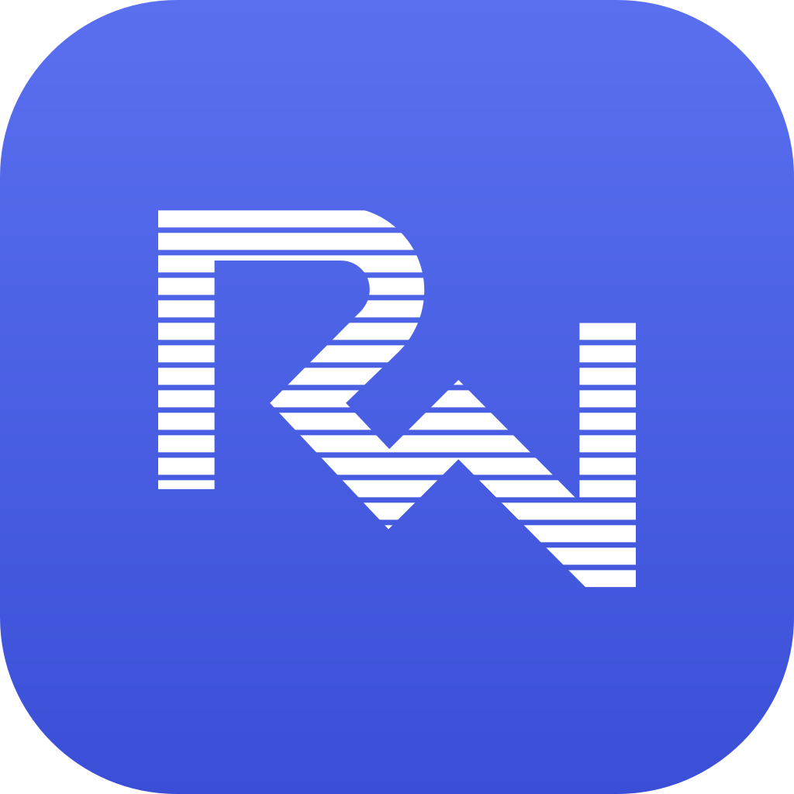
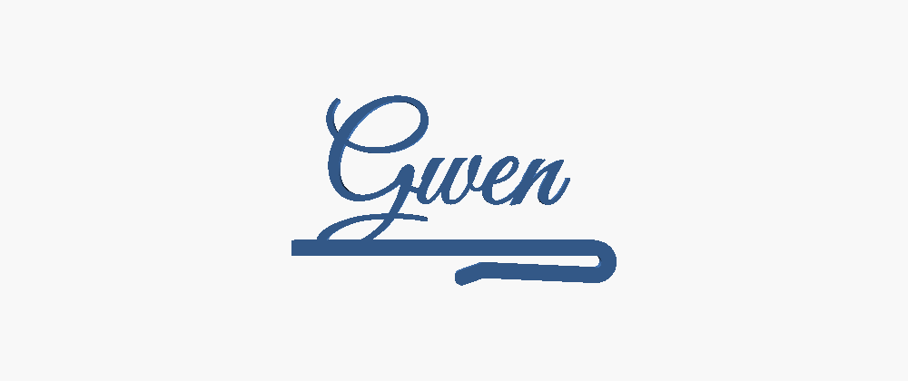
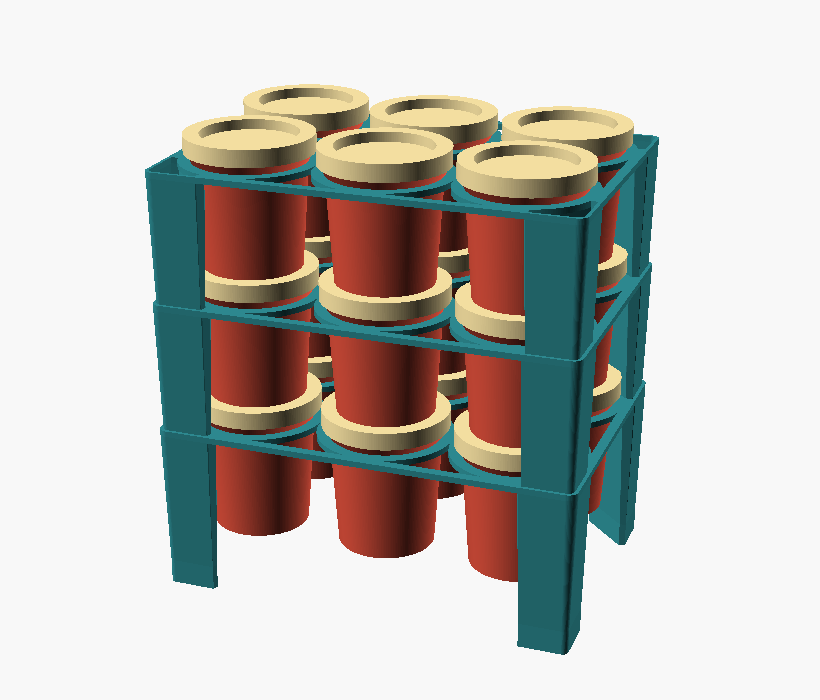

<p align="center">
  
</p>

<h1 align="center">RainnWorks 3D models</h1>

<p align="center">Parametric 3D-printable models in OpenSCAD. Free to print yourself, or configure and order one at rainn.works/models.</p>


## The models

Each model is one folder: the OpenSCAD source, ready-made STL and 3MF files in
`export/`, renders in `previews/`, and a README with how to print it, which
parameters matter, how it works and its limits.

| | |
|---|---|
|  | **[Cake topper](cake-topper/)**<br>A three-line "Happy Birthday" cake topper with a big inlaid background number, printed in four colours with two posts.<br>[Configure and order one](https://rainn.works/models/cake-topper/) |
|  | **[Portable-AC door bulkhead](door-to-ac-hose/)**<br>A threaded fitting that takes a portable air conditioner's exhaust hose through a hole drilled in a door, with a hose clamp, caps and a bug vent.<br>[Configure and order one](https://rainn.works/models/door-to-ac-hose/) |
|  | **[Glass name tag](glass-name-tag/)**<br>A script name tag that clips over a wine glass rim, placed by measured ink so no letter prints loose or touches the glass.<br>[Configure and order one](https://rainn.works/models/glass-name-tag/) |
|  | **[Glass name tag, back clip](glass-name-tag-back/)**<br>The glass name tag with its clip turned out of the letter plane, so the name hangs on the front of the glass facing the room.<br>[Configure and order one](https://rainn.works/models/glass-name-tag-back/) |
|  | **[Hall of Fame sign](hall-of-fame/)**<br>A 300 mm "Hall of Fame" script sign for a mirror, printed as three flat words and placed with a 1:1 paper template.<br>[Configure and order one](https://rainn.works/models/hall-of-fame/) |
|  | **[Play-Doh pot organiser](playdoh-organiser/)**<br>A stackable tray that hangs each Play-Doh pot by its own lip, so a loaded tower lifts as one and costs no extra height.<br>[Configure and order one](https://rainn.works/models/playdoh-organiser/) |
|  | **[Ruffle piping nozzle](ruffle-nozzle/)**<br>A printable ruffle piping nozzle traced from the Birkmann #122, with a screw-on coupler so you can swap tips without emptying the bag.<br>[Configure and order one](https://rainn.works/models/ruffle-nozzle/) |
|  | **[Van air-filter cap](van-airfilter-cap/)**<br>A tapered press-fit weather cap that keeps rain off a horizontally mounted van air filter, with diamond vents on its lower side.<br>[Configure and order one](https://rainn.works/models/van-airfilter-cap/) |
|  | **[XIAO + Wio-SX1262 enclosure](xiao-wio-velux-bridge/)**<br>A support-free, screw-free printed case for a Seeed XIAO ESP32-S3 and Wio-SX1262 radio bridge, with both supplied FPC antennas inside.<br>[Configure and order one](https://rainn.works/models/xiao-wio-velux-bridge/) |

## Print them yourself, or order one

Every model here is free to print for yourself. Open a model's folder, set its
parameters in [OpenSCAD](https://openscad.org) (or MakerWorld's parametric
maker) and print it.

Or configure it in the browser at **[rainn.works/models](https://rainn.works/models/)**
and order it printed from RainnWorks. Ordering sends us your exact settings by
email. We ship worldwide and agree shipping and cost with you before anything is
printed.

## Build from source

Each folder has a Makefile. `make` rebuilds that model's previews and exports
from its source, and its README lists the other targets (tests, checks,
plates). You need [OpenSCAD](https://openscad.org) on your `PATH`. Some models
also need Python 3 or the BOSL2 library; their READMEs say which.

The README images are built from the committed renders, not from the models:

```sh
python3 assets/src/render.py   # needs Pillow and rsvg-convert
```

It writes `assets/hero.png`, `assets/icon-1024.png` and each model's
`assets/hero.png`, from the SVG sources in `assets/src/` and each model's
`assets/src/`.

## Licence

[CC BY-NC-SA 4.0](LICENSE). You may print, remix and share these models for
free, with credit to RainnWorks, as long as it is not for profit and remixes
use the same licence.

**Selling prints or remixes needs a partnership with RainnWorks.** Email
[support@rainn.works](mailto:support@rainn.works?subject=Selling%20RainnWorks%20models)
and let's talk.
