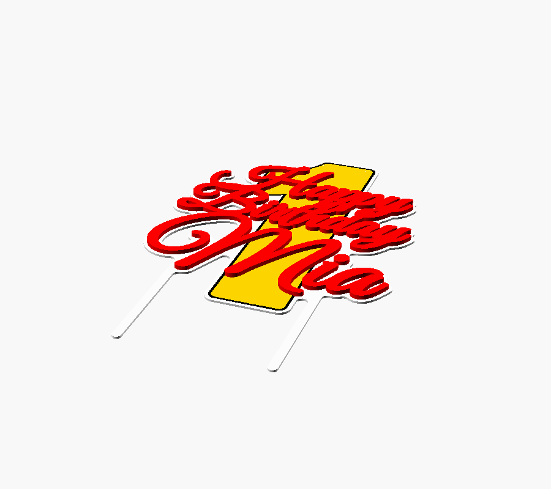
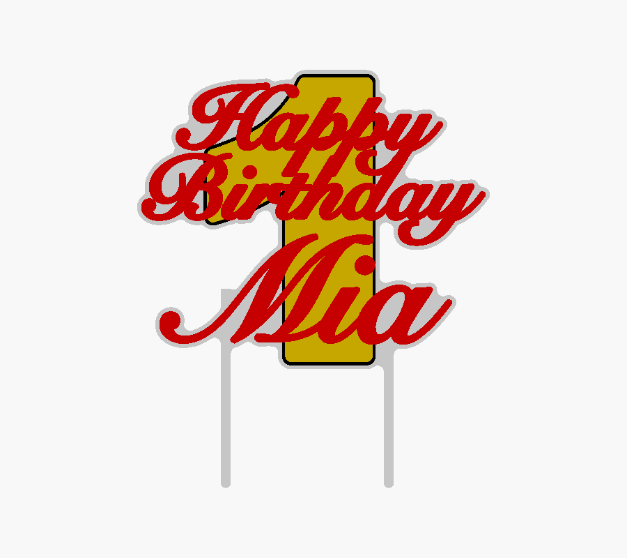
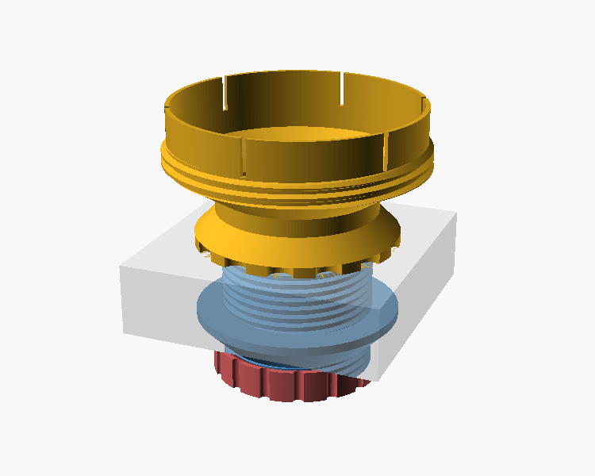
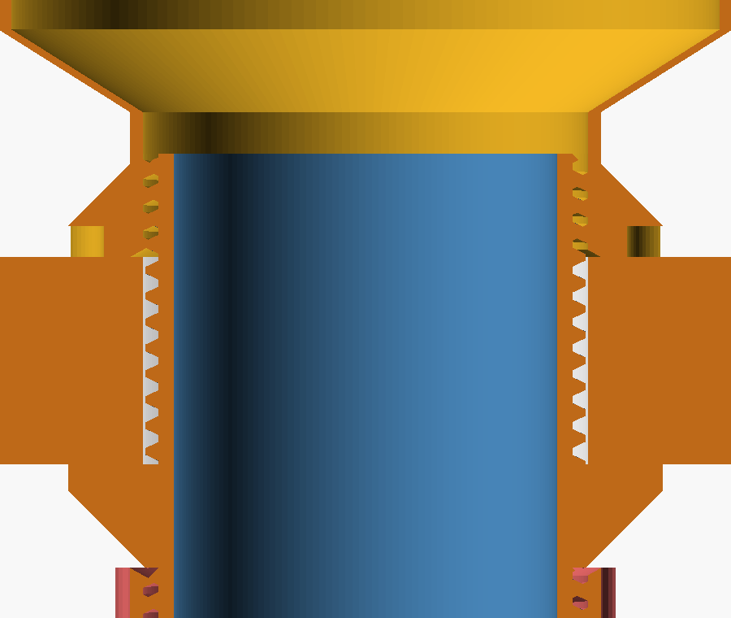
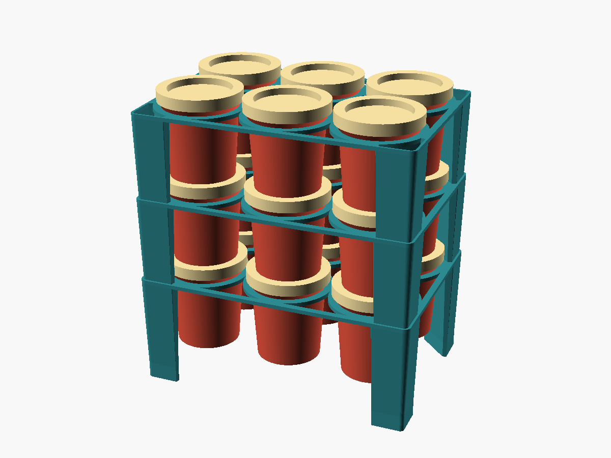
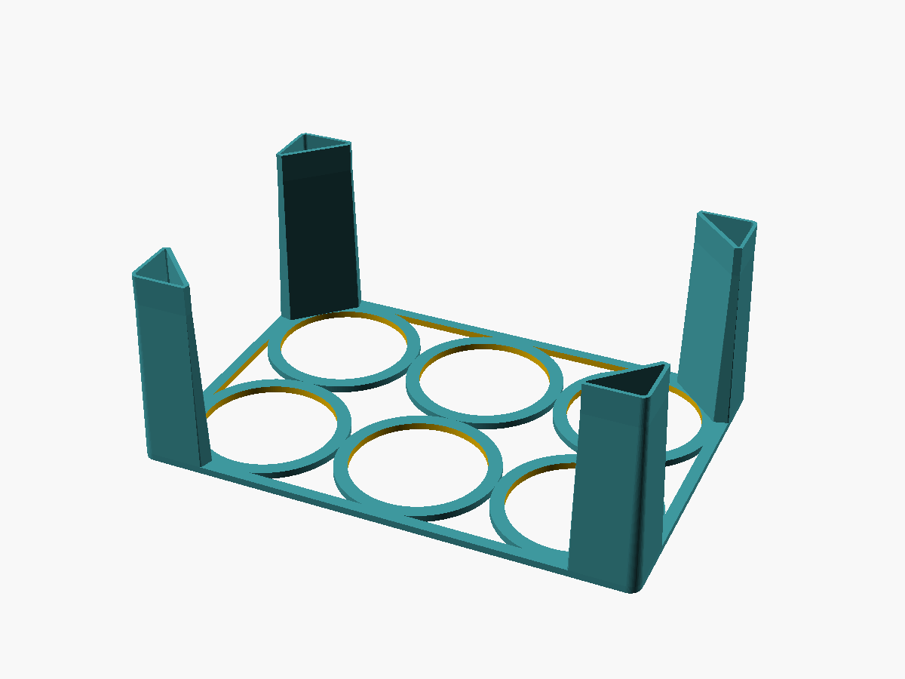
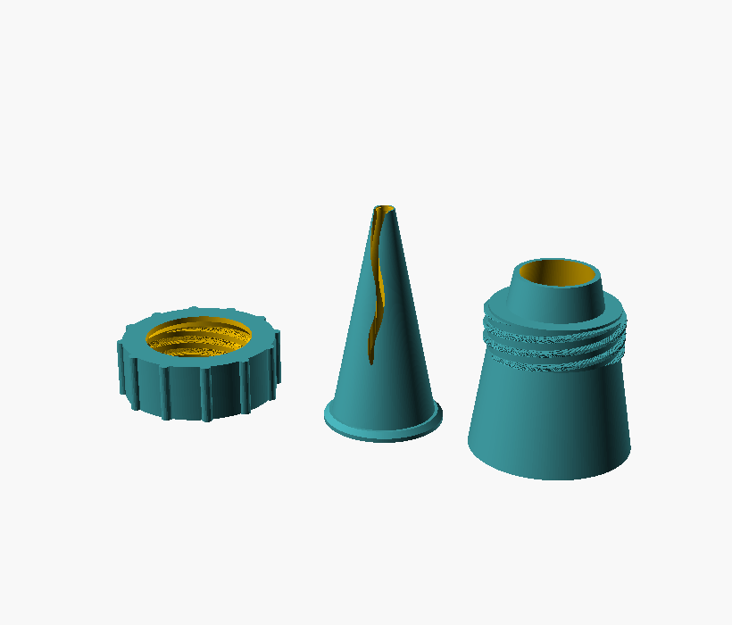
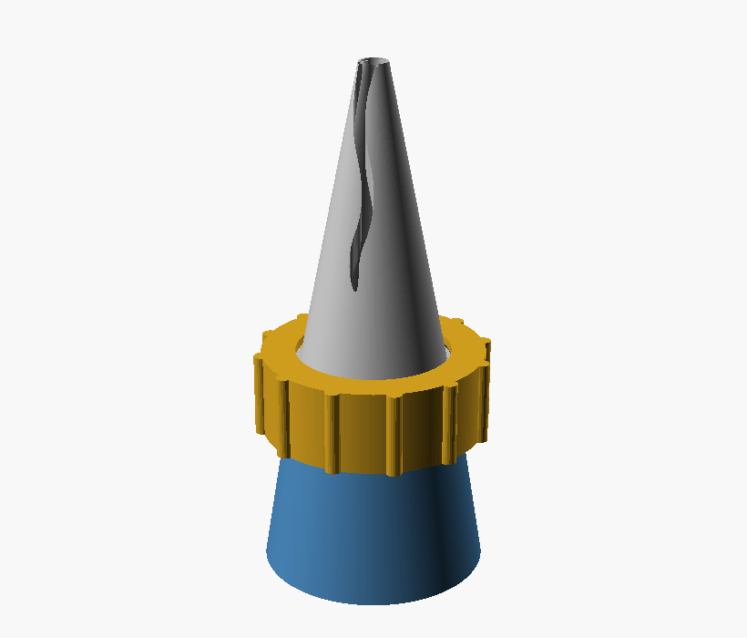
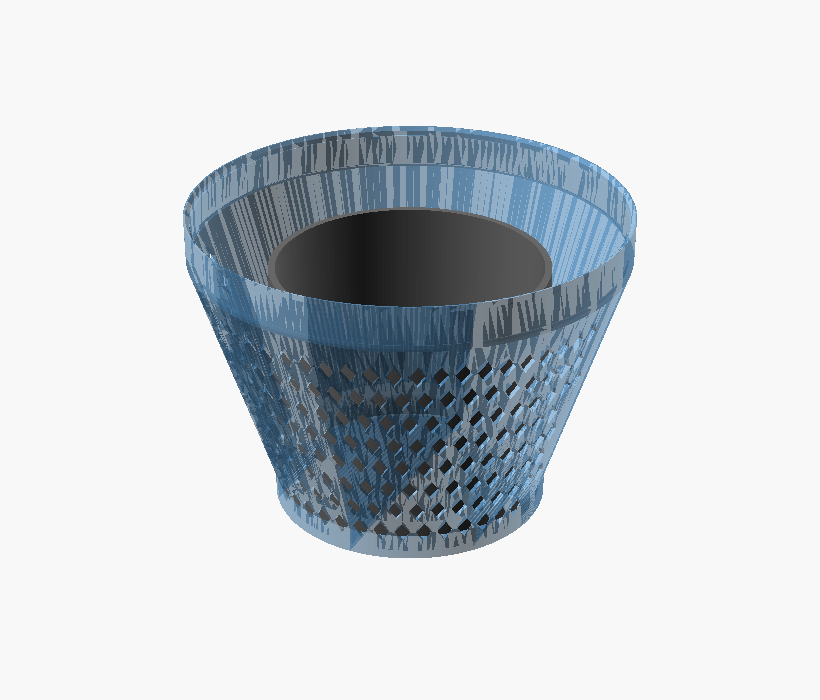
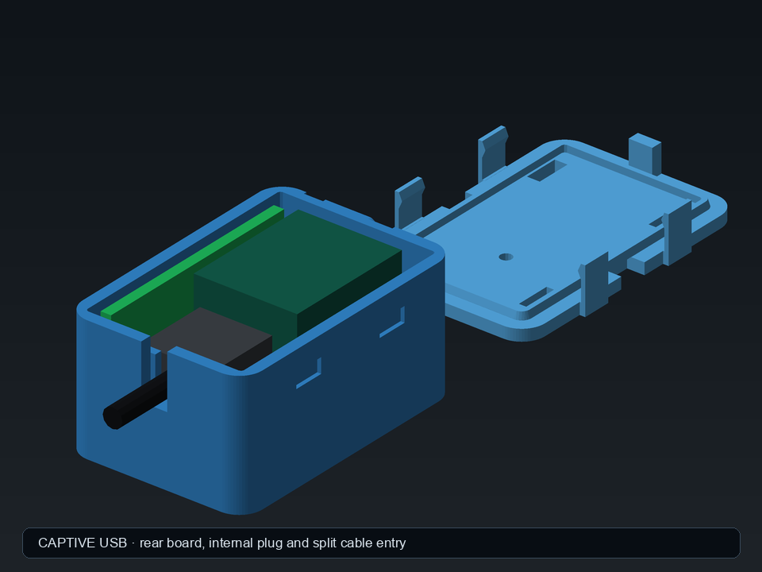

# RainnWorks 3D models

Parametric, printable designs built primarily in OpenSCAD. Each project folder
contains its source, printable exports, build instructions, and further design
notes.

## [Cake topper generator](cake-topper/)

A customisable three-line birthday topper with a large age-number inlay and two
integrated cake posts.

| Perspective | Front |
|---|---|
|  |  |

## [Portable-AC door bulkhead](door-to-ac-hose/)

A modular, threaded door fitting for a portable-air-conditioner hose, with
interchangeable inside clamps and outside caps, nets, and hose accessories.

| Complete assembly | Section view |
|---|---|
|  |  |

## [Play-Doh pot organiser](playdoh-organiser/)

Stackable trays which hold Play-Doh pots by their body lips while preserving
the pots' natural lid-to-base nesting.

| Loaded tower | Single tray |
|---|---|
|  |  |

## [Ruffle piping nozzle](ruffle-nozzle/)

A printable ruffle nozzle based on the Birkmann #122, plus a two-part threaded
coupler for changing tips without emptying the piping bag.

| Complete set | Coupler assembly |
|---|---|
|  |  |

## [Van air-filter cap](van-airfilter-cap/)

A tapered press-fit weather cap with lower-side diamond ventilation, designed
to protect a horizontally mounted van air filter from rain.

| Installed | Filter fit |
|---|---|
|  |  |

## [XIAO + Wio-SX1262 enclosure](xiao-wio-velux-bridge/)

A compact, support-free enclosure for a Seeed Studio XIAO ESP32-S3 and
Wio-SX1262 radio board, with protected mounting space for both supplied FPC
antennas. Standard and captive short-USB versions are included.

| Standard USB | Captive USB |
|---|---|
|  |  |

## Print them yourself, or order one

Every model here is free to print for yourself. Open a model's folder, set its
parameters in [OpenSCAD](https://openscad.org) (or MakerWorld's parametric
maker) and print it.

Or configure it in the browser at **[rainn.works/models](https://rainn.works/models/)**
and order it printed from RainnWorks. Ordering sends us your exact settings by
email. We ship worldwide and agree shipping and cost with you before anything is
printed.

## Licence

[CC BY-NC-SA 4.0](LICENSE). You may print, remix and share these models for
free, with credit to RainnWorks, as long as it is not for profit and remixes
use the same licence.

**Selling prints or remixes needs a partnership with RainnWorks.** Email
[support@rainn.works](mailto:support@rainn.works?subject=Selling%20RainnWorks%20models)
and let's talk.

## Building the models

Open the linked project README for model-specific dimensions, print orientation,
assembly instructions, and build targets. Generated STL and 3MF files are kept
alongside the source where applicable.
