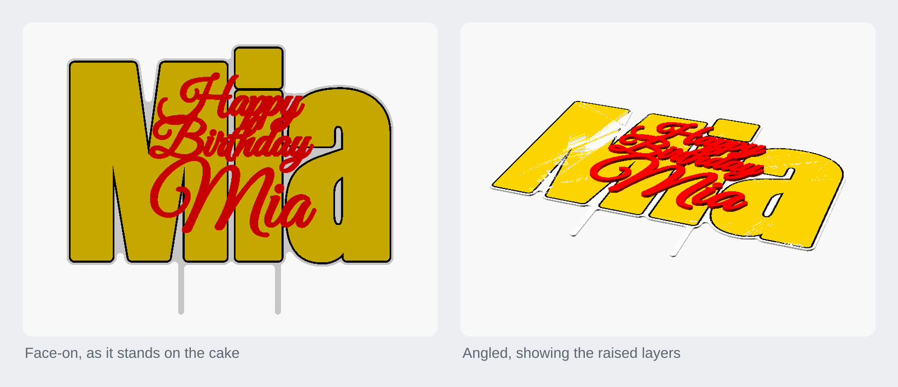

<h1 align="center">Cake topper generator</h1>

<p align="center">A three-line "Happy Birthday" cake topper with a big inlaid background number, printed in four colours with two posts.</p>

<p align="center"><a href="https://rainn.works/models/cake-topper/">Configure and order one</a> · <a href="../">All models</a></p>



## Getting started

1. **Get the file.** `export/topper.3mf` is the file to slice for a multicolour (AMS) print: it holds four separate objects, white, gold, black and red, one per filament. `export/topper.stl` is the same outer shape as one watertight single-colour solid, with no inlay. To change the words or the number, open `CakeTopperGenerator.scad` in OpenSCAD, or upload it to MakerWorld's Parametric Model Maker (see [On MakerWorld](#on-makerworld)).

   The exports and previews in this folder show "Mia" as the background word, not the `.scad`'s default `Age` of "1", so they do not match the committed defaults. Export your own from the `.scad` to get exactly the settings you set.
2. **Set the parameters.** The ones most people change:

   | Parameter | Default | What it does |
   |---|---|---|
   | `Line1`, `Line2`, `Line3` | "Happy", "Birthday", "Mia" | The three lines. Line 3 is the name and prints bigger. |
   | `Line1_Size`, `Line2_Size`, `Line3_Size` | 30, 30, 50 | Text size of each line (mm). |
   | `Text_Font` | Great Vibes | Font of the three lines. |
   | `Age` | "1" | The big number behind the text. |
   | `Age_Font` | Anton | Font of the number. |
   | `Age_Style` | `inlay` | How the number is shown: `inlay`, `engrave`, `deboss` or `raised` (see [Number styles](#number-styles)). |
   | `Age_Scale` | 1.12 | Number height as a multiple of the text block's height. |
   | `Post_Spacing` | 80 | Distance between the two posts (mm). |
   | `Post_Length` | 70 | How far the posts reach below the text (mm). 0 = no posts. |
   | `col_text`, `col_outline`, `col_age`, `col_age_stroke` | red, white, gold, black | Colour of the letters, the backing, the number and the number's outline. These drive the filament assignment. |

   The full list is under [All parameters](#all-parameters).
3. **Slice.** Print it flat, backing plate down. Every layer is a straight extrusion, so it needs no supports. In the 3MF, map each of the four objects to a filament. All heights are whole layers of `Extrusion_Layer_Height` (0.20 mm), so slice at that layer height, or change the parameter to match your slicer.
4. **Push the posts into the cake.**

### All parameters

| Parameter | Default | What it does |
|---|---|---|
| `Text_Font` | Great Vibes | Font of the three lines. Other scripts that work: Pacifico, Dancing Script, Satisfy, Sacramento. |
| `Age_Font` | Anton | Font of the number. Other bold numbers that work: Archivo Black, Bebas Neue, Oswald. |
| `Line1`, `Line2`, `Line3` | "Happy", "Birthday", "Mia" | The three lines; line 3 is the name. |
| `Line1_Size`, `Line2_Size` | 30 | Text size (mm), 10 to 80. |
| `Line3_Size` | 50 | Text size of the name (mm), 10 to 100. |
| `Line_Gap` | 4 | Extra vertical gap between lines (mm). |
| `Text_Boldness` | 1.4 | Fattens the letters (mm). |
| `Text_Spacing` | 1.0 | Letter spacing, 1 = normal. |
| `Age` | "1" | The background number. |
| `Age_Style` | `inlay` | `inlay`, `engrave`, `deboss` or `raised`. |
| `Age_Scale` | 1.12 | Number height vs the text block height. |
| `Age_Boldness` | 3.0 | Fattens the number's strokes (mm). |
| `Gap` | 2.2 | Clear gap between the number and the letters (mm). |
| `Number_Stroke` | 1.5 | Width of the black outline around the inlaid number (mm). 0 = none. |
| `Number_Outline` | 2.4 | Width of the groove for `Age_Style = "engrave"` (mm). |
| `Outline_thickness` | 2.0 | White border around the words (mm). |
| `Connect` | 3.0 | Closes small gaps so floating bits, such as the dot of a script "i", join their letter (mm). |
| `Post_Spacing` | 80 | Distance between the posts (mm). |
| `Post_Width` | 5 | Post width (mm). |
| `Post_Length` | 70 | Post length below the text (mm). 0 = no posts. |
| `col_text` | red | The letters. |
| `col_outline` | white | The backing plate and border. |
| `col_age` | gold | The number. |
| `col_age_stroke` | black | The outline around the number. |
| `Extrusion_Layer_Height` | 0.20 | Layer height every other height is counted in. |
| `Base_Layers` | 6 | Backing plate thickness, in layers (1.2 mm). |
| `Inlay_Layers` | 5 | Depth of the number's inlay, in layers. |
| `Engrave_Layers` | 4 | Depth of the `engrave` groove, in layers. |
| `Age_Layers` | 8 | Height of the `raised` number above the plate, in layers. |
| `Text_Layers` | 12 | Height of the letters above the plate, in layers (2.4 mm). |

`render_part`, `Solid` and `$fn` are hidden from the Customizer. `Solid = true` gives the single-colour solid used for the STL.

### On MakerWorld

The `.scad` is written for MakerWorld's OpenSCAD-based customizer (Parametric Model Maker / MakerLab), so a buyer can type their own name and age and download a custom model.

- **Upload the `.scad` itself**, not the 3MF, to get the "Customize" button.
- **Fonts.** MakerLab has only its own font library, roughly Google Fonts. The defaults, Great Vibes and Anton, are in it, and `Text_Font` and `Age_Font` are tagged `// font` so they appear as font pickers. macOS-only fonts such as Snell Roundhand or Arial Black will not render there.
- **Multicolour.** MakerLab turns on OpenSCAD's lazy-union and exports colour to 3MF. The model emits one top-level object per colour (`part_white`, `part_gold`, `part_black`, `part_red`), which is what that needs: each colour maps to a filament.
- **OpenSCAD 2021.** MakerLab runs the 2021 release. The model uses nothing newer and no external libraries.
- **Customizer layout.** Parameters are grouped with `/* [Section] */`, with `// [min:step:max]` sliders and `// [a, b, c]` dropdowns. `/* [Hidden] */` keeps `Solid`, `render_part` and `$fn` out of the UI.

## How it works

The three lines are stacked and centred, with the name at the bottom. The number is centred on that text block and scaled to `Age_Scale` times its height, so it sits behind all three lines.

The model is built from one 2D outline per colour, each extruded to its own height:

- **White plate.** A border of `Outline_thickness` around the words, joined to the number's shape and the two posts. It is then closed by `Connect` (grown and shrunk again), so loose pieces of script join into one part. For `inlay`, the plate reaches `Number_Stroke + Outline_thickness` past the number, so a white outline always wraps the black stroke, even where the number sticks out past the words.
- **Gold number.** For `inlay`, the whole number and its stroke are cut into the top of the plate, `Inlay_Layers` deep, and the gold fills the recess flush with the surface. The gold runs right up to and under the letters. It is grown 0.1 mm past the recess walls so the walls overlap instead of touching, which keeps the union watertight.
- **Black stroke.** A ring `Number_Stroke` wide just outside the gold, inlaid flush the same way.
- **Red letters.** Raised highest, `Text_Layers` above the plate.

The model emits these as four separate top-level objects. With `--enable lazy-union` (the Makefile's 3MF rule) each stays its own coloured object, and Bambu Studio imports a part per filament. Without lazy-union, as for the STL, they union into one mesh. The STL goes further and uses `Solid = true`: just the plate and the raised letters, with no inlay seams.

### Number styles

- **`inlay`** (default): the number is set into the white plate, flush with the surface, in the accent colour, with the black stroke round it.
- **`engrave`**: a thin groove, `Number_Outline` wide and `Engrave_Layers` deep, traces the number's outline in the plate, kept clear of the letters.
- **`deboss`**: the number is an open recess in the plate, with a clear `Gap` around the letters. Same colour as the plate, so it reads by shadow only.
- **`raised`**: the number is a raised accent layer on top of the plate, with a clear `Gap` around the letters.

## Limits

- **The shipped exports are wider than most beds.** `export/topper.stl` measures about 270 × 223 mm, because it has "Mia" as the background word. That is too wide for a 256 mm bed. A short number such as the default "1" makes a much narrower topper.
- **Fonts must exist where you render.** Locally, Great Vibes and Anton must be installed for OpenSCAD to find them. On MakerWorld only its own library works.
- **The posts are as thin as the plate.** They are part of the white plate, so they are `Base_Layers` × `Extrusion_Layer_Height` thick: 1.2 mm by default.
- **Layer heights are baked in.** The colour changes fall on whole layers of `Extrusion_Layer_Height`. Slicing at a different layer height moves them off the layer boundaries.

## Build from source

Needs `openscad`. The model is 2021-compatible; the builds here used a 2026 release, and the Makefile's 3MF rule uses the lazy-union and `export-3mf` colour options. Install the Great Vibes and Anton fonts first.

```sh
make            # everything: all previews + all STL/3MF exports
make renders    # just the PNG previews
make exports    # just the STL + 3MF files
make topper     # one part: its preview + STL + 3MF
make open       # render + open the face-on preview (macOS)
make clean      # remove generated previews/ and export/
```

Targets re-run only when `CakeTopperGenerator.scad` changes. `make clean` deletes the committed `previews/` and `export/` folders.

## Licence

[CC BY-NC-SA 4.0](../LICENSE). Free to print, remix and share with credit, not for profit. Selling prints or remixes needs a partnership with RainnWorks: [support@rainn.works](mailto:support@rainn.works?subject=Selling%20RainnWorks%20models).
