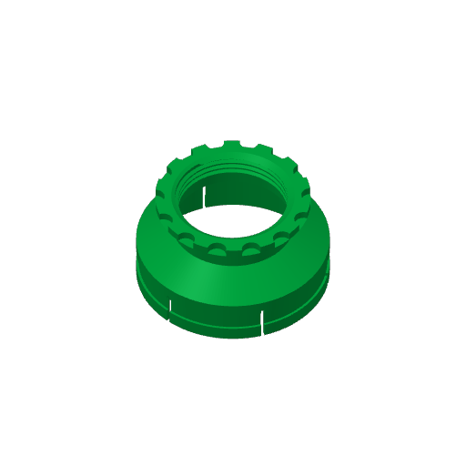
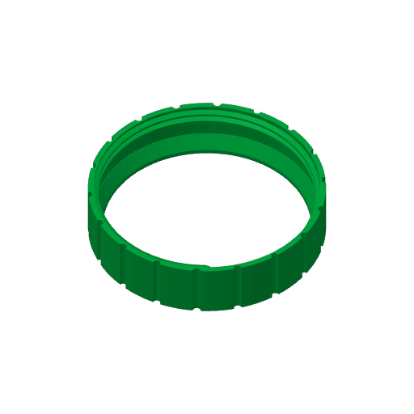
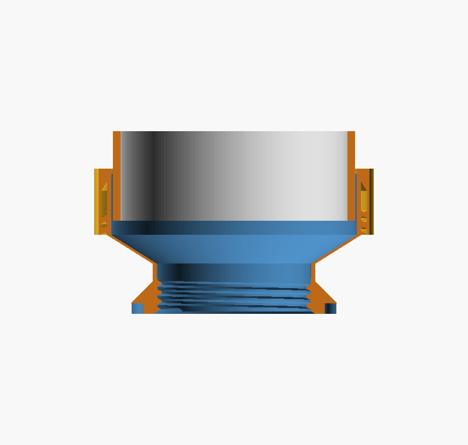

<h1 align="center">Portable-AC door bulkhead</h1>

<p align="center">A threaded fitting that takes a portable air conditioner's exhaust hose through a hole drilled in a door, with a hose clamp, caps and a bug vent.</p>

<p align="center"><a href="https://rainn.works/models/door-to-ac-hose/">Configure and order one</a> · <a href="../">All models</a></p>


## Getting started

1. **Get the files.** Everything is one OpenSCAD file, `bulkhead.scad`, and each part is picked with `render_part`. `export/` has every printable part as STL and 3MF, made from the defaults: an 86 mm hole, a 40 mm door and a 146 mm hose.

   | File | Part |
   |---|---|
   | `body` | The port through the door: outside flange, outboard collar and threaded barrel. |
   | `widener` | Inside hose inlet. Clamps the door and takes the hose. |
   | `collet_nut` | Screws over the widener's mouth and squeezes it onto the hose. |
   | `cap` | Inside blanking cap. Clamps the door; the winter seal. |
   | `cap_out` | Outside blanking cap for the outboard collar. |
   | `net_out` | Outside bug-mesh vent for the outboard collar. |
   | `spanner` | C-spanner that turns the collet nut. |
   | `spanner_w` | Smaller spanner that holds the widener still while you turn the nut. |
   | `test` | Short thread coupon to fit-check against `cap` before printing the big parts. |

   `door_thickness = 40` is an untested placeholder, not a real door. If your door differs, open `bulkhead.scad` in OpenSCAD or MakerWorld's parametric maker and set it, or run `make customer DOOR=n` (see [Build from source](#build-from-source)).

   `export/customer-20mm/` is the first customer kit, for a 20 mm door, made with `make customer DOOR=20`. It holds `body`, `cap`, `widener`, `collet_nut`, `cap_out`, `net_out`, `spanner` and `spanner_w` as STL and 3MF, plus `body.png` and `section.png` previews. There is no test coupon. Only the body differs from the stock export: its barrel is 40 mm instead of 60, so the body is 76.5 mm tall instead of 96.5. The accessories are the same geometry as stock. The bore is still 86 mm and the hose 146 mm.
2. **Set the parameters.** Measure the first three:

   | Parameter | Default | What it does |
   |---|---|---|
   | `bore_d` | 86 | Diameter of the hole drilled in the door (mm). Still to be measured. |
   | `door_thickness` | 40 | Door thickness (mm). Placeholder, still to be measured. Only the body's barrel changes with it. |
   | `duct_od` | 146 | Hose outer diameter across the rib crests (mm). Measured on the real hose. |
   | `thread_clearance` | 0.45 | Diametral clearance between male and female threads (mm). Raise it if the test coupon is tight, lower it if sloppy. |
   | `ring_engage` | 1.35 | How far the grip rings reach past the hose crest before the nut is tightened (mm). The one knob if the hose screws in too stiffly. |
   | `render_part` | `body` | Which part to make. |

   The full list is under [All parameters](#all-parameters).
3. **Fit-test the thread.** Print `test` and `cap` in PLA and check the thread runs smoothly and snugs up. Too tight: raise `thread_clearance`. Sloppy: lower it. The coupon takes minutes; do this before the big parts.
4. **Slice.** Bambu Lab X2D, 0.4 mm nozzle was the target.
   - **Set the support threshold to 20° (the default is 30°) and leave supports off.** At 30° the 25° thread flanks fall below the line and the slicer flags every thread turn on the body, 81 cm² of it. At 20° the flagged area falls to 0.6 cm². This is a slicer setting, not a model change; the threads print fine bare. Don't turn supports on to clear the warning: you get support inside the threads.
   - **Orientation.** Thread axis vertical for every threaded part, supports off.
     - `body`: outboard collar down, barrel up. The seating face prints flat, facing up.
     - `cap`: flange down, closed top up.
     - `widener`: mouth down, collet ring on the plate, flange up. The flare and flange cone support themselves.
     - `collet_nut`: hose-hole end down, open threaded end up, like a cup the right way up. Its squeeze cone is then the inside bottom. Printed the other way up, the cone is a ceiling and the slicer asks for support.
     - `cap_out`, `net_out`: flat on the plate.
     - `spanner`, `spanner_w`: flat on the plate. Every wall is vertical.
     - `test`: base down.

     `widener` and `collet_nut` are exported already flipped into print orientation, so drop them on the plate as they are.

     <p> </p>
   - **Material.** PLA for fit-tests; PETG for the real one, because the collet fingers flex without cracking. The header of `bulkhead.scad` suggests PLA at about 210 °C nozzle, 60 °C bed, 0.20 mm layers, 3 walls, 20% infill; PETG at 250 to 260 °C, 70 to 80 °C bed, 0.20 mm layers, 3 to 4 walls, 25 to 40% gyroid, 30 to 50% cooling and a slow first layer.
   - **Fast settings** that were used: 0.24 mm layers (the X2D maximum for the stock 0.4 nozzle), 2 walls, 10% grid infill, no supports. The size dominates the time, not the settings: 0.20 to 0.24 mm plus fast settings saved only about 8 minutes. The widener and nut took about 4 to 5 hours each when they were sized for a 135 mm hose, and they are larger now (Ø159 and Ø167). Print them overnight, or print a short collet stub and short nut first to confirm the grip.
5. **Fit it.**
   1. Drill the hole (`bore_d`) through the door.
   2. Push the body through from the outside, flange on the outside face. The barrel is a deliberately loose fit. Foam or weather tape under the flanges seals the door.
   3. On the inside, screw on the widener (or the cap) until its flange traps the door against the body flange.
   4. Slide the collet nut over the hose, screw the hose into the widener's mouth, then screw the nut onto the mouth. Tighten it with `spanner` while `spanner_w` holds the widener. Without the second spanner, turning the nut unscrews the widener and releases the door clamp. Tighten by feel; don't crank it.
   5. On the outside, screw `cap_out` or `net_out` onto the outboard collar.

   Swap the widener for the cap by hand in winter. The door is unclamped only for the few seconds of the swap. The same accessories also fit the outboard collar, so either face of the door can be capped or ducted.

### All parameters

Everything that drives a dimension is in the parameter block at the top of `bulkhead.scad`. Derived values such as `flange_od = bore_d + flange_margin` are computed below it.

| Parameter | Default | What it does |
|---|---|---|
| `render_part` | `body` | `body`, `cap`, `widener`, `collet_nut`, `cap_out`, `net_out`, `spanner`, `spanner_w`, `test`, or the preview-only `assembly`, `section`, `clampdemo`. |
| `bore_d` | 86 | Drilled hole diameter (mm). |
| `door_thickness` | 40 | Door thickness (mm). |
| `duct_od` | 146 | Hose OD across the rib crests (mm). |
| `insert_clear` | 2.0 | Mouth bore = hose OD + this (mm). |
| `fit_clearance` | 1.0 | Barrel OD = bore − this. A loose drop-in (mm). |
| `thread_pitch` | 5.0 | Body and accessory thread pitch (mm). |
| `thread_clearance` | 0.45 | Diametral male-to-female clearance (mm). |
| `thread_angle` | 50 | Included thread angle; the printed flank is half of it off horizontal. See [Supports off](#supports-off). |
| `inside_thread_len` | 20 | Barrel thread protruding inside the door (mm). Absorbs door-thickness error. |
| `collar_len` | 14 | Outboard threaded port length (mm). |
| `airway_d` | 74 | Clear through-airway diameter (mm). |
| `wall` | 3.0 | Nominal wall thickness (mm). |
| `flange_margin` | 29 | Body flange OD = bore + this (mm). |
| `flange_t` | 5 | Body flange thickness (mm). |
| `acc_flange_margin` | 29 | Accessory clamp flange OD = bore + this (mm). |
| `acc_flange_t` | 6 | Accessory flange thickness (mm). |
| `acc_thread_len` | 20 | Accessory internal thread depth; must swallow the barrel protrusion (mm). |
| `acc_clear_depth` | 8 | Counterbore above the thread that swallows the barrel tip on a thin door (mm). |
| `grip_flutes`, `grip_r` | 14, 7 | Hand-grip scallops round the accessory flange: count and cutter radius (mm). |
| `cap_top_t` | 4 | Closed-end thickness of the caps (mm). |
| `out_flutes`, `out_flute_r` | 16, 3 | Light knurl on the outside knobs: count and cutter radius (mm). |
| `net_standoff` | 4 | Gap between the collar tip and the vent grille (mm). |
| `grille_t`, `grille_bar`, `grille_gap` | 2.5, 1.5, 2.0 | Grille thickness, bar width and mesh opening (mm). A smaller opening stops smaller bugs but cuts airflow. |
| `flare_len` | 16 | Widener flare height, throat to mouth (mm). |
| `collet_thread_len` | 14 | Externally threaded base of the collet, where the nut runs (mm). |
| `collet_finger_len` | 34 | Slotted fingers above the thread; they carry the grip rings (mm). |
| `collet_slots`, `collet_slot_w` | 6, 3 | Number and width (mm) of the finger slots. |
| `collet_wall` | 2.5 | Collet wall at the thread root (mm). |
| `collet_pitch` | 6 | Coarse collet thread pitch; the nut clamps in about one turn (mm). |
| `nut_wall` | 4 | Collet nut wall (mm). |
| `nut_flutes` | 18 | Knurl flutes on the nut. |
| `nut_cone` | 20 | Axial length of the nut's squeeze cone (mm). Longer is a shallower wedge: 10 mm is 31°, 20 mm is 17°. |
| `spanner_wrap` | 180 | Spanner jaw wrap (degrees). |
| `spanner_teeth_arc` | 120 | Arc of the jaw that carries teeth (degrees). |
| `spanner_wall` | 9 | Jaw wall (mm). |
| `spanner_h` | 15 | Spanner thickness (mm). |
| `spanner_handle` | 140 | Handle length from the nut's OD (mm). |
| `spanner_grip_w` | 22 | Handle width (mm). |
| `spanner_slop` | 0.6 | Jaw bore clearance over the target OD (mm). |
| `wspanner_h`, `wspanner_handle` | 14, 120 | Small spanner thickness and handle length (mm). |
| `ring_spacing` | 11 | Axial spacing of the grip rings (mm). Deliberately not the hose rib pitch. |
| `hose_rib_pitch` | 6.3 | Rib pitch of the preview hose only; drives no printed part (mm). |
| `ring_thick` | 1.2 | Ring thickness at its tip (mm). |
| `ring_engage` | 1.35 | Ring reach past the hose crest before the nut is tightened (mm). |
| `ring_count` | 3 | Number of grip rings. |
| `ring_start` | 3 | Gap between the collet thread top and the first ring (mm). |
| `support_cones` | true | 45° cones under the flanges so they print without support. |
| `show_threads` | true | `false` gives plain bores for a quick proportions check. |

### On MakerWorld

`bulkhead.scad` is annotated for MakerWorld's OpenSCAD customizer (Parametric Model Maker / MakerLab), so a buyer can set their own door and hose sizes and pick a part.

- **Upload the `.scad` itself**, not a 3MF, to get the "Customize" button.
- **BOSL2 is supported.** It is one of MakerLab's curated libraries, so the `include <BOSL2/...>` lines work unchanged. No fonts are used.
- **Pick a part.** `render_part` is a dropdown. The functional parts are printable; `assembly`, `section` and `clampdemo` are preview-only. A buyer customises once per part and downloads each.
- **Customizer layout.** Parameters are grouped with `/* [Section] */` and use `// [min:step:max]` sliders. `$fa` and `$fs` live under `/* [Hidden] */`.
- **OpenSCAD 2021.** MakerLab runs the 2021 release. If a thread call errors on upload, it is a BOSL2 version mismatch on their side; check against the BOSL2 version MakerLab ships.
- **Single colour.** Each part prints in one filament. The `color()` calls are only for the previews.

## How it works


1. A round hole is drilled through the door.
2. The **body** drops through from the outside. Its flange seats on the outside face, and a threaded barrel passes through the hole. The barrel is a loose fit, `bore_d − 1` mm: the clamp holds it, not the bore, so the accuracy of the hole doesn't matter.
3. **One coarse thread spec is used on both faces of the door**, so the same accessories screw on either side, and the thread can be as large as possible, which keeps the airway wide open for an exhaust.
4. **Inside accessories clamp the door.** The widener and the cap have a fluted grip flange that bears on the inside face, trapping the door between it and the body flange. The accessory is the clamp; there is no separate nut.
5. **Outside accessories only close or vent the outboard collar.** The body flange already does the flange job outside, so `cap_out` and `net_out` are compact knurled knobs with no clamp flange. `net_out`'s mesh sits `net_standoff` above the collar tip, so the collar never reaches it.
6. **The hose screws into the widener's mouth.** Internal grip rings drop into the hose's rib valleys, a form lock rather than friction. The collet nut then screws over the mouth and squeezes the slotted fingers, so the flexible ribs can't spring back out and the hose can't unscrew itself. All printed, no hardware.

```
   outside                     door                     inside
  [cap_out / net_out]        ===||===        [widener + collet_nut -> hose]
        screws onto           body            geared accessory clamps the door;
        outboard collar     flange|barrel     collet_nut clamps the hose
```

### Supports off

Every part is designed to print with supports off.

- **Thread flank angle.** `thread_angle` is the included angle, and the printed flank sits at exactly half of it off horizontal. An early note claimed 50° gave "a ~45° slope"; it gives 25°, below Bambu's 30° default, so the slicer demanded support on every thread turn (74 cm² on the body). That wrong claim is why the support problem was blamed on the flange cone for so long. Hence the 20° threshold in [Getting started](#getting-started).
- **Why not 80°.** 80° gives 40° flanks, and the measured sub-30° overhang on the body drops from 74.16 cm² to 0.11 cm². But it re-cuts both male and female threads, and they don't interchange: at the major diameter a 50° tooth crest is 1.33 mm wide against an 80° groove of 0.40 mm, so a 50° male jams about 0.9 mm out of an 80° female. The body was already printed at 50°, so 80° would scrap it along with `cap`, `cap_out` and `net_out`. It is held at 50° until the whole kit is next reprinted as a set. Don't go past 90°: at `thread_depth = pitch/2` the flanks use the whole pitch and the profile becomes a knife-edge V with no crest flat. 80° keeps about 0.8 mm.
- **45° cones under every flange** (`support_cones`) replace the flat annular overhang. The body's outboard collar was lengthened so its thread survives below the cone.
- **The body's cone lands on the thread root, not the crest.** It used to start at `barrel_od` (the crest, Ø85) while the thread valleys sit at the minor diameter (Ø80), so the cone base jutted 2.5 mm over thin air: a flat 7.06 cm² shelf right round the part. Flat is the worst overhang, and that shelf was the real reason support was demanded at the lip, not the 45° slope. Starting the cone at the root drops it to 0.60 cm², a harmless thread-end artefact. The cone height tracks the new base so it stays a true 45°, and the body grew 2.5 mm taller.
- **The body's flange-to-barrel step can't be ramped** on the seating side, because the barrel must neck to Ø85 to pass through the hole. Orientation handles it instead: collar down.
- **The widener and nut are exported flipped.** The widener was once exported flange-up, its modelling origin, so it landed flange-down on the plate. That turns the grip rings' square biting faces into 31 cm² of flat ceiling, and it bridged badly. Mouth-down, the same area is 0.75 cm². The flip is applied only in the render selector, so the `assembly` and `section` views are unaffected.

### The threads

BOSL2 builds the threads as a real helical sweep of a defined trapezoidal profile, with flat-ish crests and straight flanks. A `linear_extrude` with twist gives a wavy cross-section and needs huge facet counts. BOSL2 is the one external dependency.

### The hose grip



The hose connection went through four designs.

- **v1, internal helical tabs** that the hose twisted onto. The tabs stood out about 4 mm, so the hose couldn't even push past them, and it pulled out when the door swung.
- **v2, a groove for a bought metal worm-drive clamp.** Rejected: not all-printed.
- **v3, a slotted collet and a printed nut.** It failed in use and had to be superglued, for two reasons. It was sized for a 135 mm hose against a real 146 mm one: the mouth bore and nut throat were both 137 and the nut's thread crests 142, so it fouled in three places. And even sized right, friction alone can't grip ribbed hose. A smooth collet touches only the rib crests, a few thin helical lines on the stiffest part of the hose.
- **v4, the current one: grip rings plus the same collet nut.** Circumferential barbs inside the mouth drop into the rib valleys, and the nut squeezes the fingers so the ribs can't flex back out. The barb's mouth side is a 45° ramp, so the hose feeds in easily and the ring prints without support mouth-down. The other side is square and bites on pull-out. The nut also stops the hose slowly unscrewing itself as the door swings, which is a likelier failure than straight pull-out.

**Plain rings, not a helical thread.** The adapter that ships with these AC units uses plain rings and the hose still screws in, because its helical rib flexes to ride over them. A helix builds up phase error every turn; each ring only has to land somewhere in the roughly 5.5 mm valley.

**Ring spacing deliberately doesn't match the hose.** `duct_od` is 146 mm across the rib crests, measured; earlier values of 130 and 135 were for a different hose. The rings were first cut at 6.3 mm to match the rib pitch, derived from the stock adapter's 5.5 mm rib gap. That made the mouth behave like one continuous fine thread, which is all or nothing: get the pitch slightly wrong and every ring lands on a crest together. Checked against a true 8 mm pitch, 4 rings at 6.3 mm engage about 1, while 3 widely spaced rings still engage 2. So `ring_spacing = 11` and `ring_count = 3`: few, wide and shallow, like the stock adapter, which grips with a handful of shallow ribs over about 60 mm. Each ring independently finds a valley or squashes a rib slightly, and the nut locks whatever caught. Nothing depends on the rib pitch, so it never has to be measured. `hose_rib_pitch` only shapes the preview hose.

**Shallow rings and a squeeze, because the rib depth is unknown.** It was never measured; the valley is somewhere between 136 and 141 mm. `ring_engage = 1.35` reaches only 1.35 mm past the crest, and the nut's squeeze supplies the rest:

| If the rib is | Rings engage | Squeeze still left |
|---|---|---|
| 2.5 mm deep | 54% | 1.15 mm |
| 5.0 mm deep | 27% | 3.65 mm |

Either way it grips and the nut still has travel. Full nut travel gives 5 mm of diametral squeeze. This is an interference fit by design: straight rings against a helical rib mean the hose must flex 1.36 mm at the worst point to screw in, measured. That is exactly what the stock adapter does. PETG fingers flex more happily than PLA.

### The spanners

The collet nut is Ø167, too wide to wrap a hand round, and its knurl can't be deepened: `nut_wall` is 4 mm and the 2.6 mm scallops already leave only 1.4 mm. Hand-grip lugs were tried and rejected; the force needed is tool territory. So `spanner` is a C-spanner with teeth that match the nut's knurl.

- **180° wrap.** The jaw has to go on sideways, because the widener's flare blocks one end and the hose the other. A half-circle's opening equals its full diameter, so it slides straight on without flexing. Teeth sit on the middle 120° only, leaving the mouth clear.
- **Handle length.** `spanner_handle = 140` makes the tool 244 mm long, so it fits a 255 × 255 mm X2D plate flat and unrotated. 185 mm (289 mm overall) fits at no rotation and buys only 19% more torque, because the lever arm is measured from the nut's axis and the jaw radius is most of it already.
- **Shallower wedge.** `nut_cone` went from 10 to 20 mm. Same squeeze, but the wedge drops from 31° to 17°, which is 2× the radial force for the same torque.
- **The jaw and nut were checked to mate:** their intersection volume is empty. The spanner prints flat with no overhang at all.

`spanner_w` holds the widener while the nut is turned; otherwise tightening the nut turns the widener backwards and unscrews it from the body, releasing the door clamp. It grips the widener's clamp flange, whose 7 mm scallops bite far better than the nut's 2.6 mm knurl. Its jaw is taller than its teeth for strength: a 5.6 mm handle would take only about 17 Nm, not enough to hold against the big spanner.

### Customer kits

A customer with a different door gets `make customer DOOR=n`, which writes a complete kit to `export/customer-nmm/` without changing the defaults in `bulkhead.scad`. Only the body changes with the door (`barrel_len = door_thickness + inside_thread_len`); the accessories are emitted unchanged so the folder is self-contained.

## Limits

- **The default door and hole are not measured.** `door_thickness = 40` is a placeholder and `bore_d` is still marked to measure. Set both for your door.
- **The thread clearance needs a test print.** Print `test` and `cap` first and tune `thread_clearance`.
- **The rib depth of the hose was never measured.** The shallow rings and the nut's squeeze are designed to cope, but the grip is only proven on the one 146 mm hose. If the hose screws in too stiffly, lower `ring_engage`.
- **Changing `thread_angle` breaks compatibility.** Parts printed at different thread angles do not screw together; change it only when reprinting the whole kit.
- **The big parts are slow.** The widener and collet nut are several hours each, however you slice them.
- **The collet grip range may need tuning.** `collet_*` and `nut_*` may need more slots or a deeper squeeze if the grip needs more range.
- **Parts are large.** The collet nut is Ø167 mm and the spanner 244 mm long, sized to fit a 255 × 255 mm plate. A longer `spanner_handle` may not fit your bed.

## Build from source

Needs `openscad` with [BOSL2](https://github.com/BelfrySCAD/BOSL2) in its library path.

```sh
make                    # everything: all previews + all STL/3MF exports
make renders            # just the PNG previews
make exports            # just the STL + 3MF files
make body               # one part: its preview + STL + 3MF (any part name works)
make customer DOOR=20   # one customer's kit -> export/customer-20mm/
make open               # render + open the assembly preview (macOS)
make clean              # remove generated previews/ and export/
```

Targets re-run only when `bulkhead.scad` changes; `make customer` always runs. To render one part by hand:

```sh
openscad -o export/widener.stl -D 'render_part="widener"' bulkhead.scad
```

`make clean` deletes the whole of `previews/` and `export/`, including `export/customer-20mm/` and the previews the Makefile does not make (`clamp_parts.png`, `nut_sliced.png`, `widener_sliced.png`).

Slicing was checked headlessly with the Bambu Studio CLI, using the `Bambu Lab X2D 0.4 nozzle` machine, the `0.20/0.24mm Standard @BBL X2D` process and `Bambu PLA Basic @BBL X2D` filament. There is no CLI "send to printer"; the printer is driven from the Bambu Studio GUI or Bambu Handy.

## Licence

[CC BY-NC-SA 4.0](../LICENSE). Free to print, remix and share with credit, not for profit. Selling prints or remixes needs a partnership with RainnWorks: [support@rainn.works](mailto:support@rainn.works?subject=Selling%20RainnWorks%20models).
