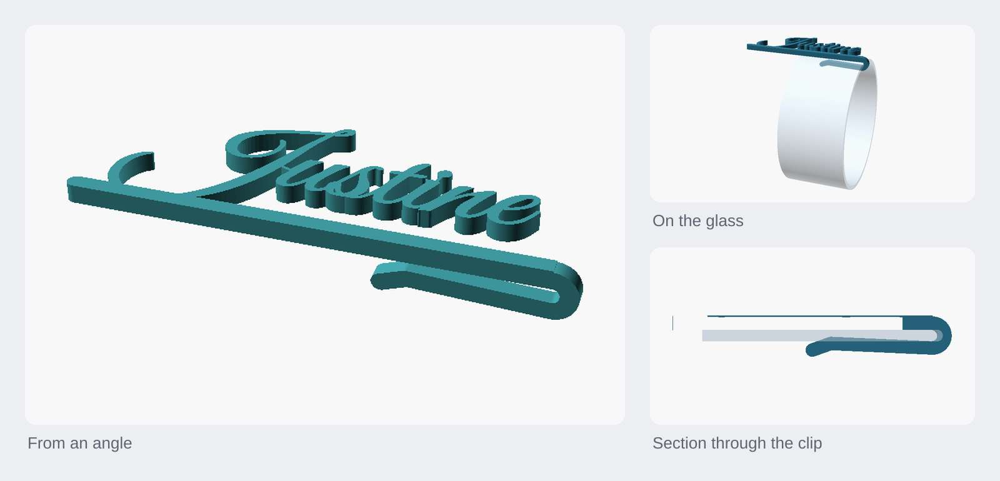
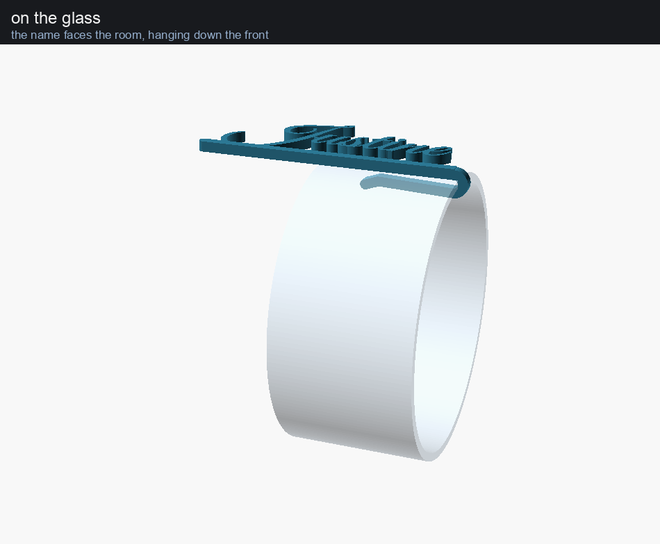

<h1 align="center">Glass name tag, back clip</h1>

<p align="center">The glass name tag with its clip turned out of the letter plane, so the name hangs on the front of the glass facing the room.</p>

<p align="center"><a href="https://rainn.works/models/glass-name-tag-back/">Configure and order one</a> · <a href="../">All models</a></p>



A wedding place-setting tag, variant 2 of [glass-name-tag](../glass-name-tag/).
Variant 1 sweeps its clip in the letter plane, so the tag hangs edge-on on the
side of the glass. This sweeps **the same clip, rotated 90 degrees out of the
letter plane**, so the letters lie parallel to the glass wall. Nothing else
changes.

It is not a copy. `nametag_back.scad` `include`s
`../glass-name-tag/nametag.scad`, and the Python imports that folder's
`measure.py`, `bridges.py` and `plate.py` and reads its `names.txt`. **This
folder cannot be built without `../glass-name-tag/` beside it**, and a fix
there arrives here for free.

## Getting started

1. **Get the files.** `export/` holds one STL per name, already rolled
   letters-down for the bed, plus two ways of laying out the set:

   | file | what it is |
   |---|---|
   | `export/<Name>.stl` | one tag per name, in its print orientation (`build.py`) |
   | `plate1.3mf`, `plate2.3mf` | 33 tags packed in rows, 15 and 18 per plate (`plate.py`) |
   | `nest1.3mf` | the same 33 tags on one plate, nested by outline with rotation (variant 1's `nest.py`) |

   These exports predate a rename in the shared name list: they include
   `Gwen.stl` and `Sheila.stl`, where `names.txt` now says `Nanny Gwen` and
   `Nanny Sheila`. For your own names, edit `../glass-name-tag/names.txt` and
   rebuild (see [Build from source](#build-from-source)).

2. **Set the parameters that matter.** Every parameter of
   [variant 1](../glass-name-tag/README.md#getting-started) applies here
   unchanged: `name`, `font`, `txt_size`, `style`, `bite`, `glass_t`,
   `preload`, `spring_len`, `spine_w`, `thick` and the rest. This file adds two
   and changes one default:

   | parameter | default | what it does |
   |---|---|---|
   | `clip_wide` | -1, meaning `bar_w` (2.4 mm) | how wide the clip is along the rim. Variant 1's clip is `thick` wide in this direction; tying it to the bar is what keeps it hidden behind the bar head-on |
   | `part` | `"tag"` | this file's output switch (values below). `render_part` belongs to variant 1's model and is held at `"none"` so that model renders nothing of its own |
   | `bold` | 0.15 | variant 1 defaults this to 0 because it is a knob there; here it is the shipping value. Great Vibes' hairlines measure 0.30 mm at size 15, under one 0.4 mm extrusion |

   `part` values: `tag` (as worn) · `print` (rolled letters-down for the bed,
   what the exports are) · `body` (the flat part alone: bar, letters, struts) ·
   `clip` · `bite` (the clip intersected with the wall: the grip, as a solid) ·
   `section` (the clip cut through on a mock rim; render without `--render` to
   keep its colours) · `onglass` (the tag on a mock glass).

3. **Slice it letters-down, with supports.** The STLs are already in that
   orientation. Only the clip needs support: 0.08 cm³, landing on 3 mm² of bed
   and 48 mm² of the part's back faces (the side against the glass). The
   letters' own faces are on the plate throughout and are never touched. Tree
   supports at 0.2 mm top distance should leave a pad that pulls off with a
   fingernail. Letters-up would need 1.60 cm³, twenty times as much.

4. **Clip it on the front of the glass.** The rim seats in the curl and the
   sprung arm closes on the inside of the glass; the name faces the room.

## How it works



The whole design reasoning, with the full tables, is in
[FINDINGS.md](FINDINGS.md). The short version:

### The one change

`nametag_back.scad` uses variant 1's `body_2d()` and `clip_2d()` unchanged. The
substantive line is:

```openscad
module clip3() {
    translate([0, cw, 0]) rotate([90, 0, 0]) linear_extrude(cw) clip_2d();
}
```

`rotate([90,0,0])` carries the clip drawing's y into z, so the curl still wraps
a slab lying under the glass face; only now that face is the letter plane's
back rather than the tag's bottom edge. The determinant is +1, so it is a
rotation and not a mirror: the clip is the same hand as variant 1's.

Including rather than forking is the point: it makes "only the clip's plane
changed" a fact about the file rather than a claim in a README. Everything
else, the measured ink placement, `style="lift"`, the bar with its rounded end,
the i-dot struts and `bend_r = glass_t/2`, is variant 1's by reference. Because
the 2D is literally the same 2D, the struts `bridges.py` computes are already
in this model's coordinates.

```
   looking along Y -- the x-z section, the clip's own plane

                               ,--.       <- the curl, over the rim
     x = rim_x  --------------(  # )
                ==============###--'      <- the bar's end
        glass ->  ###########             <- the sprung arm, inside
        wall      -----------
                ##############=========   the bar and the letters,
                z<0        |  z>0         outside, at z = 0..thick
```

**x up the glass**: the name runs along it and is read vertically, as in
variant 1. **y along the rim**, **z radial and out of the glass**. `z = 0` is
both the glass wall's outer face and the letter plane's back face; the wall is
`z = -glass_t .. 0` below the rim, and only the clip may cross it.

### Head-on, the clip hides behind the bar

The clip is `bar_w` wide (2.4 mm, the bar's own depth) and sits in the bar's
own y band, so **head-on it hides behind the bar and crosses no lettering**.
That is a test, not an observation: `tests/empty_clip_hides_behind_the_bar.scad`
flattens the real clip into the letter plane, subtracts the bar's band, and
demands the result be empty. `previews/head.png` is rendered straight on
because every wrong turn this variant took was invisible in an isometric render
and obvious face-on.


### The grip

Variant 1's clip, so variant 1's numbers, re-asserted here because variant 1
only checks them while it is building its own tag: a 2.00 mm gap where the rim
bottoms out, a 1.00 mm bend radius, 1.20 mm at the end of the arm (0.8 mm of
preload), and a measured interference of **0.79 mm over 20 mm** (`part="bite"`
intersected with the wall).

The wall had to be drawn properly before that number meant anything. Modelled
as a square-ended slab, its corner cut across the curl and the interference
came out as 2.00 mm, the whole glass, instead of 0.8 mm of preload. A
fire-polished wine rim is a half-round, concentric with the curl, and drawing
it that way put the measurement on the design intent.

### Printing: it needs 0.08 cm³ of support


Printed letters-down, the whole flat part is a first layer and rasterises with
**0.0 mm²** hanging. All 52.3 mm² belongs to the clip, mostly the sprung arm,
which cantilevers 18 mm off the curl with the jaw empty beneath it. This cannot
be designed away: the arm is on the far side of the glass wall from the letters,
and printed letters-down, closing the jaw and being self-supporting are the same
axis in opposite directions. `make overhangs` measures five orientations and
`make trade` sweeps `spring_len`; halving the arm to 10 mm saves only 0.03 cm³
and gives up 8 mm of clamping length, so 18 mm is kept. Both tables are in
[FINDINGS.md](FINDINGS.md#printability-it-needs-support-008-cm3-of-it).

### Tests

`make test` runs 34 checks, the same three kinds as the rest of the repo:

- `assert_*.scad`: render must succeed; asserts on derived values.
- `empty_*.scad`: render must produce **no** geometry. `intersection(A,B)`
  empty means they miss; `difference(A,B)` empty means A is inside B.
- mesh checks, read off the exported STL over all 33 names: one connected body,
  nothing but the clip crossing `z=0`, the clip staying inside the bar's band,
  the clip never standing proud of the letters. Plus the grip as a measured
  interference and the print rasterised layer by layer. They compare against
  numbers read back out of the model (`tests/echo.scad`), not constants typed
  into the test.

`make falsify` breaks the model eleven ways and checks each break is caught.
All eleven were.

## Limits

- **Nothing has been printed.** The preload, the entry lip and the support pad
  are all waiting on a real glass and a real rim measurement.
- **It needs support.** Variant 1 prints on a bare plate. Here 0.08 cm³ and a
  mark on the faces that touch the glass is the price, but it is not zero.
- **The tag is a flat chord against a round glass.** The letters lie in one
  plane and the glass curves away from it; the longest name here is 75.3 mm end
  to end, so only the middle touches. Variant 1 does not have this problem,
  because its plane is radial.
- **The arm is straight over 18 mm** while a wine glass bowl below the rim is
  not. Inherited from variant 1, and unresolved there too.
- **The clip's width is the bar's depth.** Anything that thins the bar thins
  the clip and narrows the grip. `assert_clip_grips` holds it above 0.8 mm.
- **The Makefile is broken today.** It reads `names.txt` from this folder, but
  the only list is `../glass-name-tag/names.txt` (the Python reads that one).
  So `make`, `make renders` and `make open` stop with
  `No rule to make target 'names.txt'`, and `make exports` finds no names and
  reports "Nothing to be done" without writing anything. `make falsify` copies
  `names.txt` from this folder into its scratch copy, so it will stop on the
  missing file too. `make test`, `make overhangs` and `make trade` still run,
  after `sed` prints an error about the missing file. Run the scripts directly
  instead (below).
- **The committed exports are behind the name list** (`Gwen`, `Sheila` rather
  than `Nanny Gwen`, `Nanny Sheila`), and `previews/` still holds cells for
  older short names (`_g_Hazz.png`, `_g_Seb.png`, `_g_Vero.png`).

## Build from source

Needs `../glass-name-tag/` present, OpenSCAD with `--enable=textmetrics` (the
scripts pass it), and Python 3 with `numpy`, `scipy` and `Pillow`. Great Vibes
and Pacifico are Google fonts and must be installed locally.

The Makefile's targets, from its usage header:

```sh
make            # previews + one STL per name
make renders    # just the PNGs. previews/head.png is the one to look at
make exports    # just the STLs, already rolled letters-down for the bed
make test       # geometry tests: grip, one body, glass clearance, what the printer holds
make falsify    # break the model on purpose and check the tests notice
make overhangs  # which way up does it print? five orientations, measured
make trade      # what the sprung arm costs, swept
make open       # render + open the head-on sheet (macOS)
make clean      # remove previews/, export/ and __pycache__/
```

Until the Makefile's `names.txt` is fixed (see [Limits](#limits)), the
equivalent direct commands are:

```sh
python3 build.py              # one STL per name, letters-down (= make exports)
python3 build.py Tom Marlow   # just these names
python3 previews.py           # the preview sheets (= make renders)
python3 plate.py              # export/plate*.3mf from the per-name STLs
python3 tests/run.py          # = make test
```

Notes:

- Editing `../glass-name-tag/names.txt` re-measures and re-bridges through
  variant 1's caches, which are keyed on a hash of variant 1's model. A change
  to the layout moves the letters and therefore the struts, and a strut that no
  longer reaches its letter renders perfectly and prints as a loose dot.
- `build.py` checks every tag as it writes it (one body, nothing in the glass)
  and refuses to finish if any fail. `FMT=3mf` writes 3MF instead of STL.
- `plate.py` is not in the Makefile, and its "missing exports" message
  mentions a `make export` target that does not exist; run `build.py` first.
- `make clean` deletes `previews/` and `export/`, which are committed.

## Licence

[CC BY-NC-SA 4.0](../LICENSE). Free to print, remix and share with credit, not for profit. Selling prints or remixes needs a partnership with RainnWorks: [support@rainn.works](mailto:support@rainn.works?subject=Selling%20RainnWorks%20models).
