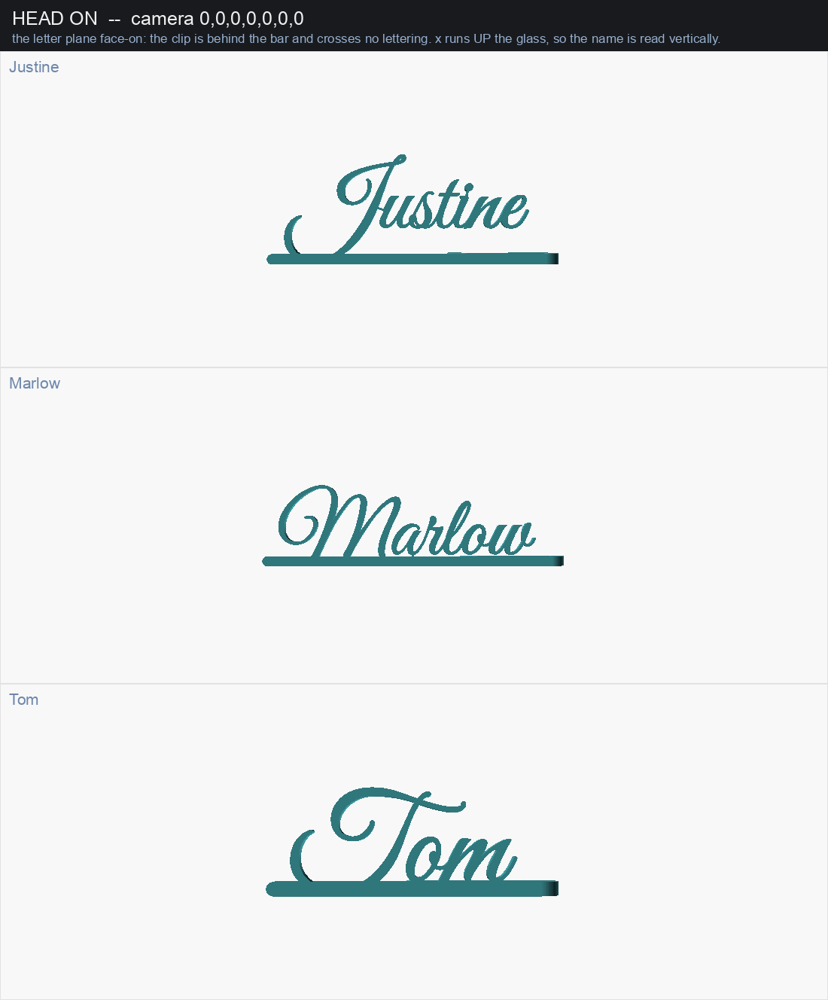
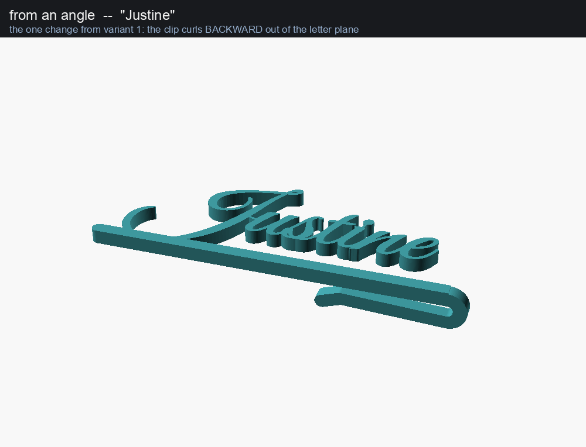
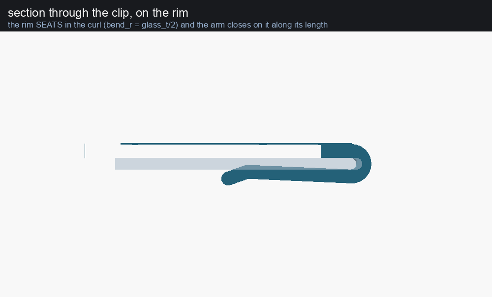
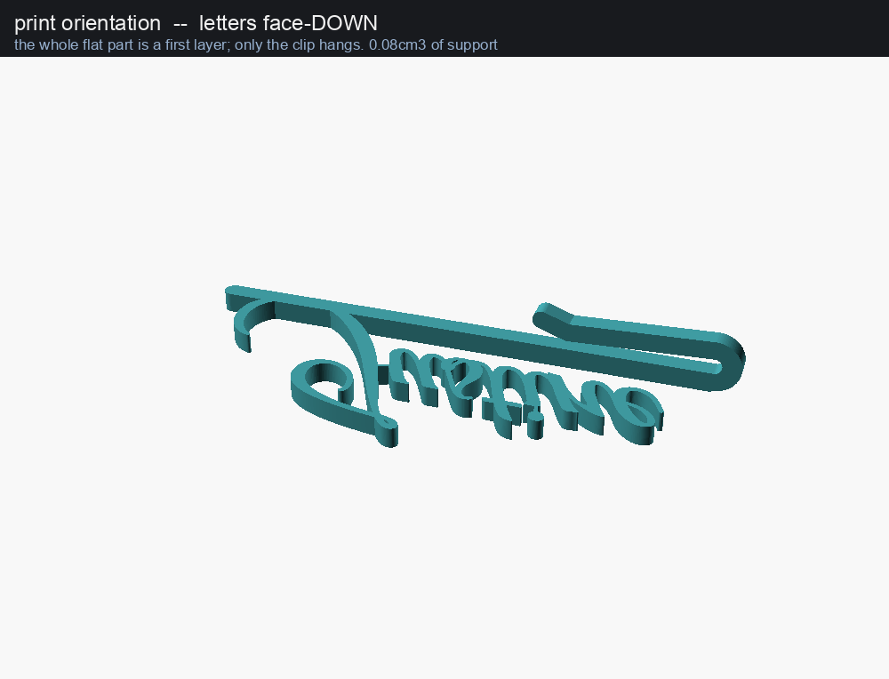

# glass-name-tag-back

A wedding place-setting tag that hangs on the **front** of a wine glass with
the name facing the room.

It is `../glass-name-tag` -- variant 1 -- with **the clip rotated 90 degrees
out of the letter plane**, and nothing else.



---

## The one change

Variant 1 sweeps its clip in the LETTER plane, so the tag hangs edge-on on the
side of the glass. This sweeps the same clip in XZ instead, so the letter plane
ends up parallel to the glass wall.

`nametag_back.scad` `include`s `../glass-name-tag/nametag.scad` and uses its
`body_2d()` and `clip_2d()` unchanged. The substantive line is:

```openscad
module clip3() {
    translate([0, cw, 0]) rotate([90, 0, 0]) linear_extrude(cw) clip_2d();
}
```

Including rather than forking is the point: it makes "only the clip's plane
changed" a fact about the file rather than a claim in a README, and variant 1's
fixes arrive here for free. The same goes for the Python: `measure.py` and
`bridges.py` are imported from that directory as modules. Because the 2D is
literally the same 2D, the struts bridges.py computes are already in this
model's coordinates.

```
   looking along Y -- the x-z section, the clip's own plane

                               ,--.       <- the curl, over the rim
     x = rim_x  --------------(  # )
                ==============###--'      <- the bar's end
        glass ->  ###########             <- the sprung arm, inside
        wall      -----------
                ##############=========   the bar and the letters,
                z<0        |  z>0         outside, at z = 0..thick
```

**x up the glass** -- the name runs along it and is read vertically, as in
variant 1. **y along the rim**, **z radial and out of the glass**. `z = 0` is
both the glass wall's outer face and the letter plane's back face; the wall is
`z = -glass_t .. 0` below the rim, and only the clip may cross it.

The clip is `bar_w` wide -- 2.4mm, the bar's own depth -- and sits in the bar's
own y band, so **head-on it hides behind the bar and crosses no lettering**.
That is a test, not an observation: `tests/empty_clip_hides_behind_the_bar.scad`.

| | |
|---|---|
|  |  |

## It needs supports: 0.08 cm3

Printed letters-down, the whole flat part is a first layer and rasterises with
**0.0 mm2** hanging. All 52.3 mm2 belongs to the clip, and mostly to the sprung
arm, which cantilevers off the curl with the jaw empty beneath it. The support
lands on 3 mm2 of bed and 48 mm2 of the part -- and printed letters-down, every
upward-facing surface is a **back** face, against the glass. The letters' own
faces are on the plate throughout and are never touched.

Letters-up costs 1.60 cm3 instead, twenty times as much, because it floats the
whole name in the air. The full five-orientation table, why reshaping the hook
cannot help, and what shortening the arm buys, are in [FINDINGS.md](FINDINGS.md).



## Build

```sh
make            # previews + one STL per name in names.txt
make renders    # just the PNGs. previews/head.png is the one to look at
make exports    # just the STLs, already rolled letters-down for the bed
make test       # the geometry tests
make falsify    # break the model on purpose, check the tests notice
make overhangs  # which way up does it print? five orientations, measured
make trade      # what the sprung arm costs, swept
make clean
```

`../glass-name-tag/` must be present -- this variant cannot be built without
it. `openscad` needs `--enable=textmetrics`; the scripts pass it. Python needs
`numpy`, `scipy` and `Pillow`. Great Vibes and Pacifico are Google fonts and
must be installed locally.

Editing `names.txt` re-measures and re-bridges through variant 1's caches,
which are keyed on a hash of variant 1's model -- a change to the layout moves
the letters and therefore moves the struts, and a strut that no longer reaches
its letter renders perfectly and prints as a loose dot.

## Parameters

Every parameter of variant 1 applies here unchanged -- `name`, `font`,
`txt_size`, `bold`, `style`, `bite`, `glass_t`, `preload`, `spring_len`,
`spine_w`, `thick`, the lot. This file adds two and changes one default:

| | default | what it decides |
|---|---|---|
| `clip_wide` | `bar_w` | how wide the clip is ALONG THE RIM. Variant 1's clip is `thick` wide in this direction; tying it to the bar is what keeps it hidden behind the bar head-on |
| `part` | `tag` | this file's output switch. `render_part` is spoken for -- it belongs to variant 1's model and is held at `"none"` so that model renders nothing of its own |
| `bold` | 0.15 | variant 1 defaults this to 0 because it is a knob there; here it is the shipping value. Great Vibes' hairlines measure 0.30mm at size 15, under one 0.4mm extrusion |

`part` values: `tag` (default) · `print` (rolled letters-down for the bed, what
`make exports` writes) · `body` (the flat part alone) · `clip` · `bite` (the
clip intersected with the wall: the grip, as a solid) · `section` · `onglass`.

## Tests

`make test` — 34 checks, the same three kinds as the rest of the repo:

- `assert_*.scad` — render must succeed; asserts on derived values.
- `empty_*.scad` — render must produce **no** geometry. `intersection(A,B)`
  empty means they miss; `difference(A,B)` empty means A is inside B.
- mesh checks — read off the exported STL over **all 33 names**: one connected
  body, nothing but the clip crossing `z=0`, the clip staying inside the bar's
  band, the clip never standing proud of the letters. Plus the grip as a
  measured interference and the print rasterised layer by layer.

Mesh checks compare against numbers read back **out of** the model
(`tests/echo.scad`), not constants typed into the test.

`make falsify` breaks the model eleven ways and checks each break is caught.
All eleven are.

## Status

**Nothing has been printed.** See the Open section of
[FINDINGS.md](FINDINGS.md).
