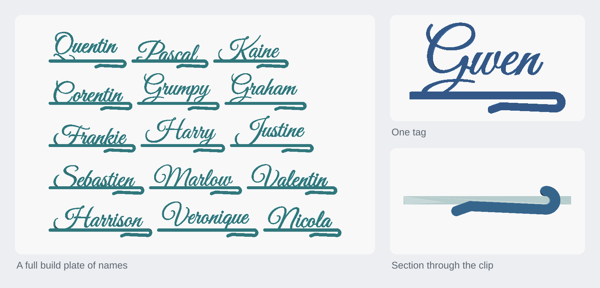
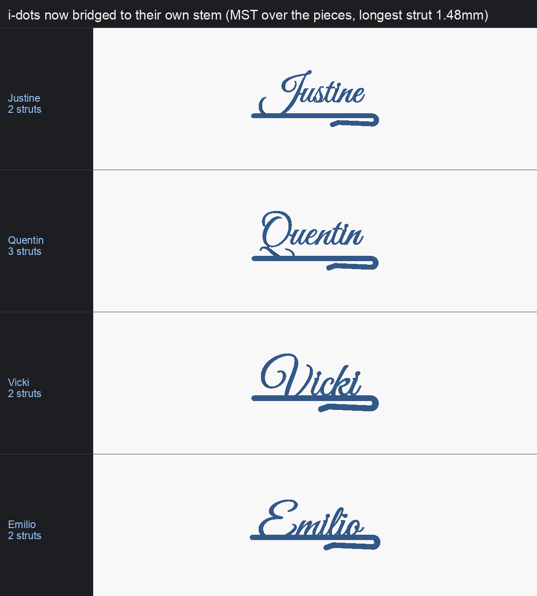
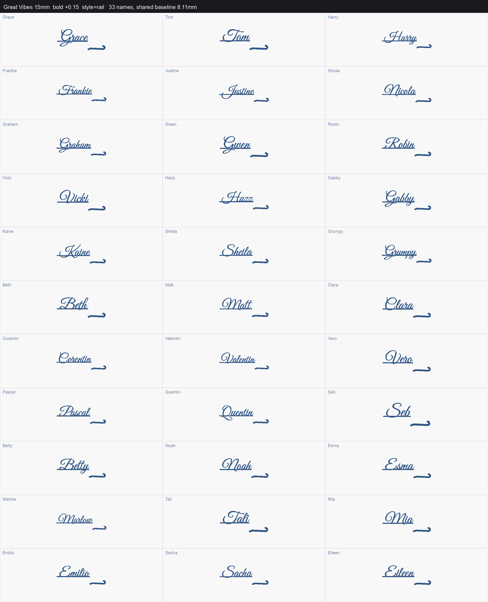
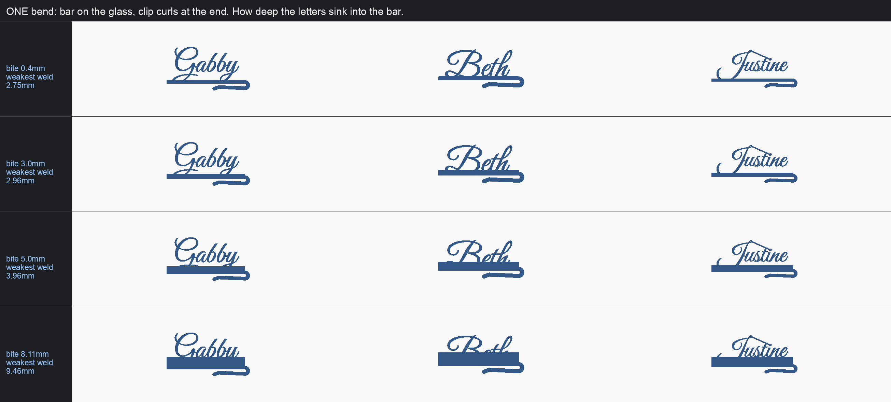
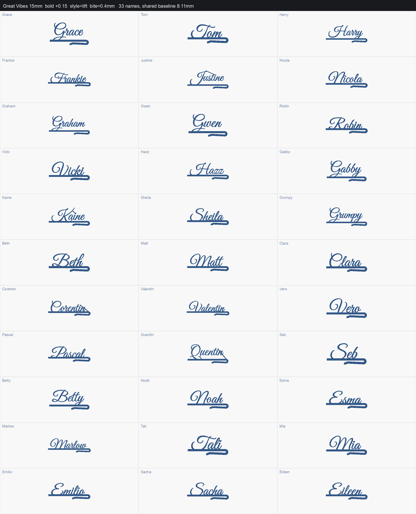
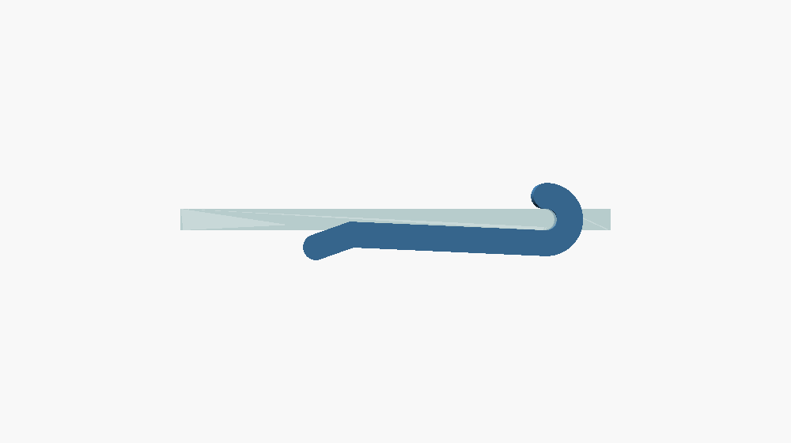
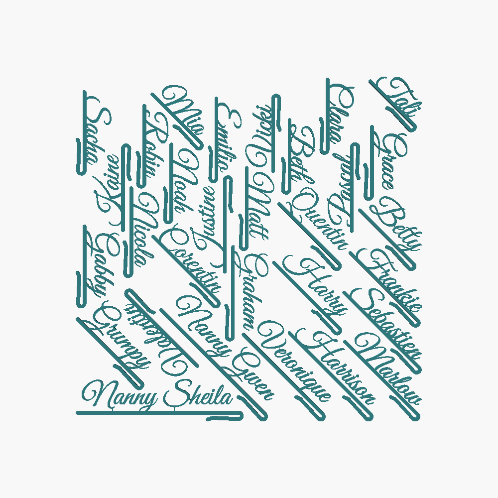

<h1 align="center">Glass name tag</h1>

<p align="center">A script name tag that clips over a wine glass rim, placed by measured ink so no letter prints loose or touches the glass.</p>

<p align="center"><a href="https://rainn.works/models/glass-name-tag/">Configure and order one</a> · <a href="../">All models</a></p>



Each guest's glass becomes their place setting. It was built for a wedding: 33
names on two build plates. The tag is a flat part that hangs edge-on on the
side of the glass. [glass-name-tag-back](../glass-name-tag-back/) is a second
variant of the same tag with the clip turned out of the letter plane, so the
name faces the room instead.

## Getting started

1. **Get the files.** `export/` holds this wedding's 33 names, ready to slice:

   | file | what it is |
   |---|---|
   | `plate1.3mf`, `plate2.3mf` | all 33 tags packed in rows, 15 and 18 per plate. What `make plates` writes |
   | `nest1.3mf`, `nest2.3mf` | the same 33 tags nested by outline with rotation, 30 and 3 per plate (`nest.py`) |
   | `nannies1.3mf` | a one-off plate of six tags |
   | `testplate.3mf` | the six hardest names in both variants side by side: this one on the left, [glass-name-tag-back](../glass-name-tag-back/) on the right |

   Each 3MF holds **one object per tag** (OpenSCAD lazy-union), so the slicer
   can move or delete single names rather than treating a plate as one lump.
   Every 3MF has a matching `.stl` and the `.scad` that composed it.

   For your own names, edit `names.txt` (one name per line) and run
   `make plates` (see [Build from source](#build-from-source)). Opening
   `nametag.scad` on its own in OpenSCAD also works, but see
   [Limits](#limits): without the Python measuring step it falls back to the
   font's metrics and leaves i-dots loose.

2. **Measure your glass rim** and print one tag before committing to a set.
   The parameters that matter:

   | parameter | default | what it does |
   |---|---|---|
   | `name` | `"Name"` | the name. The scripts pass each line of `names.txt` |
   | `font` | `"Great Vibes"` | any installed font. Great Vibes and Pacifico are Google fonts |
   | `txt_size` | 15 | text size, mm |
   | `bold` | 0.0 | fattens the strokes, mm. The scripts pass **0.15**, the shipping value (see [The font](#the-font)) |
   | `style` | `"lift"` | how the letters are carried: `lift`, `rail`, `window`, `solid`, `flush`. See [Styles](#styles) |
   | `bite` | 0.4 | how deep the letters sink into the bar for `lift`, mm. The strength against looks trade in one number |
   | `glass_gap` | 0.4 | clear air kept between the lowest ink and the glass face, mm |
   | `glass_t` | 2.0 | rim thickness of the glass, mm. Wine glasses run 1 to 2 mm |
   | `preload` | 0.8 | how far the jaw closes past the glass thickness: the grip, mm |
   | `spring_len` | 18 | length of the sprung arm inside the glass, mm |
   | `lip_len`, `lip_ang` | 3.5, 22 | the flared entry lip at the end of the arm, mm and degrees |
   | `spine_w` | 2.2 | the bar that lies against the glass, mm |
   | `bar_end_d` | 4.0 | rounding on the bar's far end, mm (capped at the bar's depth) |
   | `clip_margin` | 4 | gap between the end of the name and the bend, mm |
   | `thick` | 2.6 | print thickness, mm |

   The measured inputs, `ink_drop`, `ink_x0`, `ink_x1`, `set_drop` and
   `struts`, are filled in by the Python tools, not by hand.

3. **Slice it flat.** The whole part lives in XY and is extruded `thick` in Z,
   so the plane of the print is the plane of the tag, and the full footprint
   is on the bed. No supports and no brim. Tags sit 4 mm apart on the row
   plates and 2.5 mm apart on the nested ones, purely so they snip apart and a
   stray blob cannot bridge two.

4. **Clip it on.** The rim slides up the flared lip, seats in the curl, and
   the arm closes on the inside of the glass.

## How it works

`y = 0` is the plane of the glass wall. **Nothing but the clip may cross it**,
and that single constraint is what most of this project is about.

### Why this is not the obvious model

It solves the same everyday problem as a popular MakerWorld name tag, but it is
an original design written from scratch: none of that model's geometry or code
is used here. That model's reviews are full of the same two complaints: letters
that come out as loose pieces, and letters that stick out past the bar and stop
the tag sitting flat on the glass. Both come from **one** mistake, and it is
worth stating plainly because it is easy to repeat.

That model places the text with `valign="bottom"`, which aligns the font's
**declared descent line**. The font's metrics are not a bound on where the ink
goes. Measured, at 15 mm:

| | metric claims | Tom | Alice | Jenny | George |
|---|---|---|---|---|---|
| Great Vibes | 7.96 for *every* name | 1.98 | 1.33 | 7.96 | 7.83 |
| Pacifico | 9.48 for *every* name | 0.10 | 0.10 | 9.48 | 9.48 |

So the metric is exactly right for `Jenny`, whose `y` reaches the descent line,
and wrong by **9.4 mm** for `Alice` in Pacifico. A name with no descender is
left floating clear of the bar and prints as loose letters. Nudge it down to
fix that, which is what that model's users do by hand ("-3.0", "-5.5 to -7,
depending on the letter"), and now the deep descenders punch through the bar
into the glass. Measured on the original: at `txtYOffset=-3.0` the ink reaches
**y = -1.00**; at `-5.5`, **y = -3.50**.

They are the same bug from two ends, and no offset fixes both.

**So measure the ink instead.** `measure.py` renders each name's letters alone
through OpenSCAD and reads the extents off the exported mesh: the same text
shaper that renders the final part, so the number cannot drift from the
geometry. Placement is derived from that, never from `textmetrics`. For a set,
every tag shares one baseline height (`set_drop`, the deepest ink across the
list), so the set looks like a set. `lift` is the exception: it references each
name's own deepest ink, so the name rides at a slightly different height on
each tag.

### The parts of the solution

- **`measure.py`**: real ink extents per name, cached in `ink.json`.
- **`bridges.py`**: a script font's `i` and `j` dots are separate bodies;
  `Millie` exports as three. Printed flat, a loose dot is a 2 mm disc that
  prints beautifully and falls off. The cake-topper's morphological close does
  not work here: at 15 mm the gap under a Great Vibes i-dot is wider than the
  counters of `e` and `o`, so any radius that catches the dot fills the letters
  in. Each loose piece is bridged individually instead, with a strut
  (`strut_w`, 0.45 mm, one extrusion wide) across the measured shortest gap.
  Cached in `bridges.json`.
- **`weld.py`**: the cross-section holding each name onto its bar.
- **`plate.py`**: packs the set into rows on build plates.
- **`nest.py`**: packs the real outlines with rotation instead of bounding
  boxes.
- **`tags.py`**: exports every name as its own STL at each `bite` setting, and
  checks each file as it writes it: one body, and clear of the glass.
- **`grid.py`** and **`compare.py`**: the whole-set contact sheet, and the
  style and font comparison sheets.
- **`tests/`**: assert / empty / mesh checks, over a word list rather than one
  name, because every defect here is name-dependent.

Both caches are keyed on everything that can move the geometry, including a
hash of `nametag.scad`, so changing the font, size or model invalidates them on
their own. That key exists because of a real bug: the i-dot struts are stored
in tag coordinates, so moving the baseline left every cached strut pointing at
where its dot used to be. That renders perfectly and prints as loose dots.



Bridging is a minimum spanning tree over the pieces, using exact
point-to-segment distance. The first version bridged every island to the
largest piece, which sent the dot on `Justine`'s i straight past its own stem
and down to the bar 14 mm below. It also compared vertex sets rather than
points, and a straight bar has vertices only at its ends. Fixing both took the
longest strut from 14.44 mm to 1.48 mm, with none over 2 mm.

### Styles

`style` picks how the letters are carried. All of them were built and measured;
the losers are kept so the reasons stay visible.

| style | what happened |
|---|---|
| **`lift`** | thin bar at the glass face, name raised until its own deepest tail bites `bite` mm into it. Tails stay visible above a low bar. **The default now.** |
| `rail` | thin bar **on the baseline**, where script letters already join each other, with tails hanging below it in open air. Chosen first, then dropped (below) |
| `window` | `rail` plus a second bar at the glass face, closed at both ends. Strong, but names without tails get an empty rectangle |
| `solid` | bar from the glass face to the baseline. Strongest, but to catch a tail-less name like `Alice` it must reach within 1.3 mm of the baseline, which swallows `Jenny`'s `J` and `y` whole |
| `flush` | letters on a thin spine, anything past the glass face trimmed. Amputates descenders mid-bowl: with tails 8 mm deep and the trim at 1.8 mm it cuts about 6 mm off every one |

`rail` won first on `weld.py`, measured across all 33 names with the model as
it was then:

| | weakest weld | median | joints per name |
|---|---|---|---|
| `rail` | **9.66 mm** | 19.75 mm | 9 to 11 |
| `lift` | 2.15 mm | 3.99 mm | 1 |



But `rail` puts the bar up at the baseline, so the tag has to dive down to reach
the glass **and** then curl over the rim: two bends. The rail is flat and a
hook tangent to the glass is flat, and any curve joining two horizontal tangents
at different heights must reverse curvature, so the dive was forced into an S
that read as fighting the direction of the writing. A swept "swish" stroke with
`swish_rise` (lifting off the baseline before it dives, like a pen lifting into
a flourish) made it look deliberate, but did not remove it.

With the bar on the glass face there is no dive and no swish: one bend, a
single curl at the end. So `lift` became the default. Its weak weld was one
point on a curve nobody had drawn; `bite` makes the trade explicit, and it was
measured across all 33 names:

| `bite` | bar depth | weakest weld | tails |
|---|---|---|---|
| **0.4 mm** | 2.4 mm | 2.75 mm | fully clear |
| 3.0 mm | 3.4 mm | 2.96 mm | fully clear |
| 5.0 mm | 5.4 mm | 3.96 mm | starting to sink |
| 8.1 mm | 8.5 mm | 9.46 mm | swallowed (the same as `solid`) |

It is not monotonic below 3 mm: a different name's narrow stroke crosses the
bar's top edge at each height, which is why it had to be measured per setting.
The plates are exported at `bite = 0.4`. At the same time `thick` went from
2.0 to 2.6 mm: the weld cross-section scales linearly with thickness, so that is
30% more material at every joint for no change to the silhouette.





The bar's far end is rounded (`bar_end_d`). Every other terminal on the part is
round, the letter strokes and the clip's tip, so a square-cut bar end was the
one place the eye caught a machined edge on a drawn shape.

### The font

`Great Vibes` at 15 mm, thickened `bold = +0.15`. That is not decoration: the
narrowest strokes measure **0.30 mm**, below a single 0.4 mm extrusion, found by
eroding the letters until they broke into pieces. Pacifico needs no thickening
(it survived 0.40 mm of erosion intact, with 572 mm² of material against Great
Vibes' 262 mm²) and is the tougher choice if these ever get handled hard.

**A connected script would remove the bar entirely**, but no off-the-shelf one
is connected in the geometric sense. Measured over the name set: Great Vibes
leaves `Tom` in 2 pieces and `Gabby` in 4, with a median gap of **1.22 mm**
between them (its capitals stand clear of the lowercase by design), and 38 of
51 gaps are over 1 mm, so struts would be plainly visible. Pacifico, Snell
Roundhand, Savoye LET, Brush Script MT and Zapfino are all likewise unjoined.
Fattening and tightening the letter spacing barely moves it.

### The clip

Sized for a wine glass rim, `glass_t = 2.0 mm`.

The bend radius is **not** a free parameter. It was, at 2.4 mm, which put the
two legs of the U 4.8 mm apart for a 2 mm rim: the rim could never seat in the
curl, and the only thing that reached it was the angled tip of the arm.
Measured by intersecting the clip with the glass wall, that version touched
over **2.6 mm**, a point. It was a hook, not a clip.

So the curl is a rim wide (`bend_r = glass_t/2`), the rim seats right into it,
and the arm then runs nearly straight, closing from `glass_t` at the curl to
`glass_t - preload` at its end. That 0.8 mm of interference is the grip, and
spreading it along the arm is the whole point:

| | contact length | interference |
|---|---|---|
| curl at 2.4 mm radius | 2.6 mm | 9.7 mm³ |
| curl at rim width | **24.0 mm** | 27.3 mm³ |

`clip_rad` can still override the derived radius, for experiments only. The
last of the arm flares back out (`lip_len`, `lip_ang`) so the rim slides up it
instead of catching on a square end.

`tests/assert_clip_grips.scad` checks the curl is about a rim wide in both
directions, that the arm converges gently enough to clamp rather than claw, and
that the lip flares past the arm. `tests/run.py` measures the contact length
off the mesh and fails below 10 mm.



### Packing the plates

The tags are long thin strips of very different lengths, so a fixed grid wastes
most of the plate. `plate.py` packs rows first-fit decreasing across all open
rows, then tries 4000 seeded random restarts, because first-fit and best-fit
both stalled one row short of the plate count the set's total length allows
(measured on an earlier version of the list, two plates needed 94.5% of every
row filled). Seeded, so the same names always give the same plates. The rows
are then spread **evenly** over the plates: total print time is the same
whatever the plate count, so the only cost of an extra plate is the swap, and a
plate holding one tag pays that for nothing. `plate.py` also wipes old
`export/plate*` files first, because a stale `plate3.3mf` from an earlier run is
indistinguishable from a real plate at the slicer.

`nest.py` packs the actual outlines instead. A script name is mostly air, and
two tags turned 180 degrees interlock: the ascenders of one sit in the gaps
above the bar of the next, which a rectangle packer cannot see. It rasterises
each footprint, dilates the occupied area by the clearance, and FFT-correlates
each candidate at eight rotations (every 45 degrees) against it to find every
legal offset at once, then re-checks the finished layout against the raw
outlines.



### Relationship to glass-name-tag-back

[glass-name-tag-back](../glass-name-tag-back/) is variant 2. Its
`nametag_back.scad` `include`s this folder's `nametag.scad` and uses its
`body_2d()` and `clip_2d()` unchanged, sweeping the clip in a different plane.
Its Python imports this folder's `measure.py`, `bridges.py` and `plate.py`, and
reads this folder's `names.txt`. So a change here changes that variant too, and
this folder must be present to build it. Going the other way, `testplate.py`
here lays out that variant's exported STLs next to this one's.

## Limits

- **The grip has not been checked on a real glass.** `glass_t = 2.0` came from
  an estimate of the rim, not calipers on the actual wedding glasses. Measure
  your rim and print one tag (or `testplate.3mf`) before printing a set.
- **The exports are one wedding's guest list.** For other names, edit
  `names.txt` and rebuild; the files in `export/` will not help.
- **`nametag.scad` on its own is the unsafe path.** Without `measure.py` the
  placement falls back to the font's declared descent, which is not a bound on
  the ink, and the model echoes a warning saying so. Without `bridges.py`,
  `struts` is empty and i and j dots print as loose discs.
- **`style="rail"` no longer builds a complete tag.** Its bar and clip are
  drawn by a `swish_2d()` module that was removed when `lift` replaced it, and
  `nametag.scad` still calls it. `rail` remains in the style list and in
  `tests/run.py`'s styles.
- **Only Great Vibes at 15 mm has been worked through.** Other fonts and sizes
  are re-measured automatically, but the weld and stroke numbers above are for
  that setting.
- **Every tag must fit the bed.** `plate.py` stops if one name is wider than
  the 240 mm usable width (256 mm bed, 8 mm margin).

## Build from source

Needs OpenSCAD (a 2026 build was used here) with `--enable=textmetrics`, which
the Makefile and scripts pass, and Python 3 with `numpy` and `pillow`
(`nest.py` also needs `scipy`). Great Vibes (and Pacifico, for the comparisons)
must be installed as system fonts.

```sh
make              # the contact sheet + the build plates
make plates       # just export/plate*.3mf (+ .stl, .scad): the things you slice
make tags         # every name as its own STL, at bite 0.4 and 3.0, into export/bite*/
make grid         # the all-names contact sheet
make renders      # the style and font comparison sheets
make test         # geometry tests: placement, grip, one piece, glass clearance
make measure      # what each name's ink actually does against what the font claims
make weld         # how much material holds each name onto its bar
make one N=Grace  # a single tag's preview, previews/Grace.png
make clean        # remove previews/, export/ and both caches
```

`nest.py` and `testplate.py` are not in the Makefile. Run `make tags` first,
then `python3 nest.py` (or `NAMES="A,B,C" PREFIX=name python3 nest.py` for a
one-off plate). `testplate.py` also needs
[glass-name-tag-back](../glass-name-tag-back/)'s exports.

Notes:

- `make clean` deletes `previews/` and `export/`, which are committed.
- `make one` writes only a PNG, although the Makefile's usage line says
  "preview + STL".
- `make open` opens `previews/all_lift_bite3.0.png` with macOS `open`, but
  `make grid` writes `all_lift.png`, so it has nothing to open unless you ran
  `BITE=3.0 python3 grid.py` first.
- `make measure` passes `names.txt` as space-separated words, so a two-word
  name such as `Nanny Gwen` is measured as two names. `make plates` reads the
  file line by line and is not affected.
- `export/bite*/` and `export/tags/` are git-ignored. The committed plate 3MFs
  are self-contained, but their `.scad` files import from those folders, so
  run `make tags` / `make plates` before re-rendering them.
- Command lines are built as Python lists rather than shell strings: a shell
  loop passing several OpenSCAD flags in one unquoted variable under zsh once
  silently produced no output at all.

## Licence

[CC BY-NC-SA 4.0](../LICENSE). Free to print, remix and share with credit, not for profit. Selling prints or remixes needs a partnership with RainnWorks: [support@rainn.works](mailto:support@rainn.works?subject=Selling%20RainnWorks%20models).
