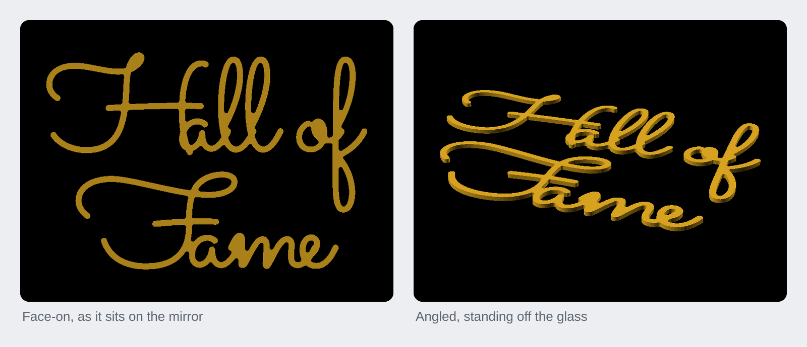

<h1 align="center">Hall of Fame</h1>

<p align="center">A 300 mm "Hall of Fame" script sign for a mirror, printed as three flat words and placed with a 1:1 paper template.</p>

<p align="center"><a href="https://rainn.works/models/hall-of-fame/">Configure and order one</a> · <a href="../">All models</a></p>



Two nested rows in a thin monoline script matched to a reference photo. The
sign is **300 x 212 mm** overall. It prints as **three pieces**, `Hall`, `of`
and `Fame`, because 300 mm does not fit on a 256 mm bed and because a break
between words is invisible once they are back in place.

## Getting started

1. **Get the files.** `export/` holds the three words ready to print, as STL
   and 3MF, and the placement template:

   | piece | size | on the plate |
   |---|---|---|
   | `hall` | 230.8 x 100.2 x 4 mm | flat |
   | `of` | 69.2 x 152.2 x 4 mm | flat |
   | `fame` | 255.8 x 95.6 x 4 mm | **turn it about 32°**: 194 x 194 mm rotated |

   `template-a4.pdf` is the artwork at 1:1 across four A4 landscape sheets
   (`template.svg` is the same artwork as one SVG in millimetres). To change
   the words or size, open `HallOfFame.scad` in OpenSCAD with textmetrics
   enabled, or rebuild with `make` (see [Build from source](#build-from-source)).

2. **Set the parameters that matter.** Everything is in `HallOfFame.scad`:

   | parameter | default | what it does |
   |---|---|---|
   | `Row1`, `Row2`, `Row3` | `"Hall of"`, `"Fame"`, `""` | the rows. Words split on spaces, one piece per word; an empty row is dropped |
   | `Row*_Scale` | 1.0 | make a row bigger or smaller than the others |
   | `Row*_Nudge` | 0 | slide a row sideways, as a fraction of the total width |
   | `Total_Width` | 300 | the whole composition, mm, not one row |
   | `Row_Gap` | -40 | mm between one row's lowest ink and the next row's highest. Negative nests them; -40 leaves 20 mm of real clearance |
   | `Font` | `"Sacramento"` | `Sacramento` (the match), `Yellowtail`, `Allura`, `Parisienne`, `Great Vibes` |
   | `Spacing` | 0.85 | letter spacing, not 1.0; see [How it works](#how-it-works) |
   | `Boldness` | 0.6 | grows every stroke by this all round, mm |
   | `Connect` | 2.0 | fuses strokes that pass close, without fattening them, mm |
   | `Thickness` | 4 | standoff from the glass, mm |

   After any change, run `make check`. If you change the words, also update
   `WORDS := 0:hall 1:of 2:fame` in the Makefile to match the new pieces in
   reading order.

3. **Slice.**
   - Flat on the bed, letters face **up**, no supports. The back face goes
     against the glass, so it wants to be the smooth bed side.
   - 4 mm thick; 100% infill is fine at this size (it is nearly all perimeter
     anyway), or 4 walls, 6 top and bottom layers and 15% infill.
   - `fame` needs turning about 32° on the plate. The slicer's auto-arrange
     finds this on its own; `make check` just confirms there is an angle that
     works.
   - Gold PLA on a smooth PEI sheet gets closest to the reference photo. Silk
     gold reads brighter on glass.

4. **Stick it on the mirror.** Print `export/template-a4.pdf` at 100% /
   "actual size", never "fit to page". Every sheet has a 100 mm ruler on it:
   measure it before you trust anything.
   1. Overlap the sheets on the red trim lines and tape them into one sheet.
   2. Tape it to the mirror. Level it using the grey centre cross and outer
      box, not the paper edge.
   3. Lay each printed word over its outline. Run a strip of masking tape
      across the top of it as a hinge, so it can flip up and come back to the
      same spot.
   4. Flip the word up, pull the template out, put the adhesive on, flip it
      back down and press.
   5. Thin double-sided foam squares hold well and come off glass cleanly;
      solvent-free mirror adhesive is the permanent option.

## How it works

The sizing runs backwards from the width. Every row is measured with
`textmetrics` at a reference size, the row that needs the most space (its width
times its `Row*_Scale`) is stretched to `Total_Width`, and every other row
follows at the same font size. So the sign is exactly 300 mm across whatever
you type.

Rows are then stacked by their **ink** extents, not nominal line height:
`Row_Gap` is a real millimetre gap between the lowest descender above and the
highest ascender below. Measured on the rows' full extents that is pessimistic,
because the `of` descender and the `F` ascender are at opposite ends of the
sign, so a negative value nests the rows properly. At -40 the closest actual
approach is 20 mm.

Each word is its own printed piece, dropped to the origin and laid flat
(`render_part="word"` with `piece_index`). The same 2D artwork, in place,
exports as the SVG that `template.py` tiles onto A4 with an overlap strip to
tape along, trim lines, a centre cross and a 100 mm ruler on every sheet.

### Two load-bearing settings

- **`Spacing = 0.85`.** Sacramento's capitals do not reach the letter after
  them. At the font's own spacing there is a 10 mm gap, and `Hall` and `Fame`
  each come off the bed as two loose bits. Tightening to 0.85 pulls the H and
  F crossbars through the following letter, which is how the script wants to
  be set anyway, and matches the reference photo.
- **`Connect = 2.0`.** Even joined, the crossbars only graze. `Connect`
  dilates then erodes, which fuses anything passing within about twice its
  value without fattening the strokes. At 0 the narrowest neck is 1.6 mm and
  one word still splits; at 2.0 it is a solid 5.0 mm.

The narrowest stroke is **5.0 mm**, about 12 lines wide on a 0.4 mm nozzle.
Nothing here is fragile.

### make check measures rather than assumes

`check.py` answers two questions the slicer will not answer until it is too
late. It splits each exported mesh into separate bodies, so a word whose
letters only look joined is caught. And it finds the narrowest stroke by
eroding the 2D artwork until a shape snaps in two or vanishes; the radius at
which that happens is half the narrowest stroke. It also spins each word's
outline to find an angle that fits a 256 mm bed with a 4 mm margin, which is how
`fame` (255.8 mm flat) turns out to fit at about 32°.

### Fonts

`fonts/` holds Sacramento, Yellowtail, Allura and Parisienne (SIL Open Font
License, licences alongside). Sacramento is the closest to the reference: a
thin monoline with the same slant. The others are heavier and have more
thick/thin contrast, and each needs its own `Spacing` to hold together:
`Yellowtail` and `Parisienne` join at 0.85, `Great Vibes` at its own 1.0.

## Limits

- **Allura is not usable as set.** It still comes apart at `Spacing = 0.70`,
  where the letters are already piling into each other, so it needs a bigger
  `Connect`.
- **Great Vibes is not vendored.** It is in the `Font` list, but `fonts/` holds
  only the other four, so it must be installed on the machine.
- **The bed is 256 mm.** At the default width `fame` fits only turned about
  32°. A wider sign or longer words may not fit at all; `make check` reports
  whether each piece fits, flat or turned.
- **The Makefile does not follow the text.** Change the rows and you must edit
  `WORDS` in the Makefile by hand, or the exports will be named and numbered
  for the old pieces.
- **The template is only as accurate as the printer.** Check the 100 mm ruler
  on each sheet before placing anything.

## Build from source

Needs OpenSCAD (a 2026 build was used here) with textmetrics, which the
Makefile enables, and Python 3 with `numpy`, `scipy`, `trimesh` and `pillow`.

```sh
make            # everything: previews + per-word STL/3MF + the paper template
make renders    # just the PNG previews
make exports    # just the per-word STL/3MF
make template   # just export/template.svg + export/template-a4.pdf
make check      # is every word one solid piece, how thin, does it fit the bed
make open       # render + open the layout preview (macOS)
make clean      # remove previews/ and export/
```

Notes:

- The fonts are vendored in `fonts/` and the Makefile points
  `OPENSCAD_FONT_PATH` at them, so the four vendored fonts build the same
  anywhere.
- `--enable textmetrics` is required: the model measures the text to work
  backwards from the 300 mm width, and will not run without it.
- `render_part` values: `layout` (the composition, as it goes on the mirror;
  the default), `template` (2D only, for the SVG), `word` (one piece, chosen by
  `piece_index`), `pieces` (every piece, spread out).
- `make clean` deletes `previews/` and `export/`, which are committed.

## Licence

[CC BY-NC-SA 4.0](../LICENSE). Free to print, remix and share with credit, not for profit. Selling prints or remixes needs a partnership with RainnWorks: [support@rainn.works](mailto:support@rainn.works?subject=Selling%20RainnWorks%20models).
