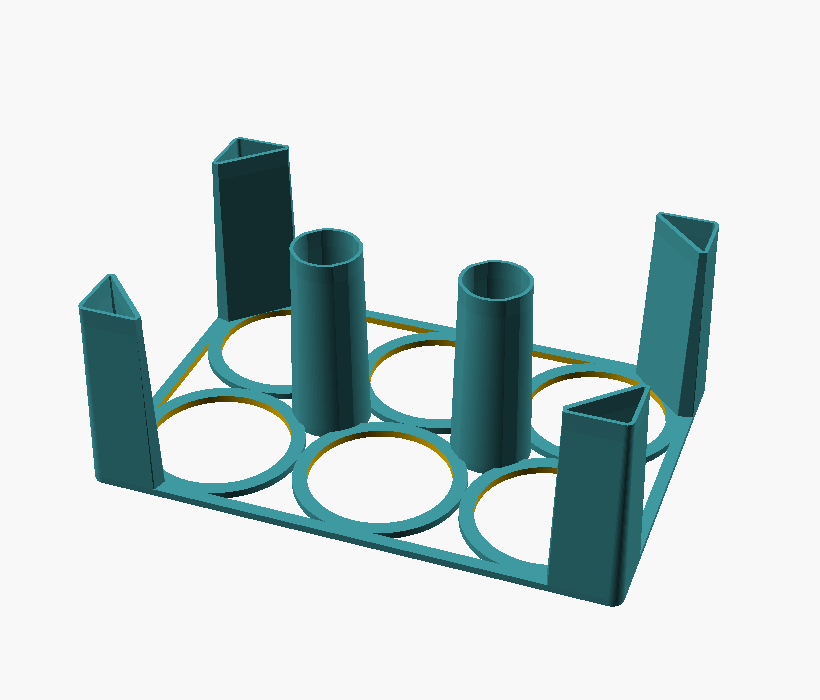
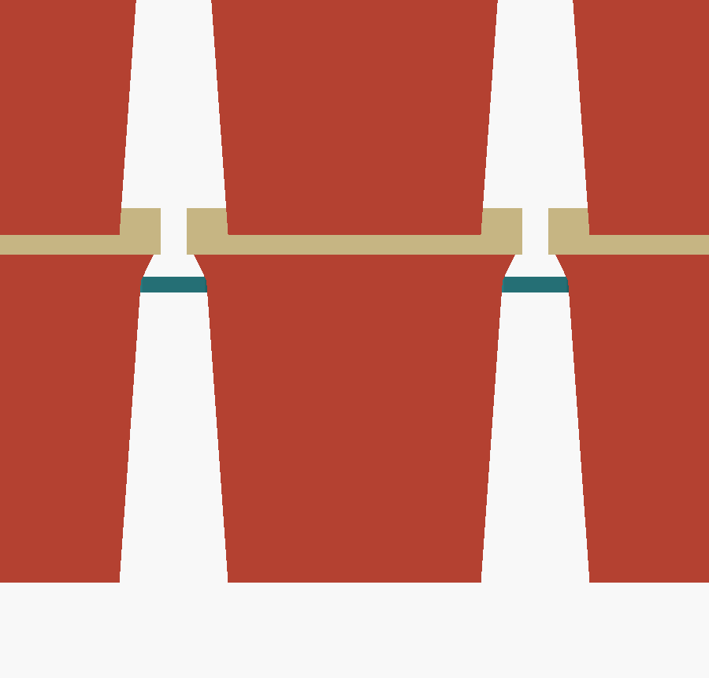
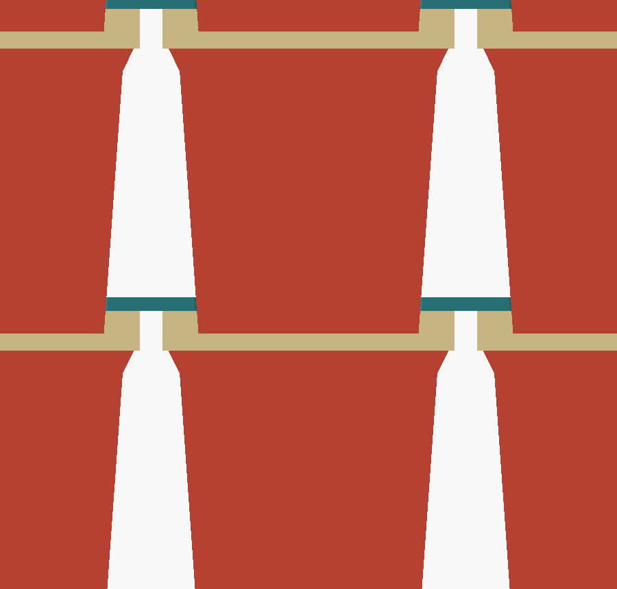
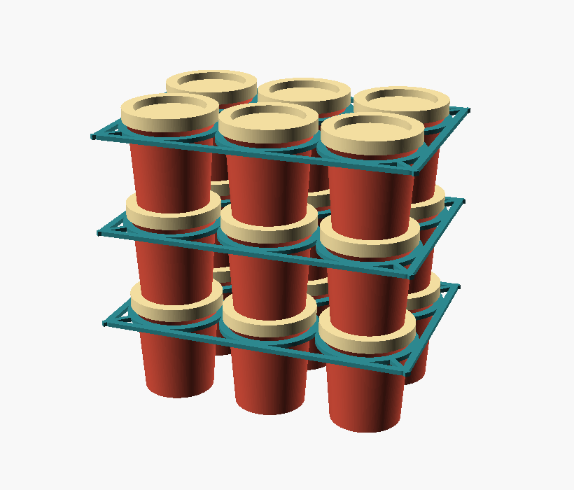
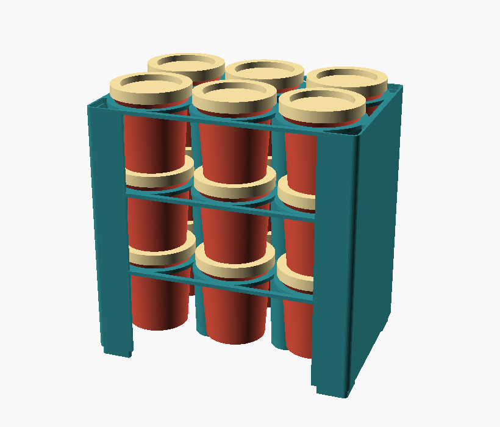
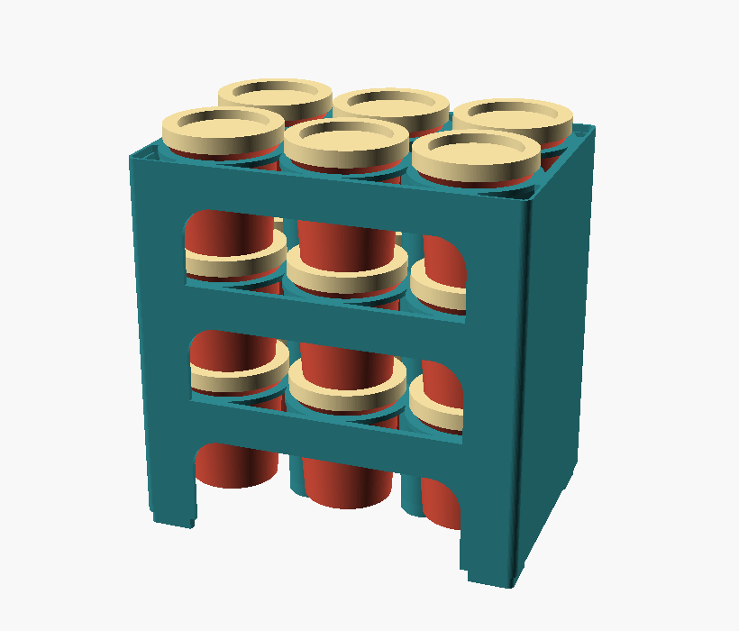

# Play-Doh pot organiser

A **stackable tray** for Play-Doh pots, built around the two features the pots
already have: the **recess in every lid** that the next pot's base nests into,
and the **lip** that the body flares out to at the top — Ø49.1 over a Ø45.2 body.

Each cell is a **Ø45.8 hole**: it clears the body, and the lip catches on it. So
every pot hangs by its own lip, and you can pick a loaded tray straight up. At
the same time the pot still nests 4mm into the lid below, exactly as it would
with no tray present, so the tray costs **zero height**.

It deliberately does **not** hang on the lid. That's soft press-on plastic and
85 g on it indefinitely would work it loose — and a lidless pot would drop
straight through. The lip is part of the pot: it gives **1.65mm of ledge**
against 0.75mm on the lid rim, and a pot stays put with its lid off.

**Legs** reach down to the tray below — or to the table — so an empty
tray stands up on its own and you can load it on a worktop. A leg isn't a post
bolted to the corner: it **is** the corner, hollowed out — bounded by the deck's
own edge outside and the cell rings inside, so it wraps around the pots, fills
space that was dead anyway, and never stands proud of the outline. It tapers in
towards the foot, which sheds material and gives the joint a lead-in.

Each leg is **one unbroken taper** from its full section at the plate down to a
straight **10mm plug**, which drops through the plate below and into the bore of
that tray's own leg — so stacked trays slot together and can't slide. There's no
shoulder, no blend, and no zone that tapers faster than another, so there's
nothing on it to read as an edge.

There are legs at the corners and one wherever four cells meet — the inner ones
are what stop a loaded tray bowing, since the corner legs only stiffen the ends.

One part, **60 g**. Print one per layer of pots.



## How a joint works


The teal band is the plate, sitting under the pot's lip where the body flares
out. The pale band above it is the lid, entirely clear of the plate — 3.4mm of
air between them, so you can take a lid off without disturbing anything.

Two supports in parallel, at the same height: the pot rests on the pot below
(nested 4mm in its lid recess), and its lip rests on the plate. Whichever takes
the load, the pot can't fall — and lifting the tray brings the lot with it.

The catch is **1.65mm of lip**, all the way round.

## `cell_style` — three ways to hold a pot

| | `hang` (default) | `nest` | `cup` |
|---|---|---|---|
| How a pot is held | hangs by its own lip | passes through, sits in the lid below | an 8mm collar cradles its base |
| **Retains the pot?** | **yes** | no | no |
| PLA, plate alone | **20 g** | 27 g | 71 g |
| PLA with legs | **48 g** | 55 g | 99 g |
| Height per layer | **53.1mm** (the pots' own) | 53.1mm | 59.5mm |
| Needs a pot below | no | yes | no |

<table>
<tr><td><br><b>hang</b> — lid rim on the plate</td>
    <td><br><b>nest</b> — spacer only</td>
    <td><br><b>cup</b> — collar cradles the base</td></tr>
</table>

`hang` is both the lightest **and** the only one that retains pots. It's the
default.

`nest` is a pure spacer: nothing holds a pot down, in any layer, so the tower
comes apart if you lift or tip it. Kept because it grips the pot low down where
there's plenty of material, and it doesn't care about the lid at all.

`cup` re-creates a guide the pot below already provides, and covers up the recess
it would have nested into — paying twice, in filament and height. Kept as the
fallback for pots with no usable lid recess.

A 3-layer, 6-pot tower: **166mm** with `hang` on legs, 166mm with `nest`, 193mm
with `cup`.

### The caveat on `hang`

It lives in the step between the base of the lip (45.2) and the lip itself
(49.1), so it depends on those two being measured right — **worth printing a
single tray to check before committing to a stack**. Three asserts guard the
ledge width, the lip standing proud enough to catch on, and the plate seating
below the lid skirt, but they can only catch values that are obviously wrong.

`lip_h` (how tall the lip is, default 4mm) is estimated rather than measured. It
only moves how far up the pot the plate ends up, and the layer pitch comes from
the pots nesting rather than from the plate, so getting it wrong costs nothing
structural.

## `stack_style` — what carries the tray above

With `hang` cells (PLA per tray):

| | PLA/tray | What holds the tray up | Trade |
|---|---|---|---|
| **`posts`** (default) | **60 g** | four corner legs, down to the tray below | Stands up empty, so you can load it on a table |
| `pots` | 20 g | nothing — the pots do | Lightest, but only stands up once full |
| `rails` | 82 g | solid end walls, bookend style | Stiff, front and back open |
| `walls` | 106 g | full perimeter + scooped front | Most protective, heaviest |

A leg only ever carries about **4 N**, and the wrapped section is enormously
stiff, so they're sized by what prints well rather than by strength: `leg_t` is
1.2mm, exactly three perimeters on a 0.4 nozzle.

`leg_sweep` (60°) sets how far the leg wraps around its corner cell. It's
bounded by a **sector centred on the ring**, not by a box or a disc on the deck
corner — that's what keeps the leg's inner edge *on* the ring for its whole
length. A disc centred on the corner only reaches the ring within ±20° of the
diagonal and leaves a lens of empty space either side; a square box is worse
still, spearing a 1.5mm lobe inward past where the ring reaches. The outline is
then morphologically **opened** at `leg_min` (0.8mm) so its ends run to a point
where they meet the ring instead of stopping square.

The taper can never exceed one wall plus the fit (~1.55mm) — any more and the
plug wouldn't fit the bore below — so over a 56mm leg it works out at **1.6°**.

Because there's no shoulder, `leg_seat` (0.15mm) is what the leg lands on: the
plate's hole is that much smaller than the plug, and the leg slides down until
its taper has grown back to match. At 1.6° a little radial buys a lot of axial —
0.15mm puts the seat 5.4mm above the plug — so `leg_seat` also sets how far the
leg protrudes and how long it has to be. **This makes the seat a taper fit, so
the exact engagement depth moves by a few mm with print tolerance.** It doesn't
affect the tower: the pots set the layer pitch, and the legs are a backstop for
part-empty layers and a stand for an empty tray.

`leg_overlap` (1.2mm, one wall) is how far the leg runs into the rings. It puts
the leg's inner wall **on** the ring rather than beside it. At 0 the two sit side
by side and their widths add — 4.7 + 1.2mm — giving a visibly fat edge on the
ring side and none on the frame side.

`leg_plug` (6mm) is the straight section on the end: 2.4mm of it passes through
the plate below, the rest engages that tray's leg, tightening as it goes in.
Counting the taper above the seat, about 9mm is inside the leg below.

`inner_legs` puts a leg wherever four cells meet — `(cols-1) × (rows-1)` of them,
so two on a 3 × 2. **A first print bowed noticeably when carried loaded**, which
is what these are for: a 56mm-deep column bonded to the middle of the plate is a
very deep rib exactly where it sags, and it also carries the tray above at
mid-span rather than only at its corners. Costs 12 g on a 3 × 2.

`inner_r` (13mm) has a floor: an inner leg must reach the rings around it or it
is an island in the middle of the deck joined to nothing. On the default pot
that's 11.4mm to touch them and 12.6mm for its wall to sit *on* one, the way the
corner legs do. `deck_t` is the other lever if it still flexes — 2.4 → 3.0 halves
the bow for about 5 g.

The **bottom** tray stands on its plugs, so the tower has about 10mm of ground
clearance under it. Harmless, and it keeps the pots off a wet worktop.

<table>
<tr><td><br><b>posts</b> — 39 g</td>
    <td><br><b>pots</b> — 20 g</td></tr>
<tr><td><br><b>rails</b> — 74 g</td>
    <td><br><b>walls</b> — 100 g</td></tr>
</table>

`make weigh` re-runs that table for your own layout and settings.

## What to print

**One part. Print one tray per layer of pots.**

No separate base or lid, and with `hang` no cap either — every plate is
referenced to its own layer's lids, so they're all identical and there's no
special case at the bottom or the top.

A 3-high, 6-pot tower is **3 trays = 180 g**, standing 181mm.

`bottom_tray = true` lengthens the posts by 4mm for the bottom tray. It only
applies to `nest` cells, where the bottom layer's pots stand on the table instead
of dropping into a lid. `hang` has no such asymmetry — every tray is identical.

## Print (single colour, supports OFF)

**Plate down, legs standing up** — nothing to bridge, no supports. A 3 × 2 tray
is 174 × 118 × 53mm.

**Turn it over to use it.** In use the plate sits at the top of its layer, just
under the lids, with the legs reaching down. The plate is symmetric, so the flip
only changes which way the legs point — but it does mean the part comes off the
bed "upside down".

`cup` trays are the exception: their collars and frusta mean they print and are
used the same way up.

## Measure these on your pots

| Param | Default | Meaning |
|---|---|---|
| `pot_h` | 57.1 | total height, lid on, bottom to top of lid |
| `pot_base_d` | 38.6 | flat bottom diameter |
| `pot_shoulder_d` | 45.2 | where the taper stops, at the base of the lip |
| `pot_lip_d` | 49.1 | the lip at the top of the body |
| `pot_lid_d` | 51.2 | over the lid — the widest point, sets the cell pitch |
| `lid_h` | 7 | height of the lid itself |
| `lid_recess_h` | 4 | depth of the recess in the lid top — how pots stack |
| `lid_recess_d` | 38.6 | diameter of that recess |

Layout is `cols` × `rows`, plus `pot_gap` and `edge`. Fit is `pot_clear` and
`recess_clear`.

**`pot_lip_d` and `pot_lid_d` are what `hang` stands on** — the cell hole goes
between them, and there's only ~1mm of lid wall to work with. Worth re-checking
with calipers before printing a stack. `lid_recess_d` is taken on trust (assumed
equal to `pot_base_d`, since that's what the pots nest on) and only matters to
`nest` and `cup`.

`cup` also assumes the **lid top is roughly flat** outside the recess, since its
plate bears on the rim. `hang` doesn't care — it catches the lid's outer edge.

## Uploading to MakerWorld

The `.scad` uploads straight into MakerWorld's parametric maker. Parameters are
grouped so the two that matter come first and nothing else is in the way:

| Group | What's in it |
|---|---|
| **Layout** | `cols` × `rows` — usually the only thing to change |
| **Pot size** | a preset; pick Custom to enter your own measurements |
| **Options** | how pots are held, what holds the tray up, plate style |
| *Advanced —* | pot dimensions, tray, legs, fit, cup cells |

Everything past `/* [Hidden] */` is internal and doesn't appear — including
`render_part`, deliberately. PMM takes the build plate from `mw_plate_1()` and
the preview from `mw_assembly_view()` (the assembly is excluded from the exported
3MF), so leaving `render_part` on show would let someone put a *preview* on the
plate. It's still settable from the command line, which is what the Makefile
drives.

Those two module names come from community documentation of PMM rather than an
official spec, so check the plate in MakerLab's own preview before publishing.

`pot_preset` carries one entry — a real Play-Doh pot, measured. There are
deliberately no presets for sizes nobody has put a caliper on; adding one means
measuring a pot and adding a row to `POT_PLAYDOH`'s table plus an entry in the
dropdown. Custom pre-fills with the measured figures so you can adjust one number
rather than start from nothing.

Bounds that only need limiting (`open_d`, `cup_h`, `head_clear`) are **clamped**
rather than asserted, since in a customizer an assert reads as a broken model
rather than as a hint. Two asserts remain, for combinations that can't make a
working part at all — a pot with no lip to hang on, and a lid recess too shallow
for cup cells — and each names the style to use instead. Verified against 36
grid/style combinations plus pots from a 28mm lid to a 90mm one.

**Driving it from the command line:** the pot dimensions are now derived from the
preset, so `-D pot_h=60` no longer does anything. Use
`-D pot_preset='"custom"' -D custom_pot_h=60`.

## Build

```sh
make            # previews + STL/3MF exports
make renders    # just previews
make exports    # just STL + 3MF
make styles     # the four stack_style comparison previews
make weigh      # material volume of every variant, for comparing filament
make tray       # the main part: preview + STL + 3MF
make clean
```

Previews are forced to full (`--render`) geometry — the grid of cells overflows
OpenSCAD's fast preview CSG, which would export a blank image.
