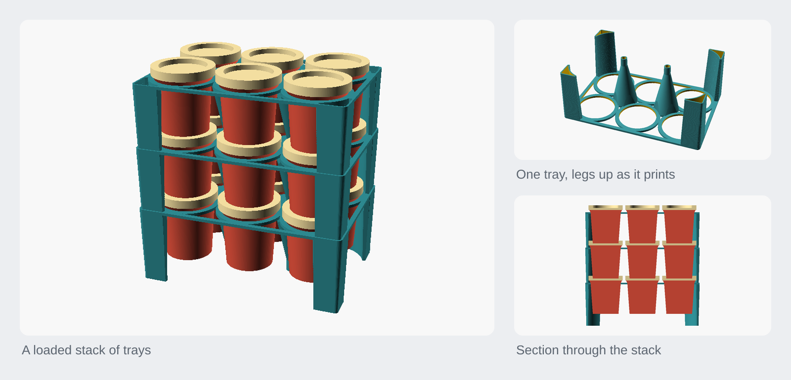

<h1 align="center">Play-Doh pot organiser</h1>

<p align="center">A stackable tray that hangs each Play-Doh pot by its own lip, so a loaded tower lifts as one and costs no extra height.</p>

<p align="center"><a href="https://rainn.works/models/playdoh-organiser/">Configure and order one</a> · <a href="../">All models</a></p>



## Getting started

1. **Get the file.** `export/tray.3mf` is the default tray: 3 × 2 pots, sized for a real Play-Doh pot, with corner and inner legs. `export/tray.stl` is the same part, but 62 MB against the 3MF's 3 MB. To change it, open `organiser.scad` in OpenSCAD or in MakerWorld's parametric maker (see [On MakerWorld](#on-makerworld)).
2. **Set the layout.** Usually this is the only thing to change.

   | Parameter | Default | What it does |
   |---|---|---|
   | `cols` | 3 | Pots across, left to right (1 to 8) |
   | `rows` | 2 | Pots deep, front to back (1 to 8) |
   | `pot_preset` | `playdoh` | The pot it is sized for. `custom` uses your own measurements (see [All parameters](#all-parameters)) |
   | `cell_style` | `hang` | How a pot is held: `hang`, `nest` or `cup` (see [Three ways to hold a pot](#cell_style-three-ways-to-hold-a-pot)) |
   | `stack_style` | `posts` | What carries the tray above: `posts` (corner legs), `pots`, `rails` or `walls` |
   | `deck_style` | `open` | `open` is a frame and rings; `solid` is a full plate |

3. **Print one tray per layer of pots.** There is only one part. No separate base, lid or cap: with `hang` cells every tray is identical, and there's no special case at the bottom or the top.
   - Single colour, **supports off**.
   - **Plate down, legs standing up.** Nothing to bridge. The default 3 × 2 tray is about 172 × 116 × 65 mm and 57 g of PLA.
   - `cup` trays are the exception: their collars and frusta mean they print and are used the same way up.
4. **Turn it over to use it.** In use the plate sits at the top of its layer, just under the lids, with the legs reaching down. The plate is symmetric, so the flip only changes which way the legs point, but it does mean the part comes off the bed upside down.
5. **Stack.** Drop the pots into a tray and they hang by their lips. The next tray's legs plug through this tray's plate and into its legs, so stacked trays slot together and can't slide. A 3-high, 6-pot tower is 3 trays, 171 g, standing about 181 mm.

Print a single tray and try it with your pots before committing to a stack. See [Limits](#limits).

### All parameters

**Pot dimensions.** Used only when `pot_preset` is `custom`. The defaults are a real Play-Doh pot, measured with calipers, so start from them and adjust.

| Parameter | Default | Meaning |
|---|---|---|
| `custom_pot_h` | 57.1 | Total height, lid on, bottom to top of lid |
| `custom_base_d` | 38.6 | Flat bottom diameter |
| `custom_shoulder_d` | 45.2 | Where the taper stops, at the base of the lip |
| `custom_lip_d` | 49.1 | The lip at the top of the body |
| `custom_lid_d` | 51.2 | Over the lid: the widest point, which sets the cell pitch |
| `custom_lid_h` | 7 | Height of the lid itself |
| `custom_lip_h` | 4 | Height of the lip. Estimated, not measured; a rough figure is fine |
| `custom_recess_h` | 4 | Depth of the recess in the lid top: how pots stack |
| `custom_recess_d` | 38.6 | Diameter of that recess |

**The shoulder and lip diameters are what `hang` stands on.** The cell hole goes between them, and there's only about 1 mm of lid wall to work with. Check them with calipers before printing a stack. The recess diameter is taken on trust (assumed equal to the base, since that's what the pots nest on) and only matters to `nest` and `cup`.

**Tray**

| Parameter | Default | What it does |
|---|---|---|
| `pot_gap` | 4 | Gap between neighbouring pots, at their widest (the lid) |
| `edge` | 3 | Tray material outside the outermost pots |
| `deck_t` | 2.4 | Plate thickness |
| `open_d` | 32 | Hole through each cell, for `nest` and `cup` |
| `head_clear` | 0 | Extra headroom per layer. Ignored with `nest` cells on legs |
| `bottom_tray` | false | `nest` cells only: longer legs for the bottom tray, whose pots stand on the table. Print one tray with it on |

**Legs**

| Parameter | Default | What it does |
|---|---|---|
| `leg_sweep` | 60 | How far each corner leg wraps around its pot, in degrees |
| `leg_t` | 1.2 | Leg wall thickness: three perimeters on a 0.4 mm nozzle |
| `leg_overlap` | 1.2 | How far the leg runs into the rings |
| `inner_legs` | true | Legs where four cells meet |
| `inner_r` | 16 | How far an inner leg reaches before the pots cut into it |
| `inner_plug_r` | 4 | Radius of the spike an inner leg tapers down to |
| `leg_plug` | 6 | Straight length on the end of each leg |
| `leg_seat` | 0.15 | What the leg seats on. Raise it if your printer runs off-size |
| `leg_min` | 0.8 | Narrowest a leg gets where it runs into a ring |
| `wall_t` | 2.4 | Wall thickness for `rails` and `walls` |
| `scoop_frac` | 0.72 | Height of the front scoop on `walls`, as a fraction of the wall |

**Fit**

| Parameter | Default | What it does |
|---|---|---|
| `pot_clear` | 0.6 | Clearance between a pot and its hole, on the diameter |
| `leg_fit` | 0.35 | Clearance of a leg's plug in the leg it drops into, on the diameter |
| `recess_clear` | 1.0 | `cup` only: clearance of the underside cone in the lid recess |

**Cup cells:** `cup_h` (8), `cup_t` (1.8), `cup_notch` (true), `cup_notch_w` (18).

### On MakerWorld

The `.scad` uploads straight into MakerWorld's parametric maker. Parameters are grouped so the ones that matter come first:

| Group | What's in it |
|---|---|
| **Layout** | `cols` × `rows`, usually the only thing to change |
| **Pot size** | A preset; pick Custom to enter your own measurements |
| **Options** | How pots are held, what holds the tray up, plate style |
| *Advanced* | Pot dimensions, tray, legs, fit, cup cells |

Everything past `/* [Hidden] */` is internal and doesn't appear, including `render_part`, deliberately. The maker takes the build plate from `mw_plate_1()` and the preview from `mw_assembly_view()` (the assembly is not included in the exported 3MF), so leaving `render_part` on show would let someone put a preview on the plate. It's still settable from the command line, which is what the Makefile drives.

Those two module names come from community documentation of the maker rather than an official spec, so check the plate in MakerLab's own preview before publishing.

`pot_preset` has one entry: a real Play-Doh pot, measured. There are deliberately no presets for sizes nobody has put a caliper on. Adding one means measuring a pot, adding a row like `POT_PLAYDOH` and an entry in the dropdown. Custom pre-fills with the measured figures, so you adjust one number rather than start from nothing.

Bounds that only need limiting (`open_d`, `cup_h`, `head_clear`) are **clamped** rather than asserted, since in a customizer an assert reads as a broken model rather than a hint. Asserts are kept only for combinations that can't make a working part, such as a pot with no lip to hang on or a lid recess too shallow for cup cells, and each says what to change. Checked against 36 grid and style combinations, and pots from a 28 mm lid to a 90 mm one.

## How it works

The tray is built around two features the pots already have: the **recess in every lid** that the next pot's base nests into, and the **lip** the body flares out to at the top, Ø49.1 over a Ø45.2 body.

Each cell is a **Ø45.8 hole**. It clears the body, and the lip catches on it. So every pot hangs by its own lip, and you can pick a loaded tray straight up. The pot still nests 4 mm into the lid below, exactly as it would with no tray, so the tray costs **zero height**.

It deliberately does **not** hang on the lid. A lid is soft press-on plastic, and 85 g on it indefinitely would work it loose; a lidless pot would drop straight through. The lip is part of the pot. It gives **1.65 mm of ledge** against 0.75 mm on the lid rim, and a pot stays put with its lid off. There's no snap feature anywhere on the pot (the body tapers the whole way), so the lip step is the only thing worth catching.


### How a joint works

The teal band is the plate, under the pot's lip where the body flares out. The pale band above it is the lid, entirely clear of the plate with 3.4 mm of air between them, so you can take a lid off without disturbing anything.

There are two supports in parallel, at the same height: the pot rests on the pot below (nested 4 mm in its lid recess), and its lip rests on the plate. Whichever takes the load, the pot can't fall, and lifting the tray brings the lot with it. The catch is 1.65 mm of lip, all the way round.

Every `hang` plate is referenced to its own layer's pots rather than to the layer below, so every tray is identical: no bottom special case, no cap.

### `cell_style`: three ways to hold a pot

| | `hang` (default) | `nest` | `cup` |
|---|---|---|---|
| How a pot is held | hangs by its own lip | passes through, sits in the lid below | an 8 mm collar cradles its base |
| **Retains the pot?** | **yes** | no | no |
| PLA, plate alone | **20 g** | 27 g | 71 g |
| Height per layer | **53.1 mm** (the pots' own) | 53.1 mm | 59.5 mm |
| Needs a pot below | no | yes | no |

<table>
<tr><td><br><b>hang</b>: the lip on the plate</td>
    <td><br><b>nest</b>: spacer only</td>
    <td><br><b>cup</b>: collar cradles the base</td></tr>
</table>

`hang` is both the lightest and the only one that retains pots, so it's the default.

`nest` is a pure spacer: nothing holds a pot down, in any layer, so the tower comes apart if you lift or tip it. It's kept because it grips the pot low down where there's plenty of material, and it doesn't care about the lid at all. Its hole follows the pot's taper, so clearance is even top and bottom, and it's sized to clear the recess mouth while leaving a rim of lid to bear on. `nest` references the layer below, which is why it has the one asymmetry: the bottom tray's pots stand on the table instead of dropping into a lid, so they sit higher and that tray needs `bottom_tray` on.

`cup` re-creates a guide the pot below already provides, and covers up the recess it would have nested into, paying twice in filament and height. It was the first version; it's kept as the fallback for pots with no usable lid recess. It assumes the lid top is roughly flat outside the recess, since its plate bears on the rim.

### `stack_style`: what carries the tray above

With `hang` cells:

| | PLA per tray | What holds the tray up | Trade |
|---|---|---|---|
| **`posts`** (default) | **57 g** | corner and inner legs, down to the tray below | Stands up empty, so you can load it on a table |
| `pots` | 20 g | nothing: the pots do | Lightest, but only stands up once full |
| `rails` | 82 g | solid end walls, bookend style | Stiff, front and back open |
| `walls` | 106 g | full perimeter and a scooped front | Most protective, heaviest |

<table>
<tr><td><br><b>posts</b></td>
    <td><br><b>pots</b></td></tr>
<tr><td><br><b>rails</b></td>
    <td><br><b>walls</b></td></tr>
</table>

`make weigh` re-runs the weights for every cell and stack style.

The front scoop on `walls` is a U with a radiused floor, open to the top. An earlier ellipse cut arched over into an unprintable overhang.

### Legs

The plate sits about 47 mm up the pot, so an empty `hang` tray has nothing to stand on without legs. Legs reach down to the tray below, or to the table, so an empty tray stands up on its own and you can load it on a worktop. They have to point down: pointing up would leave the bottom tray unsupported. The part still prints plate-down with the legs standing up (a plate held 50 mm up on legs would be all bridge), which is why it's turned over in use.

A leg isn't a post bolted to the corner: it **is** the corner, hollowed out. It's bounded by the deck's own edge outside and the cell rings inside, so it wraps around the pots, fills space that was dead anyway, and never stands proud of the outline. It tapers in towards the foot, which sheds material and gives the joint a lead-in.

Each leg is **one unbroken taper** from its full section at the plate down to a straight **plug**, which drops through the plate below and into the bore of that tray's own leg. There's no shoulder, no blend, and no zone that tapers faster than another, so there's nothing on it to read as an edge.

A leg only ever carries about **4 N**, and the wrapped section is very stiff, so legs are sized by what prints well rather than by strength: `leg_t` is 1.2 mm, exactly three perimeters on a 0.4 mm nozzle.

`leg_sweep` (60°) sets how far the leg wraps around its corner cell. It's bounded by a **sector centred on the ring**, not by a box or a disc on the deck corner, and that keeps the leg's inner edge on the ring for its whole length. A disc centred on the corner only reaches the ring within ±20° of the diagonal and leaves a lens of empty space either side; a square box is worse, spearing a 1.5 mm lobe inward past where the ring reaches. The outline is then morphologically **opened** at `leg_min` (0.8 mm), so its ends run to a point where they meet the ring instead of stopping square. Because the outline is cut against the rings, a leg can't foul a pot at any sweep.

The taper can never exceed one wall plus the fit (about 1.55 mm), or the plug wouldn't fit the bore below, so over a 56 mm leg it works out at **1.6°**.

Because there's no shoulder, `leg_seat` (0.15 mm) is what the leg lands on: the plate's hole is that much smaller than the plug, and the leg slides down until its taper has grown back to match. At 1.6° a little radial buys a lot of axial: 0.15 mm puts the seat 5.4 mm above the plug, so `leg_seat` also sets how far the leg protrudes and how long it has to be. This makes the seat a taper fit, so the exact engagement depth moves by a few millimetres with print tolerance. It doesn't affect the tower: the pots set the layer pitch, and the legs are a backstop for part-empty layers and a stand for an empty tray.

`leg_overlap` (1.2 mm, one wall) is how far the leg runs into the rings. It puts the leg's inner wall **on** the ring rather than beside it. At 0 the two sit side by side and their widths add (4.7 + 1.2 mm), giving a visibly fat edge on the ring side and none on the frame side.

`leg_plug` (6 mm) is the straight section on the end: 2.4 mm of it passes through the plate below, and the rest engages that tray's leg, tightening as it goes in. Counting the taper above the seat, about 9 mm is inside the leg below.

There's no locating peg on a leg foot: the pots already tie every tray to its neighbours, and a peg would leave the bottom tray rocking on studs. The bottom tray stands on its plugs, which lifts the tower clear of the worktop. Harmless, and it keeps the pots off a wet surface.

### Inner legs

`inner_legs` puts a leg wherever four cells meet: `(cols - 1) × (rows - 1)` of them, so two on a 3 × 2. **A first print bowed noticeably when carried loaded**, and these are the fix. The corner legs only stiffen the ends; a 56 mm deep column bonded to the middle of the plate is a very deep rib exactly where it sags, and it also carries the tray above at mid-span. They cost 12 g on a 3 × 2.

`inner_r` (16 mm) is how far an inner leg reaches before the pots cut into it. It has a floor: a first attempt at 9 mm was an island in the gap, joined to nothing. Past about 12.6 mm on the default pot it stops being a circle and becomes the four-lobed diamond that fills the gap, which bonds it to each ring along an arc rather than at four tangent points.

`inner_plug_r` (4 mm) is the spike it tapers down to. An inner leg is a rib first and an interlock second, so it's fat where it meets the rings and thin where it plugs in. It's built as a prism intersected with a cone, and its cone height is solved so it seats at exactly the same depth as a corner leg; otherwise only one of the two would ever bear.

The spike is **longer** than the corner plug (9.9 mm against 6 mm) so that every leg tip is level. Both seat at the same depth, but not at the same point along their tapers: the corner's seat is 5.4 mm up its gentle taper, while the steep inner cone reaches the hole size in 1.5 mm. Left equal, the inner spikes came out 4 mm short, so a tray on a table stood on its corners with the middle, the part that bows, hanging clear.

`deck_t` is the other lever if a tray still flexes: 2.4 → 3.0 mm halves the bow for about 5 g.

### Why the legs aren't tapered with `hull()`

A hull is **convex**, and these outlines are concave, because they're cut against the pot rings. A hulled corner leg came out as a triangular tube with a straight chord where the arc should be. The hole it plugs into keeps the arc, so the plug was filled in across exactly the curve the hole followed, and two trays wouldn't go together. A print found it; whole-tray renders hid it, because the deck underneath does follow the ring.

The taper is a stack of 32 thin offset prisms instead, each inset by the value at its mid-height so the staircase straddles the true cone: a 0.05 mm ridge every 1.75 mm, far under a layer line. Inner legs never had the problem, being a prism intersected with a cone; a hull would have filled the diamond's concave sides and swallowed the pots.

### Tests

`make test` runs 11 checks, each one a bug that actually reached a print.

Arithmetic isn't enough here. Both of the worst bugs passed every numeric check: a plug that couldn't enter its own hole (the two shapes were each correct on their own), and legs that seated at the same depth but ended at different heights. The tests ask whether parts **meet**, using the three things OpenSCAD will tell you:

| Kind | Question it answers | Caught |
|---|---|---|
| `tests/assert_*.scad` | Is a derived value right? | Legs ending 3.9 mm apart |
| `tests/empty_*.scad` | Does A fit inside B, or miss B? | Plug fouling its hole |
| Mesh checks in `tests/run.py` | How many solids came out, and where? | A leg joined to nothing |

The `empty_*` trick is the useful one: boolean emptiness is how you ask a solid modeller a yes/no question. *A fits inside B* is `difference(A, B)` being empty; *A and B miss* is `intersection(A, B)` being empty. OpenSCAD prints "Current top level object is empty", which a script can check.

Each test was run against the broken version before being kept, because a test that can't fail is worth nothing. One needed strengthening as a result: checking that a leg merely doesn't overlap a pot missed a 0.037 mm intrusion, finer than the tessellation of a 45.8 mm circle. It now demands 0.3 mm of clearance.

## Limits

- **`hang` is unproven against a real pot.** It lives in the step between the base of the lip (45.2) and the lip itself (49.1), so it depends on those two being right to within a few tenths. Print a single tray and check it before committing to a stack. Four asserts guard the ledge, the lip standing proud enough to catch on, the plate seating below the lid skirt and the web between cells, but they only catch values that are obviously wrong.
- **The lip height is estimated.** `custom_lip_h` (4 mm) isn't measured. It only moves how far up the pot the plate ends up, and the layer pitch comes from the pots nesting, so getting it wrong costs nothing structural.
- **The recess diameter is assumed.** It's taken as equal to the base diameter, not measured. It only affects `nest` and `cup`.
- **One pot preset.** Only the Play-Doh pot has been measured. Anything else needs Custom and a pair of calipers.
- **The legs are a taper fit.** Their engagement depth moves by a few millimetres with print tolerance. Raise `leg_seat` if your printer runs off-size.
- **`nest` and `cup` don't retain pots.** Only `hang` lets you lift a loaded tray.
- **The MakerWorld entry points are unofficial.** `mw_plate_1()` and `mw_assembly_view()` come from community documentation; check the plate in MakerLab's preview before publishing.

## Build from source

Needs OpenSCAD and Python 3 (standard library only, for `make test` and `make weigh`).

```sh
make            # everything: all previews + STL/3MF exports
make renders    # just the PNG previews
make exports    # just the STL + 3MF files
make styles     # the four stack_style comparison previews
make test       # geometry tests: do the parts actually fit together?
make weigh      # PLA weight of a tray in every cell and stack style
make tray       # the main part: its preview + STL + 3MF
make open       # render and open the tray preview (macOS)
make clean      # remove previews/ and export/
```

Previews are forced to full geometry (`--render`): the grid of cells overflows OpenSCAD's fast preview CSG, which would export a blank image.

`weigh.py` integrates solid volume from the exported STL, since OpenSCAD's `--summary` reports facets and a bounding box but no volume. Walls print near-solid at these thicknesses, so volume × 1.24 g/cm³ is a fair PLA estimate.

The pot dimensions are derived from the preset, so `-D pot_h=60` does nothing. From the command line use `-D pot_preset='"custom"' -D custom_pot_h=60`.

`render_part` values: `tray` (the printable part), `stack` (a loaded three-layer tower), `section` (half cut), `slice` (thin cross-section, better for reading a joint), `pot`, and `none` (renders nothing, for the tests).

## Licence

[CC BY-NC-SA 4.0](../LICENSE). Free to print, remix and share with credit, not for profit. Selling prints or remixes needs a partnership with RainnWorks: [support@rainn.works](mailto:support@rainn.works?subject=Selling%20RainnWorks%20models).
