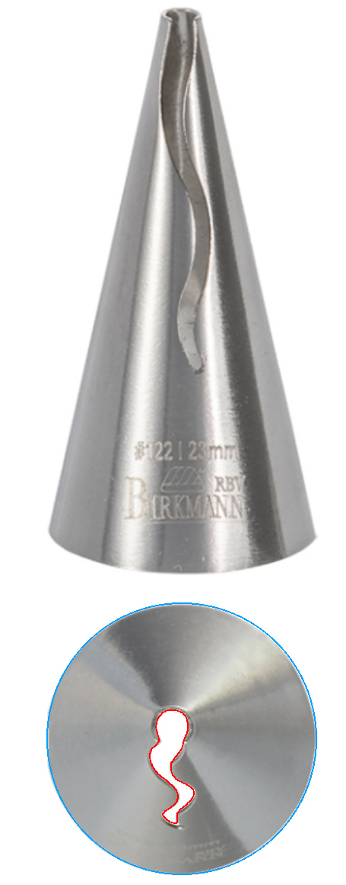
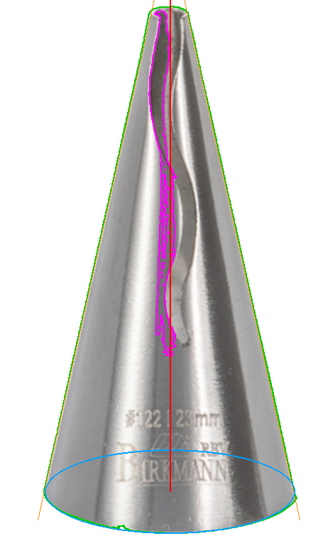

# Ruffle piping nozzle

A printable ruffle nozzle after the Birkmann #122, plus a two-part coupler so
you can swap tips without emptying the bag.

One file, `nozzle.scad`, pure OpenSCAD (no libraries). Pick a part with
`-D render_part="..."`.

```
        /\          nozzle   -- the tool. Ø23 base, 47.4mm tall, 1.2->0.8mm wall.
       /||\         coupon   -- just the tip, for testing the aperture.
      / || \
     /  ||  \       sleeve   -- goes inside the bag, pokes out the snip.
    /   \/   \      ring     -- screws over the sleeve, clamps the nozzle.
   '----------'
```

## The aperture is traced, not drawn

The S-shaped opening is the whole part, and guessing at it does not work — a
first pass with a sine-wave slot came out nearly **3× too large**. So it is
measured instead: `trace/trace.py` finds the nozzle's base circle in the
manufacturer's top-down photo, uses the published Ø23mm to set the scale, and
sub-pixel contours the aperture out of the grayscale.



It comes out **3.7 × 9.7mm, 16.1mm² of flow area** — for comparison a plain #12
round tip is 12.6mm², so this pipes at about the pressure you would expect.

`trace/trace_side.py` does the same job on the **side** photo for the cone's
proportions. That one needs a correction: the camera looks **19.6° down** at the
nozzle, so reading "tallest row / widest row" off the image is wrong twice over
— the axis is foreshortened *and* the base rim's near edge pads the apparent
height. Both are recoverable from the base ellipse (major axis = true diameter,
minor axis = diameter × sin tilt), which takes h/d from a naive **2.111** to a
corrected **2.063**, and measures the truncated tip at **Ø3.1mm**.



The outline is stored in `nozzle.scad` in **units of the base diameter**, so
`base_d` scales the whole design coherently and the one disputed number (see
*Which 23mm?* below) is a single parameter rather than a reason to re-trace.

## How the shape works

The nozzle is **a hollow cone with a small round mouth at the tip and a wavy
slot down one flank**. The slot is what ruffles: icing leaves as a ribbon,
thick at the mouth end and thinning along the tail.

The clever part is that both features come from **one** cut — a constant
cross-section prism running straight up the axis, with the traced S as its
profile:

- near the tip the cone is narrower than the bulb, so the bulb opens the mouth;
- further down the tail sticks out past the cone's flank on one side, and cuts
  the slot;
- lower still the cone is wider than the whole outline, so the prism sits
  buried in the cavity doing nothing.

One `difference()`.

**The anchoring is load-bearing.** The traced S is a *projection* of two
features that are not in the same place: the mouth is on the axis, the slot is
out on a flank. Only the bulb belongs on the axis. Anchor the outline on its
centroid instead — which for an S sits near the waist — and the tail is dragged
across the axis, so the prism cuts **both** walls: two free petals and a
see-through tip. The side photo rules that out; the tip rim is a continuous,
unbroken oval. `tests/empty_slot_is_one_sided.scad` is the regression.

Two independent measurements agree on the result: the flank slot runs **67%**
of the height by projected radius from the top-down view, against **72%**
measured off the side photo directly.

## Printing

The wall is **tapered on purpose**: 1.2mm at the base where you push it into
the bag, thinning to 0.8mm at the tip where the aperture is. That thickness
*is* the land the icing has to squeeze along before it separates, so thin means
sharp. Steel manages 0.5mm; 0.8 is as close as a 0.4mm nozzle gets while still
being two clean extrusions. `tip_wall_t = 0.45` is sharper again and much more
fragile — worth trying once you have a working print.

(An earlier version had this backwards, thickening *towards* the tip, from a
mistaken belief that the tip was two free petals needing extra section.)

### Slicer

| | |
|---|---|
| Nozzle | 0.4mm, hardened steel |
| Layer height | **0.1mm** — the aperture edge is the whole part |
| Wall loops | **999** |
| Wall extrusion width | **0.40mm** |
| Infill | 0 |
| Supports | none |
| Orientation | exactly as modelled; no part is flipped |

**Why 999 loops.** The wall thickness varies continuously from 1.2 to 0.8mm, so
on the way up it passes through every fractional multiple of the line width. A
fixed loop count leaves voids wherever the wall does not divide evenly; 999
makes the slicer fill whatever is actually there, and the part comes out as one
continuous solid with no infill boundary anywhere. This is also why the two
ends are set to exact multiples of 0.40 (3 extrusions and 2) — the model echoes
those counts on render and warns if you pick a wall that is not a whole number
of extrusions.

**Cooling.** Near the tip each layer is a thin ring of a few hundred mm², which
at 0.1mm goes by fast. Set a minimum layer time (~8–10s) or slow the top third,
or the last few millimetres will slump while soft.

Roughly 470 layers for the Ø23 nozzle. Budget an hour or so.

**Print `coupon` first.** It is the top 16mm on a thin pad — five minutes, and
it tells you whether `slot_grow` is right before you commit to the whole part.
FDM lays a narrow slot narrower than modelled; `slot_grow = 0.20` is the
compensation and it is the first number to tune.

### Food contact — read once

Layer lines hold residue that a smooth steel tip does not, so this is a
short-life tool, not an heirloom. Use PETG rather than PLA (the Birkmann's own
listing gives 40°C as its wash temperature, and PLA starts softening around
60°C — but PLA is the one that will also creep under hand pressure). Print with
a **hardened steel nozzle** if you would rather not think about brass and lead.
Hand wash, do not put it in the dishwasher, and retire it when the slot gets
scratched.

## Making it stay on the bag

**It already does, and this is the part most people get wrong.** A piping
nozzle is not clipped or threaded onto anything: you drop it inside the bag and
snip the tip **2–3mm smaller than the nozzle's base**, and the taper wedges
into the hole. The bag's own tension holds it. That is why steel nozzles are
bare cones — the taper *is* the retention feature — and it works on any
disposable bag.

Two things this design adds that steel does not have:

- **A base flange.** Steel relies purely on friction; a printed cone is
  slicker, and under real hand pressure it can push through the snip. The
  flange makes that impossible.
- **The coupler**, below.

### The coupler

```
   =====|     |=====   bag, snipped ~Ø26 and stretched over the thread
        |     |
   -----+-----+-----   sleeve body, inside the bag: flares to Ø34 so it
       /       \       cannot pull back through
      | ((thread)) |   thread pokes OUT through the snip
      |  \     /   |
       \  nozzle  /    nozzle drops over the sleeve's nose
        \  ring  /     ring screws on, clamps the nozzle's flange
```

1. Push the sleeve out through the snipped tip from inside the bag, threads
   first, until the bag sits on the neck behind them.
2. Drop the nozzle over the nose.
3. Screw the ring on. Three starts and a 9mm lead — one turn and it is tight.

To change tips: unscrew the ring, swap, screw back. The bag stays loaded.

The nose is **cut to follow the nozzle's own bore**, not made a plain plug, so
it centres the nozzle rather than merely filling it. The clamp is a matching
pair of **45° cones** rather than a flat step, so it self-centres and neither
part has an overhang to bridge.

The thread is **our own** — coarse, 3-start, 3mm pitch, 20° flank — not a
reverse-engineered Wilton. A thread we define is a thread we can test, and
`make test` does exactly that.

## Which 23mm?

The published data conflicts, and the model does not hide it:

- the product copy says **"Dimensions: Ø 23 mm"**, twice;
- the spec table says the item is **1.8 × 1.8 × 3.5 cm**, which cannot contain
  a Ø23 disc;
- the side photo's tilt-corrected height/base ratio is **2.063**, which at Ø23
  gives a 47.4mm nozzle and at Ø18 gives 37.1mm.

That last one is the new evidence, and it does not favour the default: Ø18
lands within 6% of the published 35mm *and* matches 1.8 × 1.8 exactly, whereas
Ø23 agrees with nothing but itself.

### Settle it with a print

`make sizes` exports both candidates. The nozzle is ~20 minutes of filament, so
printing one of each and holding them is cheaper than any amount of arguing
with a product listing.

| | Ø23 | Ø18 |
|---|---|---|
| height | 47.4mm | 37.1mm |
| aperture | 3.7 × 9.7mm, 16.1mm² | 2.9 × 7.6mm, 9.9mm² |
| flank slot | 31.9mm (67% of height) | 24.3mm (65%) |
| tip mouth | Ø2.95 in a Ø4.4 tip | Ø2.40 in a Ø4.4 tip |

Note these are **not** the same part scaled: `wall_t`, `slot_grow` and every
clearance are absolute, so the Ø18 fits are proved separately — `make test`
runs the whole suite at both diameters. The Ø18 aperture drops below a #12
round tip's 12.6mm², so expect to squeeze a little harder.

The default stays **Ø23** until a print says otherwise. `-D base_d=18`
rescales everything including the coupler. **Decide before printing the
coupler** — that is where being wrong actually wastes time.

## Build

```
make            # previews + STL/3MF for all parts
make test       # the geometry tests
make coupon     # the aperture test print
make sizes      # export the nozzle at both candidate diameters
make trace      # re-derive aperture AND proportions from the photos
```

## Honest comparison

Against a £3 steel tip, a printed one loses on edge sharpness and surface
finish, and it always will. What it wins on is shapes you cannot buy, a coupler
sized to your own bag, and the ability to change any of the above. That is the
reason to print it; "cheaper than steel" is not.

## Open

- **Unprinted.** Nothing here has been through a printer yet. Two numbers are
  waiting on that: `slot_grow` (whether the aperture opens to the traced size)
  and `tip_wall_t` (whether 0.8mm prints crisply and survives handling).
- **The slot edges are the structural unknown.** For the top 67% the cone is a
  C-section rather than a closed tube, so it can open slightly under pressure
  and thicken the ruffle. Far better than the two free petals an earlier
  version had, but still worth watching on the first print. `tip_wall_t` is the
  knob.
- **The tip is deliberately blunter than the original.** The real mouth is
  Ø2.55 in a Ø3.1 tip — a 0.28mm rim of steel, which FDM cannot lay. `tip_d`
  is opened to 4.4 for a ~0.7mm rim.
- `sleeve.stl` and `ring.stl` come out ~12MB because the thread is a stack of
  swept helices. The 3MF is a tenth of that; prefer it.
