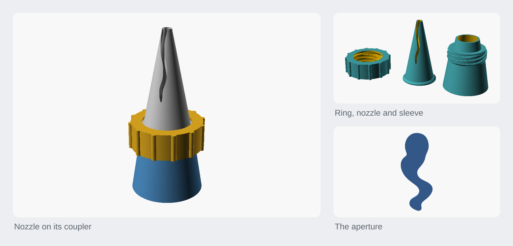
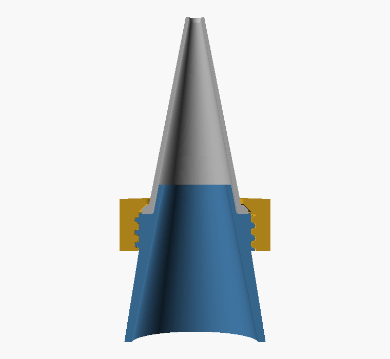
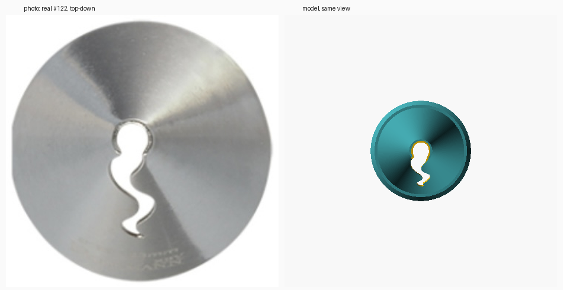
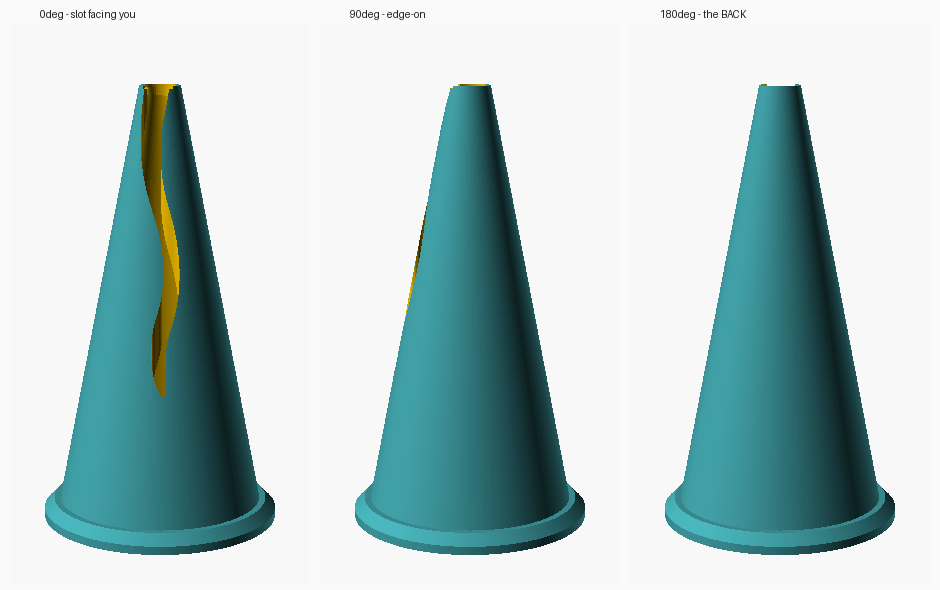

<h1 align="center">Ruffle piping nozzle</h1>

<p align="center">A printable ruffle piping nozzle traced from the Birkmann #122, with a screw-on coupler so you can swap tips without emptying the bag.</p>

<p align="center"><a href="https://rainn.works/models/ruffle-nozzle/">Configure and order one</a> · <a href="../">All models</a></p>



## Getting started

1. **Get the files.** Three parts, all in `export/` as 3MF and STL (the 3MF is about a third of the size):

   | File | What it is |
   |---|---|
   | `nozzle.3mf` | The nozzle. A complete tool on its own |
   | `sleeve.3mf` | Coupler half that goes inside the bag and pokes out through the snip |
   | `ring.3mf` | Coupler half that screws over the sleeve and clamps the nozzle |

   You only need the sleeve and ring to change tips mid-bag. To change anything, open `nozzle.scad` in OpenSCAD.
2. **Set the parameters that matter.** The defaults are what's exported.

   | Parameter | Default | What it does |
   |---|---|---|
   | `base_d` | 23 | Outer diameter at the base. The outline, cone, flange and the whole coupler scale from it |
   | `height_ratio` | 2.063 | Height as a multiple of `base_d`, measured from the side photo |
   | `tip_d` | 4.4 | Diameter of the truncated tip. Opened up from the measured 3.1 so the rim is printable |
   | `wall_t` | 1.2 | Wall at the base: 3 × 0.40 mm extrusions |
   | `tip_wall_t` | 0.8 | Wall at the tip: 2 extrusions. This is the land the icing squeezes along, so thinner is sharper |
   | `slot_grow` | 0.20 | Grows the traced outline all round, because FDM lays a narrow slot narrower than modelled. Tune this first |
   | `mouth_bevel` | 0.3 | Breaks the outer edge of the mouth at the very top |
   | `flange_t`, `flange_over` | 2.0, 1.4 | The base flange: thickness, and how far it stands out |
   | `sleeve_body_h` | 22 | Length of the sleeve body inside the bag |
   | `sleeve_flare` | 1.48 | Big open end of the sleeve, as a multiple of `base_d` |
   | `nose_h` | 7 | How far the sleeve's nose reaches up inside the nozzle |
   | `ring_wall` | 2.5 | Ring wall outside the thread |
   | `line_w` | 0.40 | Your slicer's wall extrusion width. Only used to check the walls are whole extrusions |

   The thread (`thr_pitch` 3.0, `thr_starts` 3, `thr_h` 9, `thr_depth` 1.0, `thr_flank` 20, `thr_layers` 6), its clearances (`thr_rclear` 0.25, `thr_aclear` 0.35, `thr_runout` 1.0, `thr_top_gap` 0.6, `thr_lead_in` 1.5) and `clamp_relief` (0.2) are under *Advanced*. See [Thread](#the-thread).

   To build the whole set at another diameter, use `make size D=20`. Always print the nozzle, sleeve and ring from the same diameter: see [Why Ø23](#why-ø23).
3. **Slice.**

   | | |
   |---|---|
   | Material | PETG (see [Food contact](#food-contact)) |
   | Nozzle | 0.4 mm, hardened steel |
   | Layer height | **0.1 mm**: the aperture edge is the whole part |
   | Wall loops | **999** |
   | Wall extrusion width | **0.40 mm** |
   | Infill | 0 |
   | Supports | none |
   | Orientation | exactly as exported; **don't flip any part** |

   - **Why 999 loops.** The wall thickness varies continuously from 1.2 to 0.8 mm, so on the way up it passes through every fraction of the line width. A fixed loop count leaves voids wherever the wall doesn't divide evenly; 999 makes the slicer fill whatever is there, and the part comes out as one solid with no infill boundary anywhere. That's also why the two ends are exact multiples of 0.40 (3 extrusions and 2). The model echoes those counts on render and notes it if you pick a wall that isn't a whole number of extrusions.
   - **Don't flip the coupler.** Both halves are modelled and printed axis-vertical, and flipping either one reverses the handedness of its thread. An external and an internal thread that disagree is a bug you only find on the printer. `make test` catches it in CAD; nothing catches it in the slicer.
   - **Cooling.** Near the tip each layer is a thin ring of a few hundred mm², which goes by fast at 0.1 mm. Set a minimum layer time (about 8 to 10 s) or slow the top third, or the last few millimetres will slump while soft.
   - Roughly 470 layers for the Ø23 nozzle. Budget an hour or so. The nozzle is its own test print: see [Why there's no test coupon](#why-theres-no-test-coupon).
4. **Fit it to the bag.** Without the coupler, drop the nozzle inside the bag and snip the tip **2 to 3 mm smaller than the nozzle's base**. The taper wedges into the hole. With the coupler:
   1. Push the sleeve out through the snipped tip from inside the bag, threads first, until the bag sits on the neck behind them.
   2. Drop the nozzle over the nose.
   3. Screw the ring on. Three starts and a 9 mm lead: one turn and it's tight.

   To change tips, unscrew the ring, swap, and screw it back. The bag stays loaded.

### Food contact

Layer lines hold residue that a smooth steel tip doesn't, so this is a short-life tool, not an heirloom. Use PETG rather than PLA: the Birkmann's own listing gives 40 °C as its wash temperature, PLA starts softening around 60 °C, and PLA will also creep under hand pressure. Print with a **hardened steel nozzle** if you'd rather not think about brass and lead. Hand wash, don't put it in the dishwasher, and retire it when the slot gets scratched.

## How it works



The nozzle is **a hollow cone with a small round mouth at the tip and a wavy slot down one flank**. The slot is what ruffles: icing leaves as a ribbon, thick at the mouth end and thinning along the tail.

Both features come from **one** cut: a constant cross-section prism running straight up the axis, with the traced S as its profile.

- Near the tip the cone is narrower than the bulb, so the bulb opens the mouth.
- Further down, the tail sticks out past the cone's flank on one side, and cuts the slot.
- Lower still, the cone is wider than the whole outline, so the prism sits in the cavity cutting nothing.

One `difference()`.

```
        /\          nozzle   -- the tool. Ø23 base, 47.4mm tall, 1.2->0.8mm wall.
      / || \
     /  ||  \       sleeve   -- goes inside the bag, pokes out the snip.
    /   \/   \      ring     -- screws over the sleeve, clamps the nozzle.
   '----------'
```

### The aperture is traced, not drawn

The S-shaped opening is the whole part, and guessing at it doesn't work: a first pass with a swept disc along a sine centreline, sized by eye, came out nearly **3× too large** in area (45 mm² against the real 16.1 mm²). So it's measured instead. `trace/trace.py` finds the nozzle's base circle in the manufacturer's top-down photo, uses the published Ø23 mm to set the scale, and sub-pixel contours the aperture out of the greyscale.


It comes out **3.7 × 9.7 mm, 16.1 mm² of flow area**. A plain #12 round tip is 12.6 mm², so this pipes at about the pressure you'd expect. The `APERTURE` block in `nozzle.scad` is generated by the tracer; don't hand-edit it.

`trace/trace_side.py` does the same job on the **side** photo for the cone's proportions. That one needs a correction: the camera looks **19.6° down** at the nozzle, so reading "tallest row / widest row" off the image is wrong twice over. The axis is foreshortened, *and* the base rim's near edge pads the apparent height. Both are recoverable from the base ellipse (major axis = true diameter, minor axis = diameter × sin tilt), which takes h/d from a naive **2.111** to a corrected **2.063**, and measures the truncated tip at **Ø3.1 mm**.


The outline is stored in **units of the base diameter**, so `base_d` scales the whole design coherently, and the one disputed number (see [Why Ø23](#why-ø23)) is a single parameter rather than a reason to re-trace.



### The anchoring is load-bearing

The traced S is a *projection* of two features that aren't in the same place: the mouth is on the axis, the slot is out on a flank. Only the bulb belongs on the axis. Anchor the outline on its centroid instead, which for an S sits near the waist, and the tail is dragged across the axis, so the prism cuts **both** walls: two free petals and a see-through tip. The side photo rules that out; the tip rim is a continuous, unbroken oval. So the bulb is found as the largest inscribed circle in the traced hole, and that goes on the axis. `tests/empty_slot_is_one_sided.scad` is the regression.

Two independent measurements agree on the result: the flank slot runs **67%** of the height by projected radius from the top-down view, against **72%** measured off the side photo directly.



### The wall

The wall is **tapered on purpose**: 1.2 mm at the base where you push it into the bag, thinning to 0.8 mm at the tip where the aperture is. That thickness *is* the land the icing has to squeeze along before it separates, so thin means sharp. Steel manages 0.5 mm; 0.8 is as close as a 0.4 mm nozzle gets while still being two clean extrusions. `tip_wall_t = 0.45` is sharper again and much more fragile, worth trying once you have a working print.

An earlier version had this backwards, thickening towards the tip, from a mistaken belief that the tip was two free petals needing extra section.

### Staying on the bag

**It already does.** A piping nozzle isn't clipped or threaded onto anything: you drop it inside the bag, snip the tip smaller than the base, and the taper wedges into the hole. The bag's own tension holds it. That's why steel nozzles are bare cones, and it works on any disposable bag.

Two things this design adds that steel doesn't have:

- **A base flange.** Steel relies purely on friction. A printed cone is slicker, and under real hand pressure it can push through the snip; the flange makes that impossible. It's also the coupler's clamping face.
- **The coupler.**

```
   =====|     |=====   bag, snipped ~Ø26 and stretched over the thread
        |     |
   -----+-----+-----   sleeve body, inside the bag: flares to Ø34 so it
       /       \       cannot pull back through
      | ((thread)) |   thread pokes OUT through the snip
      |  \     /   |
       \  nozzle  /    nozzle drops over the sleeve's nose
        \  ring  /     ring screws on, clamps the nozzle's flange
```

The nose is **cut to follow the nozzle's own bore**, not made a plain plug, so it centres the nozzle rather than merely filling it. A plain cylindrical nose sized to the base bore could only enter about 2.5 mm before the taper stopped it.

The clamp is a matching pair of **45° cones** rather than a flat step. A flat step needed a 1.95 mm horizontal overhang in the ring; the cones self-centre, and neither part has an overhang to bridge. `clamp_relief` leaves 0.2 mm between them so they aren't modelled as coincident faces, and the ring takes it up on the thread.

### The thread

The thread is **our own**: coarse, 3-start, 3 mm pitch, 20° flank. It isn't a reverse-engineered Wilton, since theirs can't be measured here. A thread we define is a thread we can test, and `make test` does.

At any height a thread rib occupies one angular sector, and that sector rotates with height, which is exactly what `linear_extrude(twist=)` sweeps. One extrude gives a square thread; a trapezoid needs the sector to narrow as the radius grows, so the rib is `thr_layers` nested helices of decreasing width. The sleeve's rib and the ring's groove come from **one module**, the groove being the rib grown by the clearances, so they can't drift apart.

`thread()` takes an absolute z. `linear_extrude(twist=)` sets phase from the start of the extrude, and the ring's groove spans a taller range than the sleeve's rib, so starting it 1 mm lower would silently rotate it by 40° and the two wouldn't screw together. The 2D shape is pre-rotated so phase is always referenced to z = 0.

Three bugs came from faces modelled to abut exactly, which CGAL turns into zero-volume shells and phantom interference: two threads ending on the same plane (fixed by `thr_runout` and `thr_top_gap`), the clamp cones modelled coincident (fixed by `clamp_relief`), and the ring's bore meeting its own clamp cone. The groove's runout goes downward only: running it up past z = 0 cut through the ring's clamp cone and sliced the lip off the body into 25 separate solids.

### Supports: none, and that's measured

`make overhangs` reads the exported meshes back and reports every downward-facing face:

| Part | Worst | Ledge width |
|---|---|---|
| nozzle | 11° from vertical | nothing near-flat at all |
| sleeve | 90° | mean 0.15 mm, widest 0.19 mm |
| ring | 90° | mean 0.19 mm, widest 0.73 mm |

The 90° faces are real but harmless, and the angle on its own is misleading. They're the **thread flanks**, which are a staircase rather than a smooth ramp: the helix is six nested extrusions, so each flank is six steps of **0.167 mm**. A 90° face 0.167 mm wide bridges without noticing. What decides whether a face needs support is its ledge width, not its angle.

The sleeve's rib is **ramped out of the core** over 1.5 mm at each end (`thr_lead_in`) rather than starting square: a 34° cone instead of a full-depth 1 mm ledge, which took its worst overhang from 1.00 mm to 0.19 mm. That ramp also self-centres the rib going into the ring, so the thread can be started one-handed. The ring's groove keeps its 0.73 mm ledge on purpose: it has to stay full depth to its ends or it would foul the very rib it's cut to accept, and 0.73 mm bridges anyway.

An earlier version of this README claimed the thread flanks were "45° or shallower". They're a 20° staircase. Measuring is why that got caught.

### Why Ø23

The published data conflicts. The product copy says **"Dimensions: Ø 23 mm"** twice, the spec table says the item is **1.8 × 1.8 × 3.5 cm** (which can't contain a Ø23 disc), and the side photo's tilt-corrected height/base ratio of **2.063** gives 47.4 mm at Ø23 or 37.1 mm at Ø18, matching neither cleanly.

**It doesn't matter, so it's settled at Ø23.** The only thing that could have made the real diameter matter is fitting a commercial coupler, and this prints its own, so nothing downstream cares. Given a free choice, Ø23 is the better one: **16.1 mm² of flow area against Ø18's 9.9 mm²** (below a plain #12 round tip, and a noticeably harder squeeze), and every feature (tip rim, mouth, slot) is 22% larger and so prints more reliably at 0.4 mm. There's one diameter, one coupler, and no suffixed files to mix up.

`base_d` is still a parameter, and `make size D=20` builds the set at another diameter. It deliberately builds the **whole** set, because the coupler is sized from `base_d`: a nozzle from one diameter won't clamp in a ring from another. A Ø23 ring's lip bore is Ø23.6 against a Ø18 flange of Ø20.8, so the flange drops straight through with no clamping ledge at all; and the Ø23 sleeve's nose is Ø20.0 against a Ø18 bore of Ø15.6, too fat to enter. Each diameter gets a 1.10 mm ledge with its own ring.

### Why there's no test coupon

There used to be a `coupon` part: the top 16 mm of the nozzle on a pad, about a third of the layers, as a cheap way to check `slot_grow`. Measuring the slot showed it tested the wrong half:

| Region | Median slot width |
|---|---|
| In the coupon (z ≥ 31.4) | 1.79 mm |
| Below it (z 15.6 to 31.4) | 0.86 mm |

The slot is 1.9 mm at the mouth and tapers to 0.8 mm and below down the tail. Only the tail can close up, and the coupon covered the wide half: it would have printed cleanly every time while the at-risk region went untested. So the nozzle is the test. What replaced the coupon is a number: `trace.py` measures the slot's narrowest width (`APERTURE_MIN_W`), and the model echoes what that becomes after `slot_grow` in extrusion widths, with a note under 2. At the defaults it's 0.96 mm, 2.4 extrusions: close to the floor.

### Tests

`make test` runs 18 checks. Checking that a value is derived correctly isn't the same as checking that two parts meet, so there are three kinds:

- `tests/assert_*.scad`: the render must succeed; asserts on derived values.
- `tests/empty_*.scad`: the render must produce no geometry. `difference(A, B)` empty means A fits inside B; `intersection(A, B)` empty means they miss. This is the kind that matters, since the nozzle, sleeve and ring are each obviously fine alone.
- Mesh checks: each part comes out as one solid and sits on the build plate.

The assert and empty tests run at both Ø23 and Ø18. Ø18 doesn't ship, but the walls, clearances and `slot_grow` are absolute while the outline is normalised, so a second diameter is the cheapest proof the parameterisation is real rather than tuned to one number.

Every test was verified against a deliberately broken model:

| Test | Broken by | Result |
|---|---|---|
| `empty_ring_screws_onto_sleeve` | deleting the thread's phase `rotate()` | 39,660 facets |
| `empty_nose_enters_bore` | a straight cylindrical nose | 1,440 facets |
| `empty_ring_clears_nozzle` | `clamp_relief = -0.6` | geometry produced |
| `assert_fits` | `flange_over = 3` | assert fires |
| `empty_aperture_inside_bore` | `slot_grow = 6` | assert fires |
| `empty_slot_is_one_sided` | re-anchoring the outline on its centroid | 1,424 facets |

The one-piece mesh check is a weak invariant: the two-free-petals bug left the nozzle one connected solid, because the petals still met at the base. `empty_slot_is_one_sided` is the test with teeth.

## Limits

- **Unprinted.** Nothing here has been through a printer yet. Two numbers are waiting on that: `slot_grow` (whether the aperture opens to the traced size) and `tip_wall_t` (whether 0.8 mm prints crisply and survives handling).
- **The slot edges are the structural unknown.** For the top 67% the cone is a C-section rather than a closed tube, so it can open slightly under pressure and thicken the ruffle. Far better than the two free petals an earlier version had, but worth watching on the first print. `tip_wall_t` is the knob.
- **The tail of the slot is near the floor.** It narrows to 0.96 mm as modelled, 2.4 extrusions, and FDM lays it 0.1 to 0.2 mm narrower. If the fine end of the ruffle closes up, raise `slot_grow`.
- **The tip is blunter than the original.** The real mouth is Ø2.55 in a Ø3.1 tip, a 0.28 mm rim of steel, which FDM can't lay. `tip_d` is opened to 4.4 for a rim of about 0.7 mm.
- **Worse than steel on finish.** Against a £3 steel tip, a printed one loses on edge sharpness and surface finish, and always will. What it wins on is shapes you can't buy, a coupler sized to your own bag, and the ability to change any of the above. That's the reason to print it; "cheaper than steel" isn't.
- **Short-lived.** Layer lines hold residue. Hand wash, and retire it when the slot gets scratched.
- **Mixed diameters don't fit.** A nozzle, sleeve and ring must all come from the same `base_d`.
- **Heavy thread meshes.** The thread is a stack of swept helices, so `sleeve.stl` and `ring.stl` are 1.7 and 2.3 MB against the nozzle's 0.2 MB. The 3MFs are about a third of that; prefer them. If mesh size ever matters, `thr_layers` is the cheap knob.

## Build from source

Needs OpenSCAD and Python 3. `make test` and `make overhangs` use the standard library only; `make compare` (part of the default `make`) needs Pillow; `make trace` needs numpy, Pillow, SciPy and scikit-image.

```sh
make            # everything: all previews + STL/3MF exports + the comparison images
make renders    # just the PNG previews
make exports    # just the STL + 3MF files
make test       # geometry tests: do the three parts actually fit?
make size D=20  # the whole set at some other base diameter
make compare    # the side-by-side previews (model vs the source photo)
make overhangs  # what each part asks of the printer, from the meshes
make trace      # re-derive aperture + proportions from the product photos
make open       # render and open the assembly preview (macOS)
make clean      # remove previews/ and export/
```

`make trace` rewrites the `APERTURE` block in `nozzle.scad` from the top-down photo. `trace_side.py` only reports the cone's proportions: `height_ratio` and `tip_d` are set by hand from its output, so read it rather than just running it. Look at `trace/trace_check.png` before trusting a re-trace; it's the only real verification.

STLs are exported as binary STL, a fifth of the size of ASCII.

`render_part` values: `nozzle`, `sleeve`, `ring` (the printable parts), `assembly`, `section`, `aperture` and `all` (previews).

## Licence

[CC BY-NC-SA 4.0](../LICENSE). Free to print, remix and share with credit, not for profit. Selling prints or remixes needs a partnership with RainnWorks: [support@rainn.works](mailto:support@rainn.works?subject=Selling%20RainnWorks%20models).
