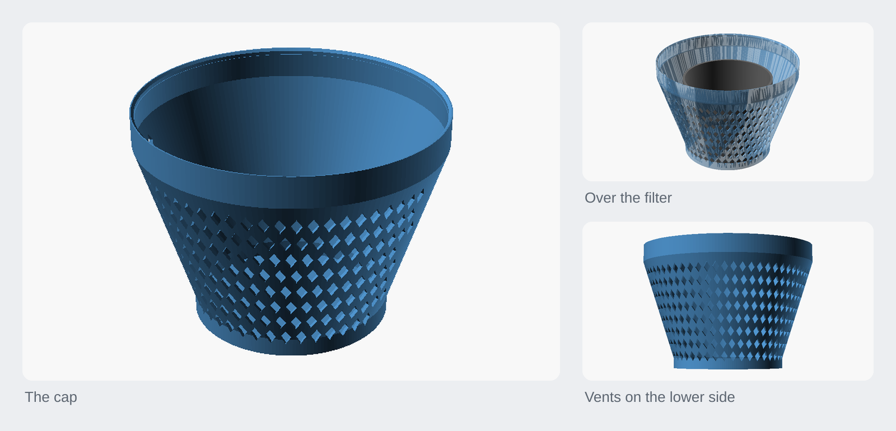
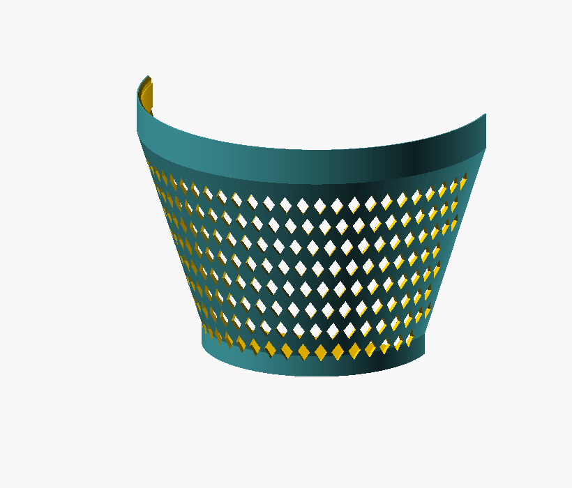
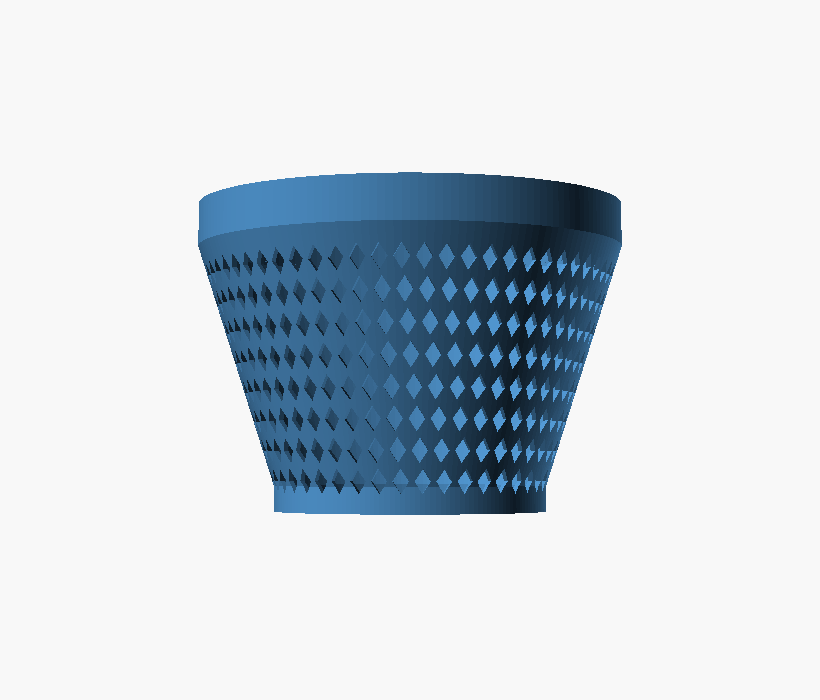
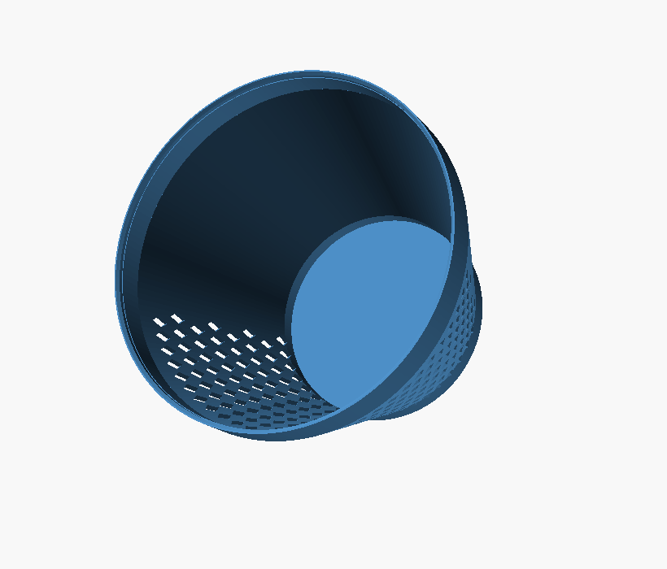

<h1 align="center">Van air-filter cap</h1>

<p align="center">A tapered press-fit weather cap that keeps rain off a horizontally mounted van air filter, with diamond vents on its lower side.</p>

<p align="center"><a href="https://rainn.works/models/van-airfilter-cap/">Configure and order one</a> · <a href="../">All models</a></p>



## Getting started

1. **Get the file.** `export/cap.stl` or `export/cap.3mf` is the cap at the default sizes. To fit a different filter, open `airfilter_cap.scad` in OpenSCAD, or upload it to MakerWorld's Parametric Model Maker (see [On MakerWorld](#on-makerworld)).
2. **Measure your filter and set the parameters.** Everything is driven off a few numbers; set them and the rest follows.

   | Parameter | Default | What it does |
   |---|---|---|
   | `lip_od` | 243 | Outer diameter of the housing rim the cap clips onto, at the big end (mm). |
   | `small_d` | 160 | Outer diameter of the small closed end, which goes over the filter (mm). |
   | `taper_len` | 140 | Rim-to-filter distance: the length of the taper (mm). |
   | `clip_len` | 25 | Straight grip section at the big end (mm). |
   | `press_fit` | 0.30 | Grip interference: the grip band's bore is `lip_od` minus this (mm). Bigger is tighter. |
   | `vent_style` | `grid` | `grid` for the diamond mesh, `louver` for slanted louvers. |

   An assert keeps the widest outer diameter at or under 250 mm, the build volume. If it trips, lower `wall` or `lip_od`. The full list is under [All parameters](#all-parameters).
3. **Slice.** Single colour, supports off.
   - Print it **small end down**: the closed end flat on the plate, clip mouth up. The cone flares out about 18° off vertical and supports itself, and the vents are self-supporting by design.
   - It is 180 mm tall and 249.8 mm wide at the top, so it uses most of the plate. Skip the brim; a few mouse ears are plenty.
   - PETG is a good choice for under-bonnet heat and toughness.
4. **Fit it.** Press the big end over the housing rim, with the vents facing down. The mouth has a lead-in chamfer to start the press.

### All parameters

| Parameter | Default | What it does |
|---|---|---|
| `render_part` | `cap` | `cap` (the part), or the previews `section`, `on_filter` and `inuse`. `profile` also works from the command line. |
| `lip_od` | 243 | Housing rim OD the cap clips onto (mm), 120 to 245. |
| `press_fit` | 0.30 | Interference at the grip band (mm). |
| `mouth_clear` | 0.8 | Diametral clearance elsewhere in the clip, so the cap slides on (mm). |
| `clip_len` | 25 | Straight grip section at the big end (mm). |
| `grip_len` | 18 | Length of the grip band within the clip section (mm). |
| `grip_gap` | 5 | Gap from the rim to the top of the grip band (mm). |
| `small_d` | 160 | Small-end outer diameter (mm). |
| `taper_len` | 140 | Taper length, big end to small end (mm). |
| `small_len` | 15 | Straight section at the small end, holding the closed end (mm). |
| `end_t` | 3.0 | Closed-end thickness (mm). |
| `wall` | 3.0 | Side wall thickness (mm). |
| `lead_in` | 2.0 | Chamfer at the clip mouth (mm). |
| `vent_style` | `grid` | `grid` or `louver`. |
| `vent_arc` | 160 | Angular spread of the vent band, centred on the bottom (degrees). |
| `vent_center` | 270 | Which way is down in use, in degrees round the cap. 270 = bottom. |
| `vent_from_end` | 8 | Start of the vent band, measured from the closed end (mm). |
| `grid_w` | 9 | Diamond hole width, tangential (mm). |
| `grid_h` | 14 | Diamond hole height (mm). Taller than wide gives a self-supporting point. |
| `grid_web` | 3 | Bar thickness between holes (mm). |
| `grid_rows` | 8 | Rows of holes up the side. |
| `louver_count` | 7 | Number of louvers up the side. |
| `louver_h` | 6 | Open height of each louver (mm). |
| `louver_web` | 4 | Solid web between louvers (mm). |
| `louver_angle` | 48 | Louver roof slope from horizontal (degrees). 45 or more prints without support. |

`max_build` (250), `$fa` and `$fs` are hidden from the Customizer.

### On MakerWorld

Upload the `.scad`, not the 3MF, to get the "Customize" button. It is pure OpenSCAD, with no libraries and no fonts. Parameters are grouped with `/* [Section] */` and use `// [min:step:max]` sliders; `render_part` and `vent_style` are dropdowns, and internal values sit under `/* [Hidden] */`. It is a single-colour part.

## How it works



The cap is a truncated cone. The big end has a straight grip band, the "clip", sized to press over the housing rim. It tapers down over `taper_len` to a smaller closed end that sits over the filter element. It fits horizontally, so the closed end faces out, the vents on the lower side let air in, and the solid top sheds rain.

```
   printed small-end-down (Z up):
                    ___________________     big end (clip) 250mm: grips the rim
                   /                   \
                  /   taper 250->160     \
       closed -> |______________________|  small end 160mm: over the filter,
       vented        mesh (lower arc)        closed; vents on the lower side
       end
```

### Shape

- **Big (clip) end, 249.8 mm.** The outer diameter is `lip_od + mouth_clear + 2 × wall`. A straight grip band presses over the housing rim.
- **Taper, 249.8 to 160 mm over 140 mm**, about 18° off vertical, so it prints without support.
- **Small end, 160 mm**, closed, over the filter, which sits about 140 mm in from the rim.
- **Overall height 180 mm**: `small_len + taper_len + clip_len`.

### Design decisions

1. **A taper, printed small end down.** The closed end sits flat on the plate, so there is no ceiling to bridge, and the cone flares out about 18° off vertical. Printed the other way up, the closed end would need support.
2. **The clip is at the big end.** The cap grips the housing rim, not the filter; the filter just sits inside. The grip band is a short interference band, and the rest of the bore is clearance, so the cap slides on and only bites at the rim.
3. **Vents that support themselves, not just angled ones.** The first attempt used horizontal louvers, which left flat overhangs and could not print. Slanting the louver roofs to 45° or more fixed that, and then a diamond grid whose holes peak at the top replaced them: it prints cleaner and lets more air through.
4. **Vents on the lower arc only.** A downward-facing opening can't collect falling rain, so keeping out rain is down to orientation and a solid top.

### Vents



- **`grid` (default): a diamond mesh.** Each hole is `grid_h` tall and `grid_w` wide, taller than wide, so it comes to a point at the top: no flat roof to bridge, no support, and a large open area. Rows are brick-offset, and the angular pitch is worked out again for each row to follow the taper.
- **`louver`: slanted slots** swept round the cap with `rotate_extrude`. Each roof rises at `louver_angle` (45° or more) from horizontal, so the overhang supports itself.

Both sit only on the lower `vent_arc` (160°), centred on `vent_center` (270, the bottom). In use the openings face down.



## Limits

- **The default sizes are not confirmed on the real filter.** `lip_od`, `small_d` and `taper_len` still need checking against the actual filter and housing.
- **The press fit needs tuning.** `press_fit` should be tuned with a short test ring before printing the full 180 mm part, but the `.scad` has no test ring part yet.
- **The small end's bore is smaller than its outer diameter.** `small_d` is the outside of the cap, so the bore at the small end is `small_d − 2 × wall`, 154 mm by default. A filter as wide as `small_d` stops where the taper opens out past it, a little short of the closed end.
- **It fills a 250 mm bed.** At the defaults the cap is 249.8 mm wide. The assert stops anything wider than 250 mm; a smaller printer needs a smaller `lip_od` or thinner `wall`.

## Build from source

Needs `openscad`. No libraries or fonts.

```sh
make            # everything: all previews + STL/3MF exports
make renders    # just the PNG previews
make exports    # just the STL + 3MF files
make cap        # the part: its preview + STL + 3MF
make open       # render + open the cap preview (macOS)
make clean      # remove generated previews/ and export/
```

Targets re-run only when `airfilter_cap.scad` changes. `make clean` deletes the committed `previews/` and `export/` folders.

Previews are forced to full geometry with `--render`. The taper and the swept or arrayed vents overflow OpenSCAD's fast preview CSG normaliser, which would export a blank image. STL and 3MF exports already use full geometry.

## Licence

[CC BY-NC-SA 4.0](../LICENSE). Free to print, remix and share with credit, not for profit. Selling prints or remixes needs a partnership with RainnWorks: [support@rainn.works](mailto:support@rainn.works?subject=Selling%20RainnWorks%20models).
