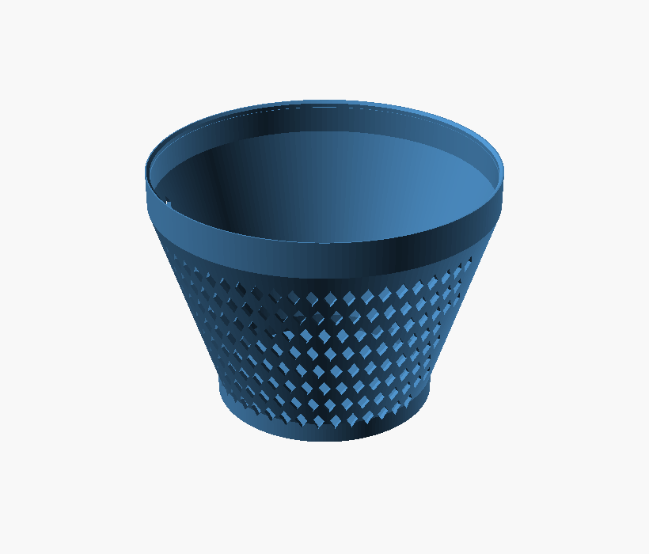

# Van air-filter cap

A tapered, press-fit weather cap for a van air filter. The **big end clips onto
the ~250mm housing rim**; it **tapers down to a ~160mm closed end** that sits over
the filter element. It fits **horizontally**, so the closed end faces out and a
**self-supporting diamond mesh** on the lower side lets air in while the solid top
sheds rain.



## Shape

- Big (clip) end: **250mm** — a straight grip band presses over the housing rim.
- Tapers **250 → 160mm over 140mm** (~18° off vertical, self-supporting).
- Small end: **160mm**, closed, over the filter which sits ~140mm in from the rim.
- Overall height ≈ **180mm**. Widest OD 249.8mm (under the 250mm build limit).

## Airflow / rain

Vents sit on the **lower ~160° arc** only, so falling rain can't get in (a
downward-facing hole can't collect water). Default `vent_style = "grid"` is a
**diamond mesh**: each hole is taller than it is wide, so it comes to a point at
the top — no flat roof to bridge, prints with **no support**, and gives a large
open area. `vent_style = "louver"` swaps in slanted louvers (roofs ≥45°, also
self-supporting) if you prefer that look.

## Print (single colour, supports OFF)

**Small end DOWN** on the plate, clip mouth up. The cone flares out ~18° (self
-supporting) and the mesh/louvers are self-supporting by design. It's ~180mm tall
and up to ~250mm wide at the top, so it uses most of the plate — skip the brim, a
few mouse-ears is plenty. PETG is a good choice (under-bonnet heat + toughness).

## Measure these on your filter

Everything is driven off a few numbers — set them and the rest follows:

| Param | Default | Meaning |
|---|---|---|
| `lip_od` | 243 | housing rim OD the cap clips onto (big end) |
| `small_d` | 160 | filter OD (small end) |
| `taper_len` | 140 | rim → filter distance (the taper length) |
| `clip_len` | 25 | straight grip section at the big end |
| `press_fit` | 0.30 | grip interference (grip bore = lip_od − this) |

An assert keeps the widest OD ≤ 250mm — if it trips, lower `wall`.

## Build

```sh
make            # previews + STL/3MF exports
make renders    # just previews
make exports    # just STL + 3MF
make cap        # the part: preview + STL + 3MF
make clean
```

Previews are forced to full (`--render`) geometry — the taper + swept vents
overflow OpenSCAD's fast preview CSG, which would export a blank image.

## MakerWorld (Parametric Model Maker / MakerLab)

Upload the **`.scad`** (not the 3MF) to get the "Customize" button. It's pure
OpenSCAD (no libraries, no fonts), grouped with `/* [Section] */` and
`// [min:step:max]` sliders, with a `render_part` dropdown and internals under
`/* [Hidden] */`. `vent_style` and `render_part` are dropdowns.
