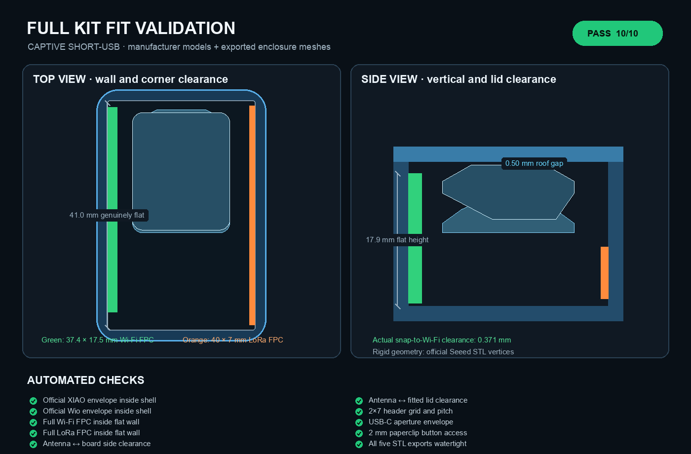

<h1 align="center">XIAO + Wio-SX1262 Velux bridge enclosure: captive USB</h1>

<p align="center">A variant of the Velux bridge enclosure that keeps a short USB cable's plug and overmould protected inside the case.</p>

<p align="center"><a href="https://rainn.works/models/xiao-wio-velux-bridge/">Configure and order one</a> · <a href="README.md">Standard USB version</a> · <a href="../">All models</a></p>


This is for a very short USB cable whose outer connector plugs into a charger while its device-side plug stays inside the enclosure. The ordinary exposed-USB model is described in [README.md](README.md), and everything there about antennas, the board locator, lid clips, ventilation and the fit test applies here too. The two base/lid pairs don't mix.

## Getting started

1. **Get the files.** `export-captive-usb/base.3mf` and `export-captive-usb/lid.3mf` (STLs alongside). The source is `velux_bridge_enclosure_captive_usb.scad`, which sets `usb_mode = "captive"` and includes the shared `velux_bridge_enclosure.scad`; change parameters in the shared file.
2. **Measure your cable.** The defaults reserve this internal plug envelope:

   | Parameter | Default | What it does |
   |---|---|---|
   | `captive_plug_body_w` | 12.5 | Width of the USB-C plug and its moulded body |
   | `captive_plug_body_h` | 6.5 | Height of the plug body |
   | `captive_plug_body_l` | 13 | Length of the plug body |
   | `captive_cable_slot_w` | 4.5 | Width of the cable aperture through the front wall |
   | `captive_cable_slot_h` | 4.5 | Height of that aperture |
   | `captive_tongue_clearance` | 0.20 | Clearance each side of the lid tongue in the slot |

   Measure the chosen cable before printing the full base. The standard README's parameters (`lid_fit_clearance`, `header_socket_d`, antenna sizes) apply here too.
3. **Print the fit test** from the standard version (`export/fit_test.3mf`): the board locator is the same. See [the standard README](README.md#getting-started).
4. **Slice.** No supports. Print the base on its floor and the lid exactly as exported, with the broad, smooth exterior face on the build plate. This revision's clips need its matching newly exported base.
5. **Assemble.**
   1. Confirm the short USB cable fits the plug envelope and entry slot without being squeezed.
   2. Stick the Wi-Fi antenna to the left wall and the LoRa antenna to the right wall, with both antenna cable exits toward the USB-cable end.
   3. Route the antenna leads back along the side channels.
   4. Plug the short USB-C cable into the XIAO while the board is still above the enclosure.
   5. Connect both I-PEX antenna plugs.
   6. Lay the USB cable into the open vertical entry slot, keeping its overmould behind the two strain shoulders.
   7. Lower all fourteen header pins into the printed sockets until the board reaches both end shelves. There are no PCB clips to engage.
   8. Check that no cable crosses the rim. Fit the lid so its long front tongue closes the installation slot, then engage all four internal lid clips.

**To open it**, put a thin flat screwdriver or similar tool into either 5 × 3 mm slot in the long edges of the lid plate. Each slot reaches across and 1 mm behind the base wall so the tool can twist at the lid/base seam. Both versions have one lid slot per side; neither has release gaps in the base.

## How it works


- **The board moves to the rear.** The XIAO/Wio stack sits at the closed rear end, and the USB-C plug and its moulded body sit in the front bay.
- **A slot open to the rim.** A vertical installation slot in the front wall runs up to the rim, so a complete cable can be laid into the base rather than threaded. A long tongue on the lid closes it down to a 4.5 × 4.5 mm cable aperture.
- **Strain shoulders.** Two internal shoulders sit 0.8 mm ahead of the nominal overmould. An outward pull on the cable reaches the shoulders before it appreciably loads the XIAO's connector.
- **Antenna leads run forward-to-back.** The antenna cable exits face forward, and the leads travel back through the two open side channels to their connectors on the rear-mounted boards.
- **Everything else is shared.** The antenna walls, pin sockets and end shelves, four internal lid clips with diamond hooks, vents, button hole and rear mark all come from the same source as the standard version. The board locator is identical, and as in the standard version it's shifted 0.5 mm toward the USB wall.



The fit tests in `tests/test_fit.py` check the official board meshes in both layouts, and the lid clip, antenna clearance and button-hole checks run against both exported lids.

## Limits

- **Cable-dependent.** The plug envelope is a default, not a standard. Measure your cable; a larger overmould won't fit behind the shoulders.
- **Not interchangeable.** This base and lid are a matched pair and don't fit the standard version's parts, or earlier revisions of their own.
- **The captive layout has no dedicated tests beyond the shared ones.** Nothing in the suite checks the cable slot, tongue or strain shoulders against a real cable.
- The standard version's limits apply too: see [README.md](README.md#limits).

## Build from source

Same tools as the [standard version](README.md#build-from-source).

```sh
make captive_usb  # captive-USB STL/3MF + its assembly preview
```

Outputs go to `export-captive-usb/`; the assembly preview is `previews/captive_usb_assembly.png`. `make test` builds these too, since the tests read both lids. `make renders` also produces `previews/captive_usb_pair.png` and `previews/fit_validation_captive_usb.png`.

## Licence

[CC BY-NC-SA 4.0](../LICENSE). Free to print, remix and share with credit, not for profit. Selling prints or remixes needs a partnership with RainnWorks: [support@rainn.works](mailto:support@rainn.works?subject=Selling%20RainnWorks%20models).
