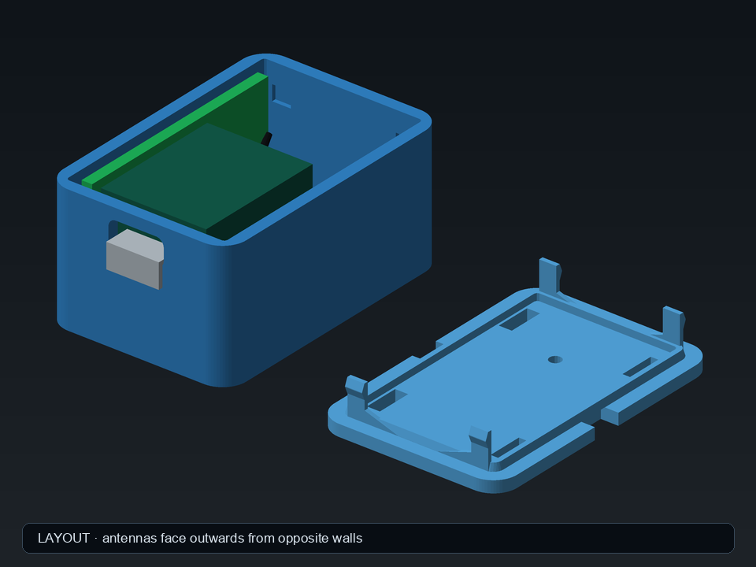
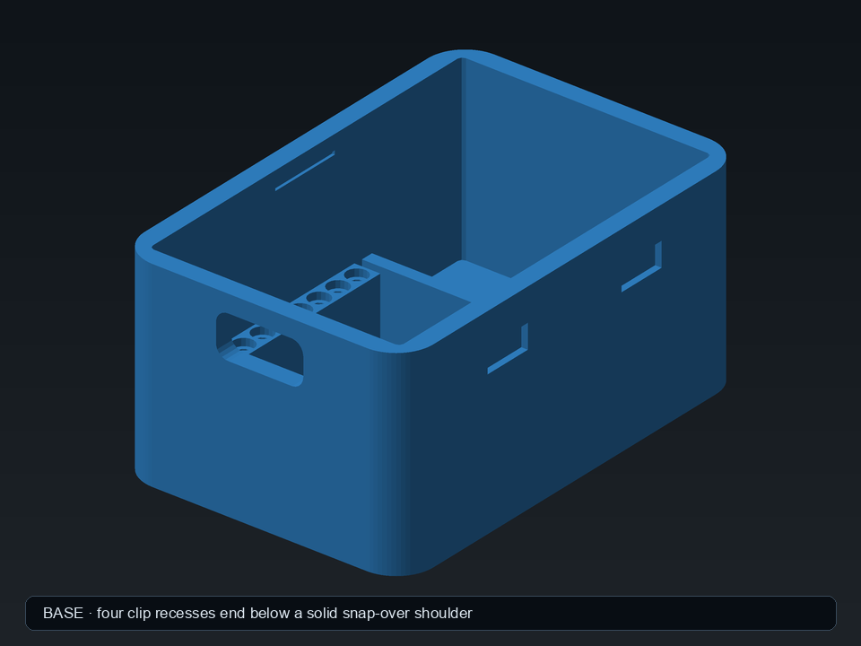

<h1 align="center">XIAO + Wio-SX1262 Velux bridge enclosure</h1>

<p align="center">A support-free, screw-free printed case for a Seeed XIAO ESP32-S3 and Wio-SX1262 radio bridge, with both supplied FPC antennas inside.</p>

<p align="center"><a href="https://rainn.works/models/xiao-wio-velux-bridge/">Configure and order one</a> · <a href="../">All models</a></p>


There are two versions, and their bases and lids don't mix:

| Version | What the USB end does | Printable files | Guide |
|---|---|---|---|
| Standard USB | Leaves the XIAO's USB-C socket reachable through the wall | `export/base.*`, `export/lid.*` | This README |
| Captive USB | Holds a short cable's USB-C plug inside the enclosure | `export-captive-usb/base.*`, `export-captive-usb/lid.*` | [README-captive-usb.md](README-captive-usb.md) |


## Getting started

1. **Get the files.** `export/base.3mf` and `export/lid.3mf` (STLs alongside). Print `export/fit_test.3mf` first, see step 3. To change anything, open `velux_bridge_enclosure.scad` in OpenSCAD; the parameters are grouped for the Customizer. `render_part` picks what to render: `base`, `lid`, `print_plate` (both), `fit_test`, or the previews `assembly`, `layout` and `cutaway`.
2. **Set the parameters that matter.** The defaults are what's exported.

   | Parameter | Default | What it does |
   |---|---|---|
   | `lid_fit_clearance` | 0.30 | Clearance per side between lid and base. Increase if the lid is tight, reduce if it's loose |
   | `header_socket_d` | 1.25 | Diameter of the 14 printed pin sockets. Physically tested; change in 0.05 mm steps |
   | `case_x`, `case_y` | 31, 46 | Outside plan size |
   | `base_h`, `lid_t` | 24.0, 2.0 | Base height and lid thickness: 26 mm closed |
   | `wifi_ant_l`, `wifi_ant_w`, `wifi_ant_t` | 37.4, 17.5, 1.8 | Wi-Fi FPC antenna, from Seeed's datasheet |
   | `lora_ant_l`, `lora_ant_w`, `lora_ant_t` | 40, 7, 1 | LoRa FPC antenna |
   | `wio_button_x`, `wio_button_y` | 0, -2.0 | Position of the Wio's user button, relative to the board centre, for the lid's paperclip hole |
   | `wall_mount_ears` | false | Adds two screw ears to the base, with `mount_hole_d` (3.5) holes |

   If your antennas come from a later revision, change the `wifi_ant_*` or `lora_ant_*` values: the height lines and fit assertions update with them. Assertions stop an antenna outline or the board stack from silently exceeding the enclosure.
3. **Print the fit test.** The header sockets are printer-sensitive. `fit_test` is the complete production board locator: both seven-pin rails, all 14 sockets and both end shelves, on a small plate. Seat the actual assembled board in it before printing the enclosure.
   - Pins won't enter, or are very tight: increase `header_socket_d` in 0.05 mm steps.
   - Pins wobble: reduce it in 0.05 mm steps.
4. **Slice.** No supports. Print `base` floor-down and `lid` with its smooth outside face down. The exported lid is already oriented that way, its broad exterior face at Z = 0; don't use a slicer's automatic orientation. Print the base and lid as a matched pair from the same export: this revision's clips and pockets don't fit earlier bases or lids.
5. **Assemble.**
   1. Before removing either adhesive liner, rehearse the complete cable path. Don't crease the coax or force a bend tighter than about **5 mm radius**.
   2. Stick the **37.4 × 17.5 mm Wi-Fi antenna** to the left wall and the **40 × 7 mm LoRa antenna** to the right wall, viewed from the USB end. Keep the top of each antenna at or below the shallow engraved height line. Put both cable exits toward the closed rear end.
   3. Arrange the spare lead length as relaxed loops in the rear bay, keeping both cables below the lid skirt. Don't coil or crease the coax tightly.
   4. Hold the assembled board just above the enclosure and attach both I-PEX plugs. Press vertically on each metal plug cap with a fingertip or plastic tool; never pull or press through the cable itself.
   5. Lower the USB-C end toward its opening, align both rows of header pins with the printed sockets, and press the board onto both end shelves. There are no PCB clips to engage. The service loops should settle below and behind the board.
   6. Check neither cable lies across the upper rim or lid skirt. Centre the lid using its tapered lead-in and press until all four internal clips click.

**To open it**, use either of the two square tool slots, one in each long edge of the lid plate. Put a thin flat screwdriver or similar tool into the slot, behind the wall at the lid/base seam, and twist gently to lift that side. Each slot releases its side's front and rear clips together.

**To remove the electronics**, take the lid off, lift the board straight out of the pin sockets, then slide its USB-C connector out of the opening.

For best RF performance, don't place either antenna side directly against metal or a wall. Standing it on its bottom on a shelf is a good default.

There's **no additional bill of materials**: no screws, nuts, magnets, foam tape or bought fasteners. Board and lid retention are printed into the two parts, and the antenna adhesive comes on the supplied antennas.

## How it works



### Antennas on the side walls

The antennas mount vertically against **opposite inside side walls**, with their broad faces radiating outwards. This keeps them protected, keeps either antenna from sitting directly above the PCB ground plane, and brings the case footprint down to almost the antenna envelope. The rounded exterior (4 mm corners) hides much tighter 0.5 mm internal corners, leaving a genuinely flat **41.0 mm** long adhesive area on each side, about **20.4 mm** tall from the floor to the lid keep-out. The rounded corners are excluded entirely.

The case is 4 mm wider than the board needs, on purpose. Beside the board, the extra width forms cable channels wide enough for the 1.13 mm coax; behind it, a service-loop bay takes the unused length of both supplied leads.

One shallow recessed line on each side wall marks the maximum safe antenna height. There are no protruding antenna-position dots.

### Board location

The XIAO's already-soldered header pins locate the board in two printed socket rails, following the standard XIAO footprint: two rows of seven, 2.54 mm pitch, 15.24 mm row spacing. Each socket has a shallow counterbore so uneven solder fillets don't carry the board. The deep sockets and two end shelves locate the assembly without PCB hooks, lid pillars, screws or bought fasteners, and the lid then retains it.

The board sits at a fixed, physically tested height. The measured 9.1 mm stack ends 3.0 mm below the plain internal roof: the case was made 2.5 mm taller to get there, without moving the board or the USB opening.

### Manufacturer dimensions used

| Part | Body / envelope | Lead |
|---|---:|---:|
| XIAO ESP32-S3 | 22.482 × 17.780 × 4.460 mm (USB included) | |
| Wio-SX1262 carrier | 21.440 × 17.780 × 7.300 mm | |
| Wi-Fi FPC antenna | 37.4 × 17.5 × ≤1.8 mm | 65 ± 2 mm, Ø1.13 mm |
| LoRa FPC antenna | 40 × 7 × 1 mm | 50 mm I-PEX lead |

The board figures are measured from Seeed's official STEP models. Caliper measurements of the assembled unit supersede their separate heights: **6.2 mm** from the lower-PCB underside to the upper-PCB top, and **9.1 mm** to the tallest SX1262 component. The configured plan envelope is **17.9 × 22.6 mm**. The default enclosure is **31 × 46 × 26 mm** including the lid.

See [`references/SOURCES.md`](references/SOURCES.md) for the exact manufacturer links and what was taken from each. Copies of the two official STEP models (and STL conversions) and Seeed's antenna comparison image are kept in `references/` so the design can be audited later.

### Lid clips


Four internal flex clips hold the lid on without changing its rounded-box silhouette.

- Each is a 7 mm wide, 1.5 mm thick tongue that spans the full depth of the centring lip and continues 7.5 mm below the lid. There's no thin section left anywhere along it.
- At the lid, where layer adhesion is weakest, each tongue flares sideways into a 10 mm tapered root, over five times the cross-section of the first design's root.
- The tongues sit wholly inside the base cavity. Only their diamond-section hooks, which print without support, enter four 7.4 mm wide pockets in the walls, shaped as slightly oversized diamond negatives.
- About 0.15 mm of vertical clearance in the pocket prevents noticeable up-and-down lid travel while still printing reliably.
- The hook projects 0.55 mm, needing about 0.45 mm of deflection to insert and giving 0.30 mm more engagement than the first printed revision. The simple cantilever estimate is about 1.8% surface strain, which the full-depth tongue and broad root spread out.

The lid also has a tapered insertion edge. Each 5 × 3 mm tool slot crosses the complete 2 mm base wall and reaches 1 mm behind its inner face, so a blade gets behind the wall rather than just pressing on its edge. There are no release cut-outs in the base walls and no rear scoop.

### USB-C opening



The USB-C opening is 9.4 × 4.6 mm: the connector's 8.94 × 4.20 mm shell plus about 0.2 mm a side. It's centred 17.3 mm up, 3 mm higher than the original board envelope put it, to account for the fitted pin spacers. The whole board locator also sits 0.5 mm toward the USB wall for closer connector alignment.

Around the opening, a rounded external pocket lets a cable overmould up to 12 × 8 mm enter 1.2 mm into the 2 mm wall. The deepest profile is 12.6 × 8.4 mm; a larger 15 × 10.8 mm outer profile gives a 45° upper transition that prints without support, and leaves 0.8 mm of wall at the pocket floor.

### Everything else

- **Ventilation** is four straight-through slots in the base floor and four in the lid. There are none in the side walls, and no horizontal vent ceilings for the printer to bridge.
- **Button access.** A 2 mm hole in the lid, offset 2 mm toward the USB end from the board centre, gives paperclip access to the Wio-SX1262's user button. Otherwise the lid inside is plain apart from its skirt, clips and vents.
- **Rear mark.** A 21 mm wide RW mark, recessed 0.4 mm, fills most of the flat rear wall opposite the USB opening. It comes from `assets/rainn-logo-single-color.svg`.


### Fit validation


`make test` runs 16 checks in `tests/test_fit.py` against Seeed's official board meshes and the exported enclosure STLs, not only the parameter maths: the official XIAO and Wio envelopes inside the shell in both layouts, 3.0 mm from the Wio's top to the fitted lid, both full antenna rectangles on the flat walls and clear of the lid and board, the 2 × 7 header grid, the USB-C aperture size and height, the overmould pocket, the lid clips and pockets, the button hole position, the rear logo recess, and every exported STL being one watertight body. The report above is drawn from the same suite; `previews/fit_validation_captive_usb.png` is the captive version's.

## Limits

- **The supplied LoRa antenna is weak.** Seeed describes it as a short-range/test antenna. The enclosure fits it exactly but can't improve its RF performance. If the Velux link is unreliable, Seeed recommends an external 868/915 MHz antenna and a 120 mm SMA-to-I-PEX pigtail, which would need a different lid.
- **The pin sockets are printer-sensitive.** Print the fit test first and tune `header_socket_d`.
- **Mixed revisions don't fit.** The base and lid must come from the same export, and the standard and captive pairs don't interchange.
- **The board stack height is measured, not modelled.** The two STEP models describe the boards separately and overlap at their connector, so the stack height comes from calipers on one assembled unit.
- **Keep the antennas off metal.** Don't mount it with either antenna side against metal or a wall.

## Build from source

Needs OpenSCAD and Python 3 with numpy, trimesh, Pillow and SciPy (the previews are rendered from the exported STLs by `scripts/render_preview.py`, and the validation reports by `scripts/render_validation.py`).

```sh
make              # previews + STL/3MF exports
make renders      # PNG previews, pair previews and validation reports
make exports      # standard printable files only
make base         # base preview + STL + 3MF
make lid          # lid preview + STL + 3MF
make fit_test     # the complete board locator test
make captive_usb  # captive-USB STL/3MF + its assembly preview
make test         # verify official board models, antennas, clearances and meshes
make open         # render and open the assembly preview (macOS)
make clean        # remove previews/, export/ and export-captive-usb/
```

The Makefile is set up for one Mac: `OSCAD` points at `/Applications/OpenSCAD.app` run under Rosetta (`arch -x86_64`), because the arm64 build aborts on that host. Elsewhere, override it, e.g. `make OSCAD=openscad`. `scripts/render_validation.py` also loads Arial from macOS's `/System/Library/Fonts`.

`make test` depends on the standard and captive exports and the validation reports, so it rebuilds any that are out of date before running `python3 -m unittest discover -s tests -v`.

## Licence

[CC BY-NC-SA 4.0](../LICENSE). Free to print, remix and share with credit, not for profit. Selling prints or remixes needs a partnership with RainnWorks: [support@rainn.works](mailto:support@rainn.works?subject=Selling%20RainnWorks%20models).
