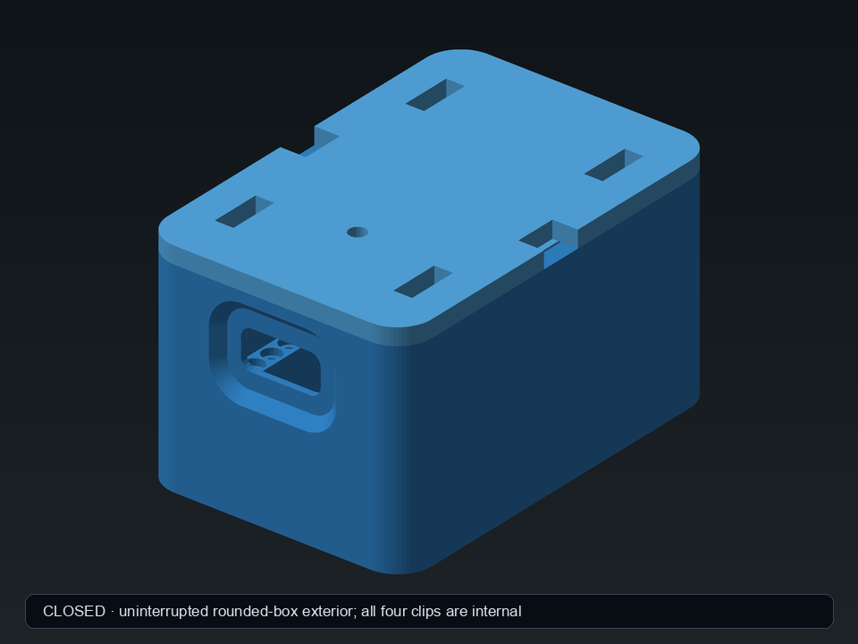
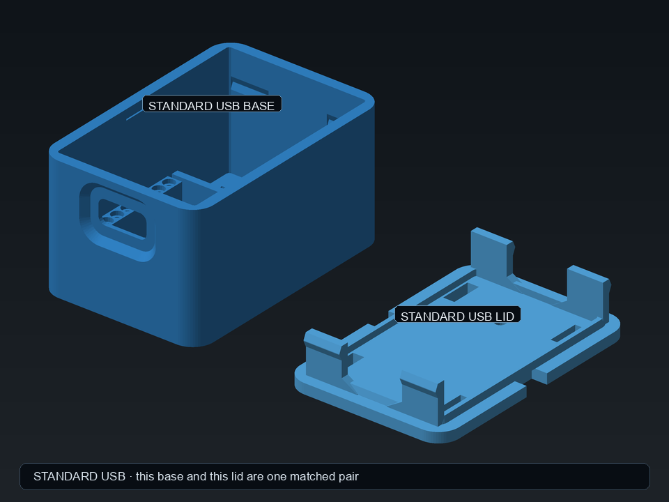
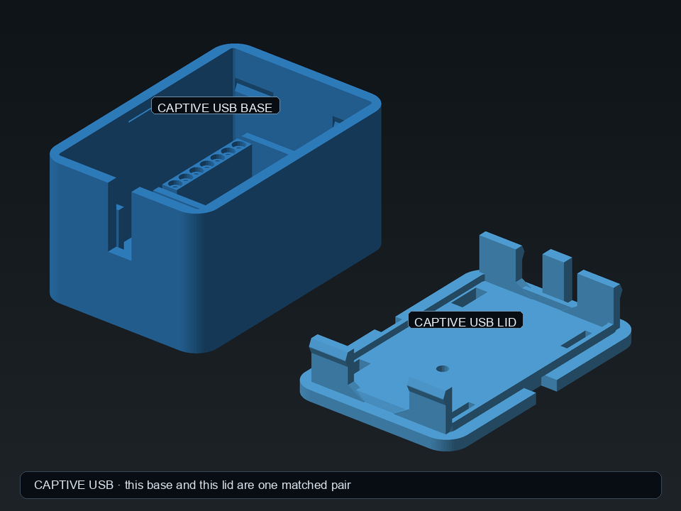
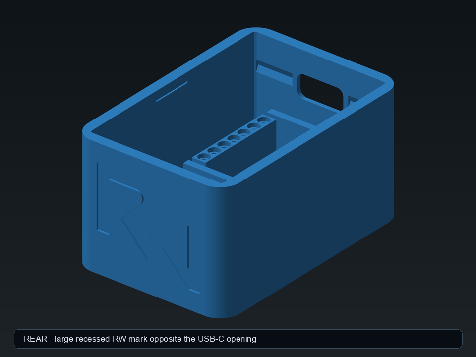
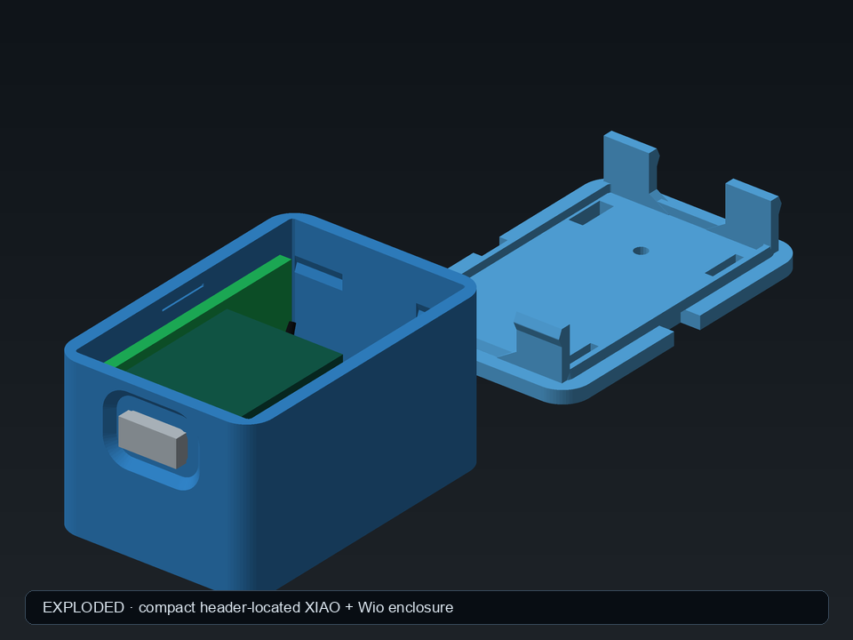
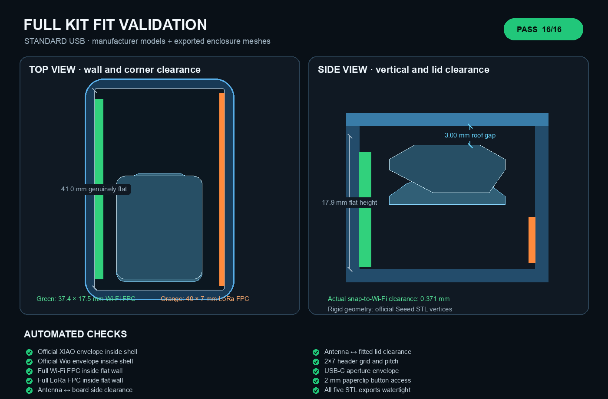

# XIAO + Wio-SX1262 Velux bridge enclosure

A compact, support-free enclosure for the assembled **Seeed Studio XIAO
ESP32-S3 + Wio-SX1262** bridge and the two adhesive FPC antennas supplied with
the kit.



## Two separate versions

Do not mix the two base/lid pairs:

| Version | What the USB end does | Printable files | Pair preview |
|---|---|---|---|
| Standard USB | Leaves the XIAO USB-C socket accessible through the wall | `export/base.*` and `export/lid.*` | `previews/standard_usb_pair.png` |
| Captive USB | Holds a short cable's USB-C plug inside the enclosure | `export-captive-usb/base.*` and `export-captive-usb/lid.*` | `previews/captive_usb_pair.png` |











The validation preview is generated by the same suite invoked by `make test`.
It projects Seeed's official board STL vertices into the configured enclosure,
draws the full published antenna envelopes, and reports the tested clearances.
The captive-cable layout has a corresponding
`previews/fit_validation_captive_usb.png` report.

The antennas mount vertically against **opposite inside side walls**, with their
broad faces radiating outwards. This keeps them protected, avoids placing either
antenna directly above the PCB ground plane, and reduces the case footprint to
almost the antenna envelope. The rounded exterior hides tighter internal corner
radii, leaving a genuinely flat **41.0 × 17.9 mm** adhesive area on each side
below the lid keep-out. This excludes the rounded corners entirely.

The XIAO's already-soldered header pins locate the board in two printed socket
rails. Their geometry follows the standard XIAO footprint: two rows of seven,
2.54 mm pitch, and 15.24 mm row spacing. The deep sockets and end shelves locate
the assembly without separate PCB hooks, lid pillars, screws, or bought
fasteners. The board and USB opening retain their physically tested heights;
the taller shell now places the plain internal roof 3 mm above the measured
tallest radio component.

## Manufacturer dimensions used

| Part | Body / envelope | Lead |
|---|---:|---:|
| XIAO ESP32-S3 | 22.482 × 17.780 × 4.460 mm (USB included) | — |
| Wio-SX1262 carrier | 21.440 × 17.780 × 7.300 mm | — |
| Wi-Fi FPC antenna | 37.4 × 17.5 × ≤1.8 mm | 65 ± 2 mm, Ø1.13 mm |
| LoRa FPC antenna | 40 × 7 × 1 mm | 50 mm I-PEX lead |

The plan values above were measured from Seeed's official STEP models. Physical
caliper measurements of the assembled unit supersede their separate heights:
**6.2 mm** from the lower-PCB underside to the upper-PCB top and **9.1 mm** to
the tallest SX1262 component. The configured plan envelope is **17.9 × 22.6
mm**.

Default enclosure size: **31 × 46 × 26 mm** including the lid. The extra four
millimetres of width are intentional: beside the board they form cable channels
wide enough for the 1.13 mm coax, and behind the board they create a service-loop
bay for the unused length of both supplied leads.

## Assembly

1. Print `base` floor-down and `lid` with its smooth outside face down. Supports
   are not required. The exported lid is already oriented this way: its broad
   exterior face is at Z=0 and should sit directly on the build plate; do not
   use the automatic orientation suggested by a slicer.
2. Before removing either adhesive liner, rehearse the complete cable path. Do
   not crease the coax or force a bend tighter than roughly **5 mm radius**.
3. Stick the **37.4 × 17.5 mm Wi-Fi antenna** to the left wall and the
   **40 × 7 mm LoRa antenna** to the right wall, viewed from the USB end. Keep
   the top of each antenna at or below the shallow 0.4 mm engraved height line.
   Put both cable exits toward the closed/rear end of the enclosure.
4. Arrange the spare lead length as relaxed loops in the rear bay, keeping both
   cables below the lid skirt. Do not coil or crease the coax tightly.
5. Hold the assembled board just above the enclosure and attach both I-PEX plugs.
   Press vertically on each metal plug cap with a fingertip or plastic tool;
   never pull or press through the cable itself.
6. Lower the USB-C end toward its opening, align both rows of header pins with
   the printed sockets, then press the board onto both end shelves. The deeper
   sockets place the measured 9.1 mm stack 3.0 mm below the internal roof and
   provide more than the requested additional 2 mm of pin depth. There are no
   separate PCB clips to engage. The service loops should settle below/behind
   the board.
7. Confirm neither cable lies across the upper rim or lid skirt. Centre the lid
   using its tapered lead-in and press until all four internal clips click.

To reopen it, use either of the two square tool slots—one in each long edge of
the lid plate. Each 5 × 3 mm slot crosses the complete 2 mm base-wall thickness
and reaches 1 mm behind its inner face. Put a thin flat screwdriver or similar
metal tool behind the wall at the exposed lid/base seam and twist gently to lift
that side. There are no release cut-outs in the base walls and no rear scoop.

To remove the electronics, remove the lid and lift the board straight out of
the pin sockets, then slide its USB-C connector through the opening. There are
no lid-mounted pads or individual PCB clips to release.

There is **no additional bill of materials**: no screws, nuts, magnets, foam tape
or bought fasteners. Board retention and lid retention are printed into the two
parts; the antenna adhesive is already part of the supplied antennas.

Four internal flex clips hold the lid on without changing its clean rounded-box
silhouette. Each is a 7 mm-wide, 1.5 mm-thick member which spans the complete
depth of the centring lip and continues 7.5 mm below the lid. There is no
0.7 mm-thick section left anywhere along the flexible rectangle. At the
layer-critical lid junction, each tongue flares sideways into a 10 mm tapered
root, providing over five times the original nominal root cross-section. The
clips sit wholly inside the base cavity; only their printable diamond-section
hooks enter four 7.4 mm-wide pockets shaped as slightly oversized diamond
negatives. Approximately 0.15 mm vertical profile clearance prevents perceptible
up/down lid travel while remaining printable. The hook now projects 0.55 mm,
requiring approximately 0.45 mm insertion deflection and giving 0.30 mm more
engagement than the first printed revision. The corresponding simple cantilever
estimate is roughly 1.8% surface strain. The full-depth tongue and broad tapered
root distribute that higher flex demand. The two side pry slots lift one side at a time,
releasing that side's front and rear clips together. The lid also has a tapered
insertion edge. The lid and underside are deliberately plain.
Because the complete tongues and recesses are larger and relocated, this revision must be
printed as a matched lid-and-base pair; its lid does not fit the earlier narrow
base pockets.
A large 21 mm-wide recessed RW mark uses most of the flat rear wall opposite
the USB-C opening; the earlier tiny surface markings remain removed. For best
RF performance, do not place either antenna side directly against metal or a
wall; bottom-down on a shelf is a good default orientation.

Ventilation is provided by four straight-through slots in the base and four in
the lid. There are no ventilation openings in the side walls and no horizontal
ventilation ceilings for the printer to bridge.

The standard USB-C opening is raised 3 mm from the original board-envelope
position to account for the fitted pin spacers. The complete board locator is
also shifted 0.5 mm toward the USB wall for closer connector alignment. The
opening itself remains fixed at its tested 17.3 mm centre height. Around it, a
rounded external pocket accepts a cable overmould up to 12 × 8 mm and lets it
enter 1.2 mm into the 2 mm wall. The deepest profile is 12.6 × 8.4 mm; a larger
15 × 10.8 mm outer profile creates a support-free 45-degree upper transition
while retaining 0.8 mm wall thickness at the pocket floor. The
2 mm circular lid opening, offset 2 mm toward the USB/front edge from the board
centre, provides paperclip access to the Wio-SX1262 user button. The lid
interior is otherwise plain apart from its perimeter skirt, snap features and
ventilation. There are no protruding antenna-position dots: one shallow recessed
line on each side wall marks the maximum safe antenna height.

The supplied LoRa FPC is described by Seeed as a short-range/test antenna. The
enclosure accommodates it exactly, but the case cannot improve its RF
performance. If the Velux link is unreliable, Seeed recommends an external
868/915 MHz antenna and 120 mm SMA-to-I-PEX pigtail; that would need a different
lid.

## Fit and customisation

The header sockets are printer-sensitive. Print `fit_test.stl` first; it contains
the **complete production XIAO locator**: both seven-pin rails, all 14 sockets
and both end shelves. Seat the actual assembled board in it
before committing to the full enclosure. The earlier partial lid-corner coupon
was removed because it could not reproduce the stiffness or catch action of the
complete lid:

- too tight: increase `lid_fit_clearance` from `0.30`;
- too loose: reduce it;
- pins will not enter or are excessively tight: increase `header_socket_d` from
  the physically tested `1.25` default in 0.05 mm steps;
- pins wobble: reduce `header_socket_d` in 0.05 mm steps;
- antenna supplied under a later revision: change the `wifi_ant_*` or
  `lora_ant_*` values—the placement guides and fit assertions update with them.

All main dimensions are grouped for OpenSCAD/MakerWorld customisation. Assertions
stop an antenna outline or board height from silently exceeding the enclosure.

## Build

```sh
make            # previews + STL/3MF exports
make renders    # PNG previews only
make exports    # printable files only
make base       # base preview + STL + 3MF
make lid        # lid preview + STL + 3MF
make fit_test   # small tolerance coupon
make test       # verify official board models, antennas, clearances and meshes
make clean
```

## Sources

See [`references/SOURCES.md`](references/SOURCES.md) for the exact manufacturer
links and what was taken from each file. Copies of the two official STEP models
and the antenna comparison image are retained in `references/` so the design can
be audited later.
